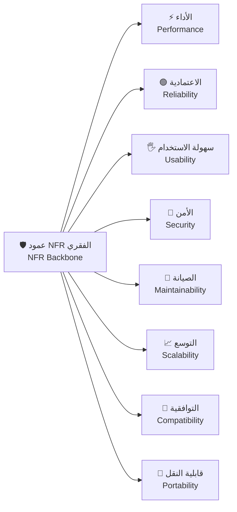
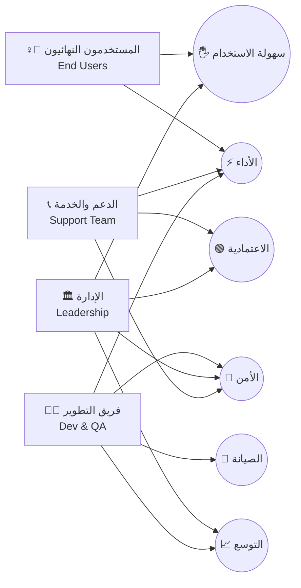
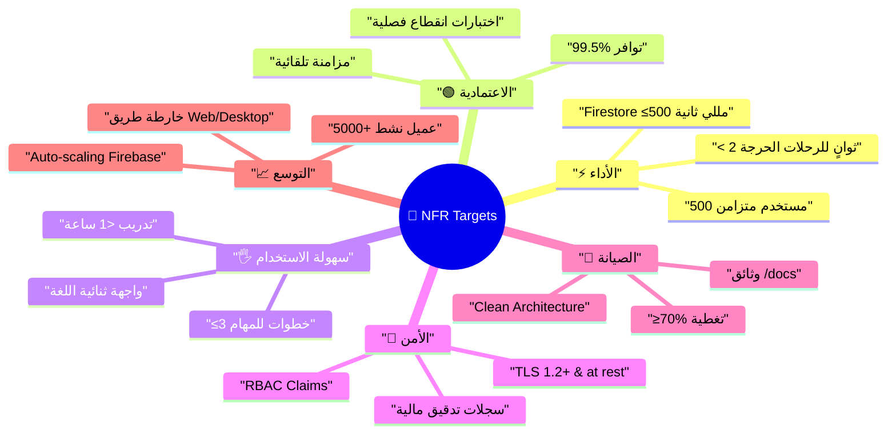
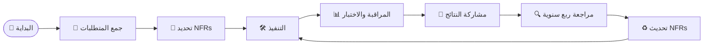

# 🛡️ المتطلبات غير الوظيفية والجودة | Non-Functional Requirements & Quality

> 🗂️ **ملخص سريع | Quick Summary**
> هذا الملف يوضح كيف تدعم المتطلبات غير الوظيفية جودة النظام واستقراره وسهولة استخدامه لجميع الأطراف، مع دعم كل نقطة بأيقونات ورسومات وشرح مختصر.

---

> **📂 المشروع | Project:** CA Admin • **👤 المالك | Owner:** Abdullah Alshaif • **🆚 الإصدار | Version:** v0.1 • **🗓️ آخر تحديث | Last Updated:** 2025-09-08

---

**🇸🇦 نظرة عامة:** توضح هذه الوثيقة كيف تدعم المتطلبات غير الوظيفية جودة النظام واستقراره وسهولة استخدامه لجميع الأطراف (المستخدم، المطور، الإدارة).
**🇬🇧 Overview:** This document links NFRs to the quality attributes that keep the platform fast, stable, secure, and maintainable for every stakeholder.
**🔎 كيف تقرأ هذا الملف | How to Use this File:** 🇸🇦 ابدأ ببطاقة القياس السريعة ثم انتقل إلى القسم الخاص بكل سمة لمراجعة التفاصيل وخطط القياس.  
🇬🇧 Start with the quick scorecard, then dive into each attribute section for detailed guidance and measurement playbooks.

---

---

## 🧾 بطاقة قياس سريعة | Quick NFR Scorecard

> 🧾 **شرح مختصر:** جدول يلخص الأهداف الرئيسية لكل سمة جودة، مع أدوات القياس والفائدة العملية.

| Attribute                    | Key Targets                                                                                                                                                                                                                                                                                      | Measurement & Tools                                                                                                                                                                              | Value                                                                                                                                                                |
| ---------------------------- | ------------------------------------------------------------------------------------------------------------------------------------------------------------------------------------------------------------------------------------------------------------------------------------------------ | ------------------------------------------------------------------------------------------------------------------------------------------------------------------------------------------------ | -------------------------------------------------------------------------------------------------------------------------------------------------------------------- |
| ⚡ الأداء Performance        | 🇸🇦 500 مستخدم متزامن، زمن استجابة < 2 ثانية للرحلات الحرجة، استعلامات Firestore ≤ 500 مللي ثانية. 🇬🇧 500 concurrent users, < 2s critical workflows, Firestore queries ≤ 500 ms.                                                                                                               | 🇸🇦 اختبارات تحميل k6، Firebase Performance Monitoring، لوحات زمن الاستجابة في Cloud Monitoring. 🇬🇧 k6 load tests, Firebase Performance Monitoring, Cloud Monitoring response-time dashboards. | 🇸🇦 يحافظ على رحلة مستخدم سريعة حتى في ذروة الاستخدام ويقلل الشكاوى التشغيلية. 🇬🇧 Keeps critical journeys fast at peak demand and reduces operational escalations. |
| 🟢 الاعتمادية Reliability    | 🇸🇦 توافر تشغيلي 99.5% مع مزامنة تلقائية ومعالجة تضارب لمنع فقد البيانات. 🇬🇧 99.5% operational uptime with auto-sync and conflict handling to prevent data loss.                                                                                                                               | 🇸🇦 تنبيهات Cloud Monitoring، اختبارات انقطاع فصلية، مراجعة سجلات الأخطاء. 🇬🇧 Cloud Monitoring alerts, quarterly outage drills, error log reviews.                                             | 🇸🇦 يضمن استمرارية الخدمة لفريق الدعم والعملاء دون توقفات حرجة. 🇬🇧 Ensures uninterrupted service for support teams and customers.                                  |
| 🖐️ سهولة الاستخدام Usability | 🇸🇦 واجهة ثنائية اللغة، تجربة مهيأة للهواتف المتوسطة، الرحلات الحرجة ≤ 3 خطوات، تدريب أقل من ساعة. 🇬🇧 Bilingual UI, mid-range mobile-first experience, critical journeys ≤ 3 steps, onboarding < 1 hour.                                                                                       | 🇸🇦 جلسات اختبار قابلية الاستخدام، تحليلات مسار المستخدم، مراقبة معدلات إكمال المهام. 🇬🇧 Usability testing sessions, funnel analytics, task completion tracking.                               | 🇸🇦 يقلل منحنى التعلم ويزيد رضا المستخدمين الميدانيين. 🇬🇧 Reduces the learning curve and boosts frontline satisfaction.                                            |
| 🔐 الأمن Security            | 🇸🇦 RBAC باستخدام Firebase Custom Claims، تشفير TLS 1.2+ أثناء النقل وفي السكون، سجلات تدقيق مالية وصلاحيات. 🇬🇧 RBAC via Firebase Custom Claims, TLS 1.2+ encryption in transit and at rest, audit logs for finance and access changes.                                                        | 🇸🇦 مراجعات صلاحيات نصف سنوية، فحص إعدادات الأمان، تصدير السجلات إلى BigQuery. 🇬🇧 Semi-annual access reviews, security posture checks, log exports to BigQuery.                                | 🇸🇦 يحمي بيانات العملاء ويلبي المتطلبات التنظيمية الداخلية والخارجية. 🇬🇧 Protects customer data and satisfies internal and external compliance.                    |
| 🧰 الصيانة Maintainability   | 🇸🇦 هندسة نظيفة بطبقات واضحة، ≥ 70% تغطية اختبارات وحدات وتكامل، توثيق `/docs` محدث. 🇬🇧 Clean layered architecture, ≥ 70% unit + integration coverage, up-to-date `/docs` documentation.                                                                                                       | 🇸🇦 تقارير التغطية في CI، مراجعات معمارية فصلية، متطلبات دمج الوثائق مع Pull Requests. 🇬🇧 CI coverage reports, quarterly architecture reviews, doc-included pull requests.                     | 🇸🇦 يسهل إضافة الميزات وتقليل وقت إصلاح الأعطال. 🇬🇧 Simplifies feature delivery and shortens defect resolution time.                                               |
| 📈 التوسع Scalability        | 🇸🇦 دعم 5000+ عميل نشط، الاستفادة من التدرج التلقائي لـ Firestore و Cloud Functions، الحفاظ على تكافؤ Android/iOS مع خارطة طريق للويب وسطح المكتب. 🇬🇧 Serve 5000+ active customers, leverage Firestore & Cloud Functions auto-scaling, maintain Android/iOS parity with a Web/Desktop roadmap. | 🇸🇦 لوحات استخدام الموارد في Firebase، اختبارات تحميل موسمية، مراجعات سعة استراتيجية. 🇬🇧 Firebase resource dashboards, seasonal load tests, strategic capacity reviews.                        | 🇸🇦 يمنع الاختناقات المفاجئة ويدعم التوسع الجغرافي وقنوات جديدة. 🇬🇧 Prevents sudden bottlenecks and supports geographic and channel expansion.                     |

---

---

## 🚀 مقدمة | Introduction

### 🎯 الهدف | Purpose

- 🇸🇦 تحدد المتطلبات غير الوظيفية السمات النوعية الأساسية لتجربة CA Admin مثل الأداء، الاعتمادية، الأمن، وقابلية الصيانة. 🇬🇧 NFRs capture the qualitative expectations for CA Admin across performance, reliability, security, and maintainability.
- 🇸🇦 تربط الوثيقة كل سمة بجداول القياس وخطط المتابعة كي يتمكن المطور والمحلل ومدير المنتج من الرجوع إليها بسرعة. 🇬🇧 The document ties each attribute to measurement plans so engineers, analysts, and product owners can reference it quickly.

### ⚖️ لماذا يهم | Why It Matters

- 🇸🇦 تضمن NFRs أن الميزات الوظيفية تعمل بثبات تحت الحمل وتقدم تجربة سلسة للمستخدمين. 🇬🇧 NFRs ensure functional features stay consistent under load and keep the user experience smooth.
- 🇸🇦 توفر لغة مشتركة بين التقنية والإدارة لاتخاذ قرارات مبنية على بيانات قابلة للقياس. 🇬🇧 They create a shared language between engineering and leadership for data-driven decisions.

### 🤝 أصحاب المصلحة الرئيسيون | Key Stakeholders

- 🧑‍💼 🇸🇦 الإدارة التنفيذية تحتاج مقاييس موثوقة لتتبع الالتزام بالعقود ومستوى الخدمة. 🇬🇧 Executives rely on trustworthy metrics to track SLAs and contractual obligations.
- 🧑‍💻 🇸🇦 فرق التطوير والاختبار تستخدم NFRs لتحديد أولويات السبر والاختبارات الآلية. 🇬🇧 Development and QA teams use NFRs to prioritise instrumentation and automated tests.
- ☎️ 🇸🇦 فرق الدعم وخدمة العملاء تعتمد على الاستقرار والأداء للحفاظ على رضا العملاء. 🇬🇧 Support teams depend on performance and uptime to keep customers happy.

### 🛠️ الاستخدام اليومي | Daily Application

- 🇸🇦 اربط قصص المستخدم في الباك لوج بمؤشرات هذه الوثيقة قبل بدء أي Sprint. 🇬🇧 Map backlog stories to the indicators listed here before each sprint kickoff.
- 🇸🇦 راجع نتائج القياس في اجتماعات الختام Sprint Review للتأكد من الالتزام المستمر. 🇬🇧 Review measurement outcomes during sprint reviews to confirm continued compliance.

---

## 🧱 خريطة السمات | Quality Attribute Map

> 🧱 **شرح مختصر:** يوضح المخطط ارتباط السمات النوعية بالعمود الفقري للمتطلبات غير الوظيفية.
> **🇸🇦 ملخص:** يوضح المخطط ارتباط السمات النوعية بالعمود الفقري للمتطلبات غير الوظيفية. **🇬🇧 Summary:** The diagram shows how quality attributes connect back to the NFR backbone.

> 🧱 **شرح الرسم:** يوضح كيف ترتبط كل سمة جودة بالمتطلبات غير الوظيفية الأساسية.

---

---

## 🤝 توافق السمات مع أصحاب المصلحة | Stakeholder Alignment

> 🤝 **شرح مختصر:** يوضح المخطط من يستفيد مباشرة من كل سمة جودة.
> **🇸🇦 ملخص:** يوضح المخطط من يستفيد مباشرة من كل سمة جودة. **🇬🇧 Summary:** The diagram highlights which stakeholders benefit from each attribute.

> 🤝 **شرح الرسم:** يوضح كيف تستفيد كل جهة من السمات النوعية.

---

---

## 🧠 خريطة ذهنية للـ NFR | NFR Mindmap

> 🧠 **شرح مختصر:** تلخص الخريطة الحدود الرقمية المستهدفة لكل سمة جودة.
> **🇸🇦 ملخص:** تلخص الخريطة الحدود الرقمية المستهدفة لكل سمة جودة. **🇬🇧 Summary:** Mindmap of the measurable targets for each quality attribute.

> 🧠 **شرح الرسم:** يوضح الأهداف الرقمية لكل سمة جودة.

---

---

## 🔁 دورة التحسين المستمر | Continuous Quality Cycle

> 🔁 **شرح مختصر:** يحول هذا المسار NFRs إلى حلقة قياس وتحسين مستمرة.
> **🇸🇦 ملخص:** يحول هذا المسار NFRs إلى حلقة قياس وتحسين مستمرة. **🇬🇧 Summary:** The flow turns NFRs into a continuous measurement and improvement loop.

> 🔁 **شرح الرسم:** يوضح كيف تتحول المتطلبات غير الوظيفية إلى دورة تحسين مستمر.

---

---

## ⚡ الأداء | Performance

> 🇸🇦 يضمن الأداء العالي أن الرحلات الحرجة تبقى سريعة مع نمو عدد المستخدمين. 🇬🇧 High performance keeps critical journeys responsive as the user base grows.

| العنصر                          | الوصف Description                                                                                               | القياس Measurement                                                                                                           | الفائدة Value                                                                                              |
| ------------------------------- | --------------------------------------------------------------------------------------------------------------- | ---------------------------------------------------------------------------------------------------------------------------- | ---------------------------------------------------------------------------------------------------------- |
| سعة الحمل Load Envelope         | 🇸🇦 يدعم النظام ≥ 500 مستخدم متزامن دون تدهور. 🇬🇧 Supports ≥ 500 concurrent users without degradation.        | 🇸🇦 اختبارات حمل k6 ربع سنوية + مراقبة Firebase Performance. 🇬🇧 Quarterly k6 load tests + Firebase Performance monitoring. | 🇸🇦 يحافظ على كفاءة فرق التشغيل خلال الذروة. 🇬🇧 Keeps operations efficient during peak hours.            |
| زمن الاستجابة Response Time     | 🇸🇦 زمن الاستجابة للرحلات الحرجة أقل من 2 ثانية. 🇬🇧 Critical workflows respond in under 2 seconds.            | 🇸🇦 لوحات زمن الاستجابة في Cloud Monitoring + تتبع RUM. 🇬🇧 Cloud Monitoring dashboards + real-user monitoring.             | 🇸🇦 يحسن رضا المستخدم ويقلل تذاكر الأعطال. 🇬🇧 Improves satisfaction and reduces incident tickets.        |
| استعلامات Firestore Query Speed | 🇸🇦 الاستعلامات المفهرسة تعطي النتائج في ≤ 500 مللي ثانية. 🇬🇧 Indexed Firestore queries complete in ≤ 500 ms. | 🇸🇦 Firebase profiler + مراجعة الفهارس لكل إصدار. 🇬🇧 Firebase profiler and index reviews per release.                      | 🇸🇦 يقلل التكاليف ويزيد سرعة الشاشة الرئيسية والتقارير. 🇬🇧 Lowers costs and keeps dashboards/snaps fast. |

---

## 🟢 الاعتمادية والتوافر | Reliability & Availability

> 🇸🇦 الاعتمادية تمنح الفريق ثقة في استقرار العمليات اليومية. 🇬🇧 Reliability gives teams confidence in day-to-day stability.

| العنصر                                     | الوصف Description                                                                                                                                  | القياس Measurement                                                                                          | الفائدة Value                                                                                             |
| ------------------------------------------ | -------------------------------------------------------------------------------------------------------------------------------------------------- | ----------------------------------------------------------------------------------------------------------- | --------------------------------------------------------------------------------------------------------- |
| التوافر التشغيلي Operational Uptime        | 🇸🇦 الحفاظ على توافر 99.5% للخدمات الأساسية. 🇬🇧 Maintain 99.5% uptime for core services.                                                         | 🇸🇦 إنذارات SLA في Cloud Monitoring + تقارير شهرية. 🇬🇧 SLA alerts in Cloud Monitoring + monthly reports.  | 🇸🇦 يقلل الأعطال المكلفة ويعزز ثقة الشركاء. 🇬🇧 Reduces costly outages and builds partner trust.         |
| المزامنة والتضارب Sync & Conflict Handling | 🇸🇦 مزامنة تلقائية ومعالجة تضارب لمنع فقد البيانات أثناء الانقطاعات. 🇬🇧 Auto-sync and conflict resolution to avoid data loss during outages.     | 🇸🇦 اختبارات استعادة فصلية + سيناريوهات فشل في QA. 🇬🇧 Quarterly recovery tests + failure scenarios in QA. | 🇸🇦 يحافظ على دقة السجلات دون تدخل يدوي. 🇬🇧 Keeps records accurate without manual re-entry.             |
| الشفافية Incident Transparency             | 🇸🇦 سجلات أحداث واضحة وتواصل ضمن 30 دقيقة من أي حادث مؤثر. 🇬🇧 Transparent incident logs and communication within 30 minutes of impactful events. | 🇸🇦 قوالب تقرير الحوادث + مراجعات ما بعد الانقطاع. 🇬🇧 Incident report templates + post-incident reviews.  | 🇸🇦 يعزز ثقافة التعلم ويحد من تكرار الأعطال. 🇬🇧 Builds a learning culture and reduces repeat incidents. |

---

## 🖐️ سهولة الاستخدام | Usability

> 🇸🇦 تجربة الاستخدام السلسة تقلل التدريب وتسرّع إنجاز المهام الميدانية. 🇬🇧 Smooth usability cuts training time and accelerates field task completion.

| العنصر                           | الوصف Description                                                                                                            | القياس Measurement                                                                                                     | الفائدة Value                                                                                  |
| -------------------------------- | ---------------------------------------------------------------------------------------------------------------------------- | ---------------------------------------------------------------------------------------------------------------------- | ---------------------------------------------------------------------------------------------- |
| واجهة ثنائية اللغة Bilingual UI  | 🇸🇦 دعم كامل للعربية والإنجليزية مع تبديل تلقائي RTL/LTR. 🇬🇧 Full Arabic/English support with automatic RTL/LTR switching. | 🇸🇦 مراجعة تصميم ثنائية اللغة + اختبارات جودة قبل الإطلاق. 🇬🇧 Bilingual design reviews + pre-release QA checks.      | 🇸🇦 يضمن شمولية التجربة لكل المستخدمين. 🇬🇧 Ensures inclusivity across user groups.           |
| تصميم موجه للجوال Mobile-First   | 🇸🇦 تجربة محسّنة للأجهزة المتوسطة على Android و iOS. 🇬🇧 Optimised for mid-range Android/iOS devices.                       | 🇸🇦 اختبارات أداء الأجهزة الفعلية + تتبع معدلات الأعطال لكل جهاز. 🇬🇧 Physical device tests + crash rates per device. | 🇸🇦 يقلل الأعطال الميدانية ويزيد الإنتاجية. 🇬🇧 Reduces field issues and boosts productivity. |
| الرحلات الحرجة Critical Journeys | 🇸🇦 إكمال الطلب/التتبع/الدفع في ≤ 3 خطوات. 🇬🇧 Complete order/track/pay journeys in ≤ 3 steps.                              | 🇸🇦 تحليلات funnel + جلسات مراقبة المستخدم. 🇬🇧 Funnel analytics + moderated user sessions.                           | 🇸🇦 يقلل التخلي عن المهام ويرفع التحويل. 🇬🇧 Decreases drop-off and improves conversions.     |
| التدريب السريع Fast Onboarding   | 🇸🇦 تدريب أقل من ساعة للمستخدم الجديد. 🇬🇧 Onboard new users in under one hour.                                             | 🇸🇦 استبيانات بعد التدريب + تتبع الوقت إلى الإنتاجية. 🇬🇧 Post-training surveys + time-to-productivity tracking.      | 🇸🇦 يسرّع اعتماد الأدوات داخل المؤسسات. 🇬🇧 Speeds up organisational adoption.                |

---

## 🔐 الأمن | Security

> 🇸🇦 الأمن يحمي البيانات ويمنع الوصول غير المصرح به دون المساس بسهولة الاستخدام. 🇬🇧 Security protects data and prevents unauthorised access without sacrificing usability.

| العنصر                        | الوصف Description                                                                                                       | القياس Measurement                                                                                                             | الفائدة Value                                                                                                       |
| ----------------------------- | ----------------------------------------------------------------------------------------------------------------------- | ------------------------------------------------------------------------------------------------------------------------------ | ------------------------------------------------------------------------------------------------------------------- |
| التحكم بالوصول Access Control | 🇸🇦 تطبيق RBAC مع Firebase Custom Claims. 🇬🇧 Enforce RBAC using Firebase Custom Claims.                               | 🇸🇦 مراجعات صلاحيات نصف سنوية + تنبيهات تغيير صلاحيات. 🇬🇧 Semi-annual access reviews + privilege change alerts.              | 🇸🇦 يحد من المخاطر الداخلية ويضمن مبدأ أقل صلاحية. 🇬🇧 Limits insider risk and ensures least privilege.            |
| التشفير Encryption            | 🇸🇦 تشفير TLS 1.2+ أثناء النقل وتشفير كامل للبيانات في السكون. 🇬🇧 TLS 1.2+ in transit and full encryption at rest.    | 🇸🇦 فحوصات أمنية دورية + تدقيق إعدادات خدمة Google Cloud. 🇬🇧 Periodic security scans + Google Cloud security posture checks. | 🇸🇦 يحمي سرية بيانات العملاء ويناسب التدقيقات الخارجية. 🇬🇧 Protects customer confidentiality and audit readiness. |
| سجلات التدقيق Audit Logging   | 🇸🇦 حفظ سجلات لكل العمليات المالية وتغييرات الصلاحيات. 🇬🇧 Maintain audit logs for financial actions and role updates. | 🇸🇦 تصدير أسبوعي إلى BigQuery + تنبيهات اختلافات. 🇬🇧 Weekly exports to BigQuery + anomaly alerts.                            | 🇸🇦 يوفر شفافية لحل النزاعات والامتثال. 🇬🇧 Provides transparency for dispute resolution and compliance.           |

---

## 🧰 الصيانة | Maintainability

> 🇸🇦 القابلية للصيانة تسهّل التطوير المستمر وتقلل المخاطر التقنية. 🇬🇧 Maintainability enables continuous delivery and reduces technical risk.

| العنصر                         | الوصف Description                                                                                                     | القياس Measurement                                                                                               | الفائدة Value                                                                                           |
| ------------------------------ | --------------------------------------------------------------------------------------------------------------------- | ---------------------------------------------------------------------------------------------------------------- | ------------------------------------------------------------------------------------------------------- |
| هندسة نظيفة Clean Architecture | 🇸🇦 اتباع طبقات واضحة وفصل المخاوف. 🇬🇧 Adhere to layered clean architecture.                                        | 🇸🇦 مراجعات تصميم فصلية + فحوصات lint architecture. 🇬🇧 Quarterly design reviews + architecture lint checks.    | 🇸🇦 يسهل فهم الكود وإعادة استخدامه. 🇬🇧 Makes code easier to understand and reuse.                     |
| تغطية الاختبارات Test Coverage | 🇸🇦 ≥ 70% تغطية لاختبارات الوحدات والتكامل للمنطق التجاري. 🇬🇧 ≥ 70% unit + integration coverage for business logic. | 🇸🇦 تقارير CI التلقائية + بوابات فشل عند انخفاض التغطية. 🇬🇧 Automated CI reports + gating when coverage drops. | 🇸🇦 يقلل العيوب المتكررة ويدعم refactoring آمن. 🇬🇧 Reduces regressions and supports safe refactoring. |
| توثيق `/docs` Documentation    | 🇸🇦 توثيق لكل API ووحدة في مجلد `/docs`. 🇬🇧 Document every API and module inside `/docs`.                           | 🇸🇦 قائمة تحقق PR + مراجعات Docs أسبوعية. 🇬🇧 PR checklist + weekly doc reviews.                                | 🇸🇦 يمكّن المطورين الجدد من الانخراط بسرعة. 🇬🇧 Enables faster onboarding for new engineers.           |

---

## 📈 القابلية للتوسع | Scalability

> 🇸🇦 التوسع المدروس يبقي الأداء ثابتًا مع نمو قاعدة العملاء والقنوات. 🇬🇧 Planned scalability keeps performance steady as customers and channels grow.

| العنصر                         | الوصف Description                                                                                                                | القياس Measurement                                                                                                            | الفائدة Value                                                                                                           |
| ------------------------------ | -------------------------------------------------------------------------------------------------------------------------------- | ----------------------------------------------------------------------------------------------------------------------------- | ----------------------------------------------------------------------------------------------------------------------- |
| قاعدة العملاء Active Customers | 🇸🇦 دعم 5000+ عميل نشط دون إعادة تصميم جذري. 🇬🇧 Support 5000+ active customers without major redesign.                         | 🇸🇦 تحليلات نمو المستخدم في BigQuery + مراجعة نصف سنوية للسعة. 🇬🇧 BigQuery growth analytics + semi-annual capacity reviews. | 🇸🇦 يضمن جاهزية المنصة للتوسع التجاري. 🇬🇧 Ensures platform readiness for business expansion.                          |
| التدرج التلقائي Auto-Scaling   | 🇸🇦 الاستفادة من مزايا Firestore و Cloud Functions في التدرج التلقائي. 🇬🇧 Leverage Firestore and Cloud Functions auto-scaling. | 🇸🇦 مراقبة استهلاك الموارد + تنبيهات حدود الكلفة. 🇬🇧 Monitor resource utilisation + cost threshold alerts.                  | 🇸🇦 يمنع حد الموارد من إيقاف الطلبات الحرجة. 🇬🇧 Prevents resource ceilings from blocking critical traffic.            |
| تكافؤ المنصات Platform Parity  | 🇸🇦 الحفاظ على تكافؤ Android/iOS مع خارطة طريق للويب وسطح المكتب. 🇬🇧 Maintain Android/iOS parity with a Web/Desktop roadmap.   | 🇸🇦 مراجعات مطابقة الميزات + لوحات تتبع تقدم المنصات. 🇬🇧 Feature parity reviews + platform progress dashboards.             | 🇸🇦 يزيل التجزئة ويهيئ الطريق لقنوات توزيع جديدة. 🇬🇧 Eliminates fragmentation and prepares new distribution channels. |

---

## 📊 دفتر القياس | Measurement Playbook

- 📅 🇸🇦 جدول متابعة شهرية يجمع مؤشرات الأداء والاعتمادية والأمن في لوحة موحدة داخل Looker Studio. 🇬🇧 A monthly review pulls performance, reliability, and security indicators into a unified Looker Studio board.
- 🧪 🇸🇦 اربط سيناريوهات [خطة الاختبار](../11-test-plan/11-test-plan.md) بالمقاييس أعلاه وحدد حالة كل هدف (محقق/خطر/غير متتبع). 🇬🇧 Link [Test Plan](../11-test-plan/11-test-plan.md) scenarios to the metrics above and tag each target (Met/Risk/Not Tracked).
- 📬 🇸🇦 شارك موجزًا تنفيذيًا ربع سنويًا يلخص الالتزام بالـNFR وأهم العوائق. 🇬🇧 Distribute a quarterly executive digest summarising NFR compliance and key blockers.

---

## 📐 سمات ISO/IEC 25010 | ISO/IEC 25010 Quality Attributes

| Attribute (EN)         | الصفة (AR)        | Target / الهدف                          | Evidence / الدليل                                                                                                                |
| ---------------------- | ----------------- | --------------------------------------- | -------------------------------------------------------------------------------------------------------------------------------- |
| Functional Suitability | الملاءمة الوظيفية | Cover 100% of documented use cases      | 🇸🇦 مطابقات قصص المستخدم في `/docs` + مراجعات قبول المنتج. 🇬🇧 User story traceability in `/docs` + product acceptance reviews. |
| Performance Efficiency | كفاءة الأداء      | < 2s response time                      | 🇸🇦 لوحات الأداء في Cloud Monitoring. 🇬🇧 Cloud Monitoring performance dashboards.                                              |
| Compatibility          | التوافقية         | Android/iOS, future Web/Desktop         | 🇸🇦 مراجعات تكافؤ المنصات الفصلية. 🇬🇧 Quarterly platform parity reviews.                                                       |
| Usability              | سهولة الاستخدام   | Bilingual UI, intuitive design          | 🇸🇦 تقارير اختبار قابلية الاستخدام. 🇬🇧 Usability testing reports.                                                              |
| Reliability            | الاعتمادية        | 99.5% uptime                            | 🇸🇦 تقارير SLA الشهرية. 🇬🇧 Monthly SLA reports.                                                                                |
| Security               | الأمن             | RBAC + encryption                       | 🇸🇦 محاضر مراجعة الوصول وتدقيق التشفير. 🇬🇧 Access review minutes and encryption audits.                                        |
| Maintainability        | قابلية الصيانة    | Clean Architecture + ≥70% test coverage | 🇸🇦 تقارير التغطية CI + مذكرات مراجعة معمارية. 🇬🇧 CI coverage reports + architecture review notes.                             |
| Portability            | قابلية النقل      | Flutter cross-platform                  | 🇸🇦 نتائج بناء الأنظمة المتعددة. 🇬🇧 Multi-platform build results.                                                              |

---

## 💡 أفضل الممارسات و FAQ | Best Practices & FAQ

### 🧭 أفضل الممارسات | Best Practices

- 📝 **التوثيق المبكر | Early Documentation:** 🇸🇦 وثّق NFRs في بداية المشروع وراجعها مع جميع أصحاب المصلحة. 🇬🇧 Document NFRs early and review them with every stakeholder.
- 🧪 **التحقق المستمر | Continuous Validation:** 🇸🇦 اختبر الالتزام بالـNFR أثناء تنفيذ [خطة الاختبار](../11-test-plan/11-test-plan.md). 🇬🇧 Validate NFRs during the [Test Plan](../11-test-plan/11-test-plan.md) execution.
- 📊 **مراقبة المؤشرات | Monitor Metrics:** 🇸🇦 راقب السرعة والتوفر والأخطاء بشكل دوري عبر لوحات المراقبة. 🇬🇧 Continuously monitor performance, uptime, and error metrics on dashboards.
- 🏛️ **تحديث معماري | Architecture Alignment:** 🇸🇦 حدّث NFRs عند تغيير [المعمارية](../06-architecture/06-architecture.md). 🇬🇧 Refresh NFRs whenever the [Architecture](../06-architecture/06-architecture.md) shifts.
- 📆 **مراجعات ربع سنوية | Quarterly Reviews:** 🇸🇦 أجرِ مراجعة ربع سنوية للأهداف مقابل النتائج الفعلية. 🇬🇧 Run quarterly reviews of targets versus actuals.

### ❓ الأسئلة الشائعة | FAQ

**❓ س: كيف نحدد NFR جديدة؟ | Q: How do we define a new NFR?**

- 🇸🇦 اربطها بحاجة عمل أو حالة استخدام أو التزام امتثال واضح. 🇬🇧 Tie it to a specific business need, use case, or compliance obligation.
- 🇸🇦 حدد مقياسًا قابلًا للقياس (وقت، نسبة، حد) وطريقة جمعه. 🇬🇧 Assign a measurable metric (time, ratio, threshold) and the collection method.

**❓ س: متى نراجع أو نحدث NFRs؟ | Q: When should NFRs be revisited?**

- 🇸🇦 بعد إطلاق ميزة رئيسية، اكتشاف خلل جوهري، أو تغيير كبير في البنية التحتية. 🇬🇧 After major feature releases, critical incidents, or infrastructure shifts.

---

## 🧪 سيناريو توضيحي | Example Scenario

> 🇬🇧 During UAT, the team simulates **500 users**; all core journeys finish in under **2s**, validating performance and reliability targets. 
> 🇸🇦 أثناء الاختبار التشغيلي، يُحاكي الفريق **500 مستخدم** وتُنجز الرحلات الأساسية في أقل من **ثانيتين**، ما يؤكد تحقيق أهداف الأداء والاعتمادية.

**📈 القياسات المسجلة | Metrics Captured:** 🇸🇦 زمن الاستجابة الوسطي 1.6 ثانية، اكتمال 99% من الطلبات دون أخطاء، عدم وجود تضارب بيانات بعد المزامنة. 🇬🇧 Median response 1.6s, 99% of orders completed error-free, zero data conflicts after sync.

---

## 🚀 نصائح جودة متقدمة | Advanced Quality Tips

- 📡 🇸🇦 فعّل أدوات مراقبة الأداء (Firebase Performance، Google Cloud Monitoring) للتنبيه المبكر على التدهور. 🇬🇧 Enable Performance Monitoring (Firebase, Cloud Monitoring) for early degradation alerts.
- 🛡️ 🇸🇦 استخدم منصة مركزية لتتبع الأخطاء (Crashlytics، Sentry) وربطها بتنبيهات Slack. 🇬🇧 Centralise error tracking (Crashlytics, Sentry) and wire alerts into Slack.
- 🎯 🇸🇦 صِل كل NFR بمؤشر أداء رئيسي (KPI) واضح وقابل للمراجعة التلقائية عبر CI. 🇬🇧 Map each NFR to a KPI with automated CI gate checks.
- 🔄 🇸🇦 نفّذ مراجعات جودة بعد كل إطلاق رئيسي لتحديد فرص التطوير عبر خطة عمل. 🇬🇧 Run post-release quality retros to surface improvement actions.

---
