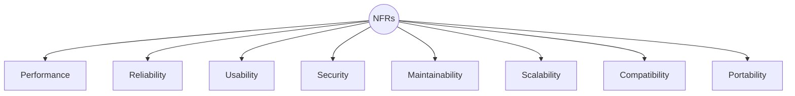
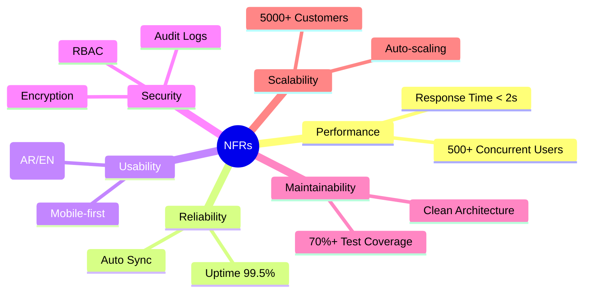
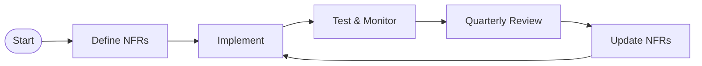

# ⚙️ Non-Functional Requirements & Quality / المتطلبات غير الوظيفية والجودة

> **Project:** CA Admin  
> **Version:** v0.1 — Owner: Abdullah Alshaif  
> **Last Updated:** 2025-09-08

---

## 1. Introduction / المقدمة

**EN:**
Non-functional requirements (NFRs) define the **quality attributes** of the CA Admin system, including performance, reliability, usability, security, and maintainability. These ensure the system is practical, stable, and user-friendly.

**AR:**
المتطلبات غير الوظيفية تحدد **سمات الجودة** لنظام CA Admin مثل الأداء، الموثوقية، سهولة الاستخدام، الأمان، وقابلية الصيانة. وهي تضمن أن يكون النظام عمليًا ومستقرًا وسهل الاستخدام.

---

## 2. Visual Quality Map / خريطة جودة بصرية

---

## 3. NFR Mindmap / خريطة ذهنية للمتطلبات غير الوظيفية

---

## 4. NFRs vs Functional Requirements / الفرق بين المتطلبات غير الوظيفية والمتطلبات الوظيفية

| Aspect     | Functional Requirements (FRs) / المتطلبات الوظيفية | Non-Functional Requirements (NFRs) / المتطلبات غير الوظيفية |
| ---------- | -------------------------------------------------- | ----------------------------------------------------------- |
| Definition | What the system does (features, use cases)         | How the system should be (quality, performance, security)   |
| Example    | Place order, generate report                       | Response < 2s, 99.5% uptime, bilingual UI                   |
| Validation | User acceptance tests, feature demos               | Performance tests, monitoring, user feedback                |

---

## 5. Quality Review Cycle / دورة مراجعة الجودة

---

## 6. Performance / الأداء

- **EN:** System must handle at least **500 concurrent users** with < 2s response time.
- **AR:** يجب أن يدعم النظام **500 مستخدم متزامن** بزمن استجابة أقل من ثانيتين.
- **EN:** Firestore queries should return results within **500ms** for indexed fields.
- **AR:** يجب أن تعود استعلامات Firestore بالنتائج خلال **500 مللي ثانية** للحقول المفهرسة.

---

## 7. Reliability & Availability / الموثوقية والتوافر

- **EN:** System uptime target: **99.5%**.
- **AR:** الهدف أن يكون النظام متاحًا بنسبة **99.5%**.
- **EN:** Automatic sync and conflict resolution ensures no data loss during outages.
- **AR:** المزامنة التلقائية وحل التعارض يضمنان عدم فقدان البيانات أثناء الانقطاعات.

---

## 8. Usability / سهولة الاستخدام

- **EN:** Support **Arabic & English** with automatic **RTL/LTR** switching.
- **AR:** دعم **العربية والإنجليزية** مع التبديل التلقائي بين **RTL/LTR**.
- **EN:** Mobile-first design optimized for Android/iOS mid-range devices.
- **AR:** تصميم يعتمد **الهاتف أولاً** ومناسب لأجهزة Android/iOS المتوسطة.
- **EN:** Max 3 steps to complete main workflows (place order, track shipment, record payment).
- **AR:** لا تزيد الخطوات الرئيسية (إنشاء طلب، تتبع شحنة، تسجيل دفعة) عن 3 خطوات.

---

## 9. Security / الأمان

- **EN:** Role-Based Access Control (RBAC) with Firebase Custom Claims.
- **AR:** تحكم في الصلاحيات عبر **RBAC** باستخدام Firebase Custom Claims.
- **EN:** All data encrypted in transit (TLS 1.2+) and at rest.
- **AR:** تشفير جميع البيانات أثناء النقل (TLS 1.2+) وأثناء التخزين.
- **EN:** Audit logs maintained for all financial and role-related actions.
- **AR:** الاحتفاظ بسجلات تدقيق لجميع العمليات المالية والمتعلقة بالصلاحيات.

---

## 10. Maintainability / قابلية الصيانة

- **EN:** Codebase follows **Clean Architecture** with layered separation.
- **AR:** يعتمد الكود على **Clean Architecture** مع فصل الطبقات.
- **EN:** Unit and integration tests must cover **≥ 70%** of business logic.
- **AR:** يجب أن تغطي اختبارات الوحدة والتكامل **70% على الأقل** من منطق الأعمال.
- **EN:** All APIs and modules documented in `/docs`.
- **AR:** توثيق جميع الـ APIs والوحدات في مجلد `/docs`.

---

## 11. Scalability / القابلية للتوسع

- **EN:** System should support scaling to **5000+ active customers** without redesign.
- **AR:** يجب أن يدعم النظام **5000+ عميل نشط** دون الحاجة لإعادة تصميم.
- **EN:** Use Firebase auto-scaling for Firestore and Functions.
- **AR:** استخدام خاصية **التوسع التلقائي** في Firestore و Functions.

---

## 12. ISO/IEC 25010 Quality Attributes / سمات الجودة (ISO/IEC 25010)

| Attribute (EN)         | الصفة (AR)        | Target / الهدف                         |
| ---------------------- | ----------------- | -------------------------------------- |
| Functional Suitability | الملاءمة الوظيفية | Cover 100% of documented use cases     |
| Performance Efficiency | كفاءة الأداء      | < 2s response time                     |
| Compatibility          | التوافقية         | Android/iOS, future Web/Desktop        |
| Usability              | سهولة الاستخدام   | Bilingual UI, intuitive design         |
| Reliability            | الموثوقية         | 99.5% uptime                           |
| Security               | الأمان            | RBAC + encryption                      |
| Maintainability        | قابلية الصيانة    | Clean Architecture + 70% test coverage |
| Portability            | قابلية النقل      | Flutter cross-platform                 |

---

## 13. Best Practices & FAQ / أفضل الممارسات وأسئلة شائعة

- Document NFRs early and review them with all stakeholders.
- Validate NFRs during [Test Plan](../11-test-plan/11-test-plan.md) execution.
- Monitor system metrics (performance, uptime, errors) continuously.
- Update NFRs if [Architecture](../06-architecture/06-architecture.md) changes.
- Review NFRs and quality targets quarterly.

### Q: ما الفرق بين المتطلبات الوظيفية وغير الوظيفية؟

**A:**

- المتطلبات الوظيفية تصف ماذا يفعل النظام (features, use cases).
- المتطلبات غير الوظيفية تصف كيف يجب أن يعمل النظام (جودة، أداء، أمان).

### Q: كيف أتحقق من تحقيق NFRs؟

**A:**

- عبر اختبارات الأداء، مراجعة السجلات، واستبيانات المستخدمين.

---

## 14. Example Scenario / سيناريو عملي

**EN:**

> During UAT, the team tests the app with 500 simulated users. All main workflows complete in <2s, and the system remains stable. The NFRs for performance and reliability are validated.

**AR:**

> أثناء اختبار القبول، يتم اختبار التطبيق مع 500 مستخدم افتراضي. جميع العمليات الأساسية تكتمل في أقل من ثانيتين ويبقى النظام مستقرًا، ما يؤكد تحقق متطلبات الأداء والموثوقية.

---

## 15. Advanced Quality Tips / نصائح جودة متقدمة

- استخدم أدوات مراقبة الأداء (Performance Monitoring) من Firebase أو Google Cloud.
- أنشئ تقارير جودة دورية وشاركها مع فريق العمل.
- اربط كل NFR بمؤشر أداء (KPI) واضح.
- راجع نتائج اختبارات الأداء بعد كل تحديث رئيسي.

---
