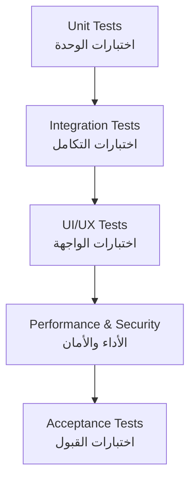

# 🧪 Test Plan / خطة الاختبار

> **Project:** CA Admin  
> **Version:** v0.1 — Owner: Abdullah Alshaif  
> **Last Updated:** 2025-09-08

---

## 1. Introduction / المقدمة

  

**EN:**
The Test Plan ensures that CA Admin meets both **functional requirements (Use Cases)** and **non-functional requirements (NFRs)**. It defines the scope, strategy, test types, environments, and acceptance criteria.

**AR:**
تضمن خطة الاختبار أن يلبي نظام CA Admin **المتطلبات الوظيفية (Use Cases)** و **غير الوظيفية (NFRs)**. تحدد نطاق الاختبار، الاستراتيجية، أنواع الاختبارات، بيئات التنفيذ، ومعايير القبول.

---

## 2. Test Pyramid / هرم الاختبار

---

## 3. Test Objectives / أهداف الاختبار

- **EN:** Verify functionality, performance, security, and usability.
- **AR:** التحقق من الوظائف، الأداء، الأمان، وسهولة الاستخدام.

---

## 4. Scope / نطاق الاختبار

**In-Scope / ضمن النطاق:**
- Orders: creation, update, status tracking
- Shipments: status updates, driver assignments
- Finance: payments, deposits, deductions, reports
- User Management: roles & permissions (RBAC)
- Offline Sync & Conflict resolution

**Out-of-Scope / خارج النطاق:**
- Payment Gateway integrations (future phases)
- AI/Analytics modules

---

## 5. Test Types / أنواع الاختبارات

| Test Type (EN)      | النوع (AR)         | Purpose / الهدف |
|---------------------|--------------------|-----------------|
| Unit Tests          | اختبارات الوحدة    | Validate individual functions (e.g., calculations) |
| Integration Tests   | اختبارات التكامل   | Validate modules working together (Orders ↔ Finance ↔ Shipments) |
| UI/UX Tests         | اختبارات الواجهة   | Ensure user-friendly experience (multi-language, RTL/LTR) |
| Performance Tests   | اختبارات الأداء    | Validate response time, load handling |
| Security Tests      | اختبارات الأمان    | Validate RBAC, Security Rules |
| Acceptance Tests    | اختبارات القبول    | Validate against Use Cases & User Stories |

---

## 6. Test Environments / بيئات الاختبار

- **Development Environment:** Firebase Emulator Suite + Local DB (Hive/SQLite)
- **Staging Environment:** Firebase test project with sample data
- **Production Environment:** Live Firebase project (with restricted access)

---

## 7. Test Data / بيانات الاختبار

**EN:**
Test data includes dummy customers, orders, shipments, and financial records. Sensitive data must not be used in testing.

**AR:**
تتضمن بيانات الاختبار عملاء وهميين، طلبات، شحنات، وسجلات مالية. يُمنع استخدام بيانات حساسة أثناء الاختبار.

---

## 8. Acceptance Criteria / معايير القبول

- **Orders:** Must be created in ≤ 60s, status updated correctly.
- **Shipments:** Driver updates must reflect to customers in ≤ 2 min.
- **Finance:** Balances reconciled automatically, reports generated weekly.
- **NFRs:**
  - Response time < 2s
  - Uptime ≥ 99.5%
  - Multi-language UI works correctly

---

## 9. Test Schedule / جدول الاختبار

- **Unit Testing:** Continuous during development
- **Integration Testing:** End of each sprint
- **System Testing:** Before release candidate
- **User Acceptance Testing (UAT):** By stakeholders before final release

---

## 10. RACI Matrix / مصفوفة المسؤوليات

| Task / المهمة                | Developers | QA/Test Engineer | IT Manager | Finance Officer | Saudi/Yemen Staff |
|-----------------------------|:----------:|:---------------:|:----------:|:--------------:|:----------------:|
| Write unit/integration tests |     R      |        C        |     I      |       I        |        I         |
| Execute test plan            |     C      |        R        |     A      |       C        |        C         |
| Oversee testing strategy     |     I      |        C        |     R      |       I        |        I         |
| Validate financial cases     |     I      |        C        |     I      |       R        |        I         |
| Validate order/shipment      |     I      |        C        |     I      |       I        |        R         |

Legend: R = Responsible, A = Accountable, C = Consulted, I = Informed

---

## 11. Tools / الأدوات

- **Flutter Test** → Unit & integration testing
- **Mockito** → Mock dependencies
- **Firebase Emulator Suite** → Firestore/Auth/Functions local testing
- **Postman** → API testing
- **GitHub Actions** → CI/CD automated tests

---

## 12. Risk & Mitigation / المخاطر والمعالجات

- **Data conflicts in offline sync** → Use audit logs + conflict resolution
- **Uncovered edge cases** → Expand regression testing
- **Security gaps** → Continuous pen-testing & rule validation

---

## 13. Notes / ملاحظات

- Test results must be documented and linked with [Use Cases](../04-use-cases/04-use-cases.md) & [NFRs](../10-nfr-and-quality/10-nfr-and-quality.md)
- Bugs must be logged with severity level (Critical, High, Medium, Low)
- Test coverage target: **≥ 70% business logic**

---
