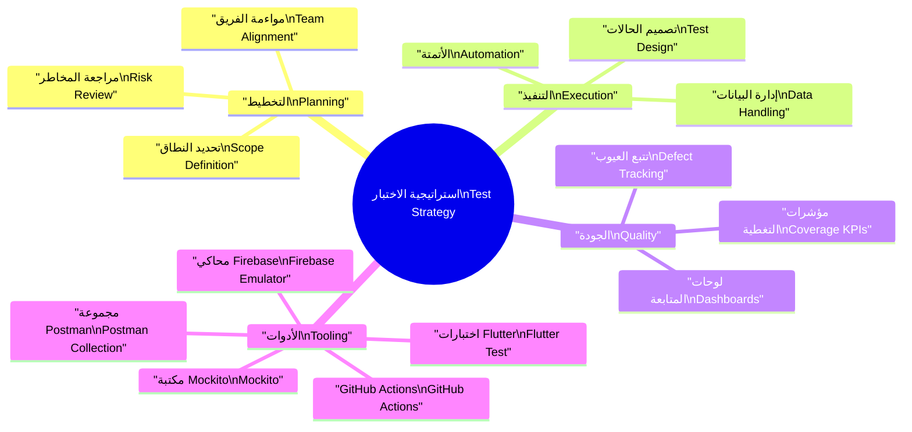
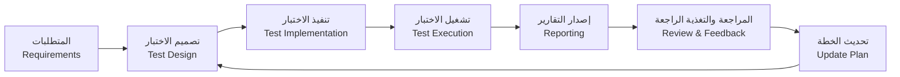

# 🧪 خطة الاختبار | Test Plan

| العنصر  | التفاصيل                                                                                                                                            |
| ------- | --------------------------------------------------------------------------------------------------------------------------------------------------- |
| المنتج  | منصة الوساطة الشرائية CA Admin CA Admin Shopping Mediation Platform                                                                              |
| الإصدار | 0.1 – آخر تحديث 2025-09-08 – المالك: عبدالله الشائف Version 0.1 – Last updated 2025-09-08 – Owner: Abdullah Alshaif                              |
| الهدف   | ضمان تغطية المتطلبات الوظيفية وغير الوظيفية مع رفع ثقة الإصدار Ensure functional and non-functional coverage while increasing release confidence |

> 🔑 **الخلاصة السريعة:** توضح الخطة كيف نختبر المنصة، من تحديد النطاق إلى التقارير، مع ربط كل اختبار بالمتطلبات والمعايير الجودة.
> 🔑 **Quick Summary:** Shows how the platform is tested, from scope to reporting, binding every test to requirements and quality metrics.

---

## 1. نظرة عامة | Overview

- 🧭 توضح الخطة نطاق الاختبارات والافتراضات والقيود قبل بدء التنفيذ.
  🧭 Explains scope, assumptions, and constraints before execution begins.
- 🎯 تربط الاختبارات بالمتطلبات الموثقة لضمان تغطية قابلة للقياس.
  🎯 Links tests to documented requirements to guarantee measurable coverage.
- 🧠 تنشئ لغة مشتركة بين الفرق حول المصطلحات، الأدوار، وإيقاعات التسليم.
  🧠 Creates a shared language across teams regarding vocabulary, roles, and cadence.

---

## 2. استراتيجية الاختبار المرئية | Visual Test Strategy

> 🧭 يوضح المخطط مسارات التخطيط والتنفيذ ومراقبة الجودة والأدوات الداعمة.
> 🧭 Diagram highlights planning, execution, quality monitoring, and tool support tracks.

---

## 3. فريق وإيقاع الاختبارات | Team & Cadence

| الدور Role                          | المسؤوليات Responsibilities                                                                                                         | الإيقاع Cadence                                                                            |
| ----------------------------------- | ----------------------------------------------------------------------------------------------------------------------------------- | ------------------------------------------------------------------------------------------ |
| 🧑‍💻 قائد الاختبار Test Lead       | تنسيق النطاق، إدارة المخاطر، إعداد التقارير التنفيذية. Coordinate scope, manage risks, prepare executive reports.                | اجتماع مراجعة أسبوعي + تقرير نهائي بعد كل دورة. Weekly review + final report per cycle. |
| 🧑‍🔬 مهندس ضمان الجودة QA Engineer | تصميم الحالات، تنفيذ الاختبارات، توثيق العيوب، دعم الأتمتة. Design cases, execute tests, log defects, support automation.        | جلسة يومية لمتابعة التنفيذ. Daily execution sync.                                       |
| 👩‍💻 مطور التطبيق Developer        | دعم إصلاح العيوب، بناء اختبارات الوحدة، تحديث سيناريوهات CI. Fix defects, build unit tests, update CI scenarios.                 | Stand-up يومي + مراجعة بعد كل إصدار. Daily stand-up + post-release review.              |
| 📊 محلل الأعمال Business Analyst | توثيق التوقعات، مراجعة نتائج UAT، اعتماد معايير القبول. Document expectations, review UAT outcomes, approve acceptance criteria. | مراجعة كل إصدار رئيسي. Per major release.                                               |
| 🛡️ مسؤول الأمن Security Officer  | تقييم اختبارات الاختراق ومراجعة نتائج RBAC والتشفير. Assess penetration tests and review RBAC/encryption results.                | ربع سنوية أو عند تغييرات حساسة. Quarterly or after critical changes.                    |

---

## 4. قائمة الاختبارات المستهدفة | Target Test Suite

| النوع Type                               | الهدف Objective                                                                                                             | الأدوات Tools                                                             | التغطية Coverage                                                                                            |
| ---------------------------------------- | --------------------------------------------------------------------------------------------------------------------------- | ------------------------------------------------------------------------- | ----------------------------------------------------------------------------------------------------------- |
| ✅ اختبارات الوحدة Unit Tests         | التحقق من سلوك الوظائف الصغيرة والمكونات المنعزلة. Verify small functions and isolated components.                       | Flutter Test، Mockito. Flutter Test, Mockito.                          | تغطية 70% على الأقل لكل وحدة أساسية. ≥70% coverage for core modules.                                     |
| 🔗 اختبارات التكامل Integration Tests | التأكد من تفاعل الوحدات API/Firestore والمخازن المحلية. Ensure modules integrate correctly (API/Firestore/local stores). | Firebase Emulator، Mock Services. Firebase Emulator, mock services.    | جميع تدفقات CRUD الأساسية + السيناريوهات الحساسة. All CRUD flows + critical scenarios.                   |
| 👣 اختبارات قابلة للاستخدام UX Tests  | تقييم سهولة الاستخدام ثنائي اللغة وقابلية الوصول. Assess bilingual UX and accessibility.                                 | جلسات UX، أدوات تتبع السلوك. UX sessions, behavioural tracking.        | كل رحلة حاسمة باللغتين. Every critical journey in both languages.                                        |
| 🧪 اختبارات الأداء Performance Tests  | قياس سلوك المنصة تحت الحمل والتزام NFR. Measure platform under load against NFR targets.                                 | k6، Cloud Monitoring. k6, Cloud Monitoring.                            | 500 مستخدم متزامن + 2s SLA للرحلات الأساسية. 500 concurrent users + 2s SLA for core flows.               |
| 🔐 اختبارات الأمن Security Tests      | مراجعة RBAC، التشفير، ونقاط الضعف القياسية. Review RBAC, encryption, and standard vulnerabilities.                       | OWASP ZAP، أدوات اختراق داخلية. OWASP ZAP, internal penetration tools. | تغطية قوائم OWASP Top 10 + سيناريوهات الأدوار الحساسة. OWASP Top 10 plus sensitive role scenarios.       |
| ✅ اختبارات القبول Acceptance Tests   | التحقق النهائي من المتطلبات قبل الإطلاق العملي. Final verification of requirements before go-live.                       | قائمة قبول UAT، تقارير الأعمال. UAT checklist, business reports.       | جميع المتطلبات الوظيفية وغير الوظيفية المعتمدة. All approved functional and non-functional requirements. |

---

## 5. تتبع المتطلبات والحالات | Requirement Traceability

| المطلب Requirement                               | حالات الاختبار Test Cases                  | المالك Owner     | الحالة Status |
| ------------------------------------------------ | ------------------------------------------ | ---------------- | ------------- |
| 🚀 تقديم الطلب Place Order                    | TC-01، TC-02، TC-03 TC-01, TC-02, TC-03 | QA Engineer      | مُغطى Covered |
| 🔄 تحديث حالة الطلب Update Order Status       | TC-04، TC-05 TC-04, TC-05               | QA Engineer      | مُغطى Covered |
| 🔐 التحكم بالوصول RBAC                        | TC-10، TC-11 TC-10, TC-11               | Security Officer | مُغطى Covered |
| ⚡ زمن الاستجابة < 2 ثوانٍ Response Time < 2s | TC-20                                      | Performance Lead | مُغطى Covered |
| 🌐 الواجهة متعددة اللغات Multi-language UI    | TC-21، TC-22 TC-21, TC-22               | UX Lead          | مُغطى Covered |

---

## 6. مسار عملية الاختبار | Test Process Flow

> 🔄 يوضح الرسم دورة حياة الاختبار من جمع المتطلبات إلى تحسين الخطة.
> 🔄 Diagram outlines the lifecycle from requirements intake to plan refinement.

---

## 7. مصفوفة أنواع الاختبارات مقابل المتطلبات | Test Types vs Requirements

| نوع الاختبار Test Type           | التغطية الوظيفية Functional Coverage | التغطية غير الوظيفية NFR Coverage | الملاحظات Notes                                                                           |
| -------------------------------- | ------------------------------------ | --------------------------------- | ----------------------------------------------------------------------------------------- |
| 🧪 وحدة Unit                  | نعم Yes                              | لا No                             | يتحقق من منطق الوحدة قبل الدمج. Validates unit logic before integration.               |
| 🔗 تكامل Integration          | نعم Yes                              | جزئي Partial                      | يضمن سلامة التفاعل بين الوحدات. Ensures module interaction integrity.                  |
| 👀 قابلية الاستخدام Usability | محدود Limited                        | نعم Yes                           | يقيّم تجربة المستخدم ووضوح الواجهات. Measures UX clarity and accessibility.            |
| ⚡ أداء Performance           | لا No                                | نعم Yes                           | يقيس السرعة تحت حمل متزايد. Measures speed under load.                                 |
| 🔐 أمن Security               | لا No                                | نعم Yes                           | يفحص الثغرات ويثبت امتثال RBAC. Checks vulnerabilities and RBAC compliance.            |
| ✅ قبول Acceptance            | نعم Yes                              | نعم Yes                           | يضمن تحقيق المتطلبات النهائية قبل الإصدار. Confirms final requirements before release. |

---

## 8. أفضل الممارسات والأسئلة الشائعة | Best Practices & FAQ

### أفضل الممارسات Best Practices

- 📘 وثّق التوقعات غير الوظيفية مبكرًا وشاركها مع الأطراف المعنية.
  📘 Document NFR expectations early and share with stakeholders.
- 🔄 ابنِ الاختبارات من قصص المستخدم وخريطة الفهارس لضمان التغطية.
  🔄 Build tests from user stories and index map to ensure coverage.
- 📊 راقب مؤشرات الجودة عبر لوحات محدثة باستمرار.
  📊 Monitor quality metrics via continuously updated dashboards.
- 🏛️ راجع خطة الاختبار بعد كل تغيير معماري جوهري.
  🏛️ Review the plan after every major architectural change.
- 🗓️ نفّذ مراجعة ربع سنوية لتقييم النتائج مقابل الأهداف.
  🗓️ Conduct a quarterly review comparing outcomes with targets.

### الأسئلة الشائعة Frequently Asked Questions

| السؤال Question                                                         | الإجابة Answer                                                                                                                                  |
| ----------------------------------------------------------------------- | ----------------------------------------------------------------------------------------------------------------------------------------------- |
| ❓ كيف نضيف متطلب اختبار جديد؟ How do we add a new test requirement? | اربط الطلب بقصة مستخدم أو NFR محدد، ثم أضف حالة في جدول التتبع. Link it to a user story or NFR, then add the case to the traceability table. |
| ❓ متى نراجع الخطة بالكامل؟ When do we review the entire plan?       | بعد الإصدارات الكبيرة، الحوادث الحرجة، أو تحديثات البنية التحتية. After major releases, critical incidents, or infrastructure updates.       |

> 📝 مثال تطبيقي: أثناء UAT، أكمل 500 مستخدم مسار الطلب والدفع في أقل من 2 ثانية مع صفر أخطاء، ما أكد صحة أهداف الأداء والاعتمادية.
> 📝 Practical example: During UAT, 500 users completed order and payment journeys under 2 seconds with zero defects, confirming performance and reliability goals.

---
