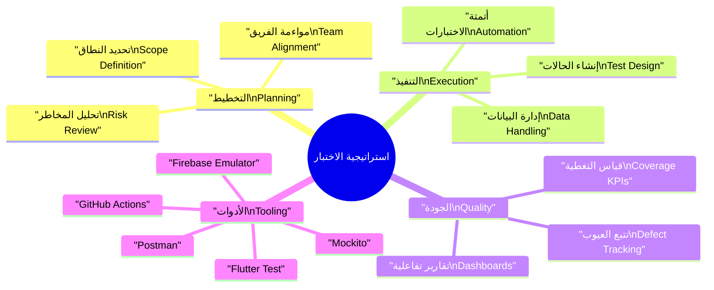
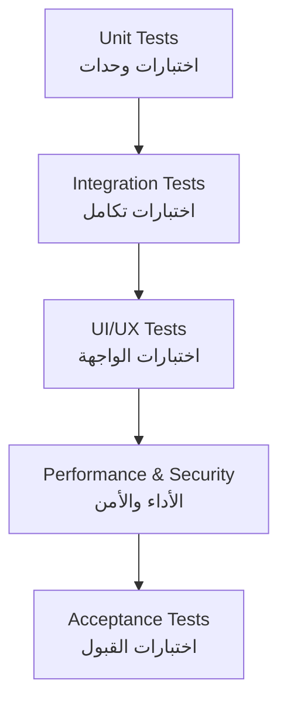
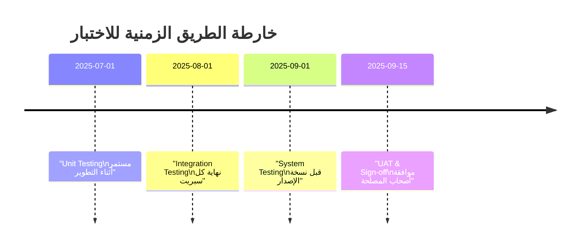
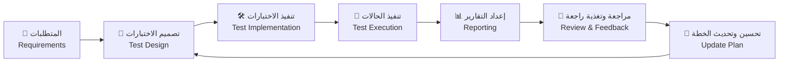

# 🧪 خطة الاختبار | Test Plan

> | 🔖  | البيان                         | Details          |
> | --- | ------------------------------ | ---------------- |
> | 🧾  | **النظام / Project**           | CA Admin         |
> | 🧑‍💼  | **مالك المستند / Owner**       | Abdullah Alshaif |
> | 🏷️  | **الإصدار / Version**          | v0.1             |
> | 📅  | **تاريخ الإنشاء / Created On** | 2025-09-08       |
> | 🔁  | **آخر تحديث / Last Updated**   | 2025-09-08       |

**الملخص التنفيذي | Executive Summary:**  
توثق هذه الخطة آليات اختبار نظام CA Admin لضمان تحقيق المتطلبات الوظيفية (Use Cases) وغير الوظيفية (NFRs)، مع التركيز على الجودة، الاستقرار، وتجربة المستخدم.  
**Summary (EN):** This document explains how the system is tested to ensure all functional and non-functional requirements are met, driving higher release confidence and product quality.

---

## 🌟 مقدمة | Introduction

تضمن خطة الاختبار أن يلبي نظام CA Admin توقعات العملاء وفريق العمل عبر تعريف نطاق الاختبار، منهجيته، البيئات، والأدوات المستخدمة، إضافةً إلى معايير القبول والتتبع.  
The Test Plan ensures that CA Admin aligns with both business expectations and technical constraints by aligning scope, strategy, environments, and acceptance criteria.

- 🎯 تحدد مسؤوليات كل فريق وتوقيت تنفيذ الاختبارات (Clarifies ownership and cadence).
- 🧭 تربط حالات الاختبار بالمتطلبات لضمان التغطية الشاملة (Connects tests to requirements for coverage).
- 🤝 توفر لغة مشتركة بين المطور، المختبر، ومحلل الأعمال (Creates a shared language across roles).

---

## 🧭 استراتيجية الاختبار المرئية | Visual Test Strategy

**الخلاصة المختصرة | Quick View:**  
تصوير شامل لعناصر الاستراتيجية، من التخطيط وحتى القياس والتحسين.

- 🗺️ التخطيط: تحديد النطاق، تقسيم الجهد، وإبراز المخاطر الأولية.
- ⚙️ التنفيذ: بناء حالات الاختبار، تهيئة البيانات، وضمان الاتساق عبر الأتمتة.
- 📊 الجودة: مراقبة المؤشرات، تحليل العيوب، ومشاركة التقارير مع أصحاب المصلحة.
- 🛠️ الأدوات: اختيار الأدوات الملائمة لمستوى الاختبار (وحدات، تكامل، أداء، أمن).

---

## ⛰️ هرم الاختبار | Test Pyramid

**الخلاصة المختصرة | Quick View:**  
يوضح تسلسل أنواع الاختبارات من الأساسيات إلى القبول النهائي.

- 🔧 **Unit Tests:** تغطي وظائف الوحدات المنفصلة وتمنع الانحدارات المبكرة.
- 🔗 **Integration Tests:** تتحقق من تماسك الخدمات (طلبات، شحنات، مالية).
- 🖥️ **UI/UX Tests:** تضمن تجربة مستخدم متسقة ودعم لغات متعددة.
- 🚀 **Performance & Security:** تتحقق من مؤشرات NFR مثل السرعة، الثبات، و RBAC.
- ✅ **Acceptance Tests:** تثبت توافق الحل مع توقعات العمل وأصحاب المصلحة.

---

## 🎯 أهداف الاختبار | Test Objectives

| 🎯 الهدف (AR)      | Goal (EN)                 | الوصف المختصر                                       | الفائدة العملية                                       |
| ------------------ | ------------------------- | --------------------------------------------------- | ----------------------------------------------------- |
| التحقق الوظيفي     | Functional Validation     | التأكد من تنفيذ حالات الاستخدام الأساسية بدقة.      | يمنع أعطال الإنتاج ويدعم ثقة المستخدم.                |
| الاعتمادية والأداء | Reliability & Performance | قياس الاستجابة، الاستقرار، وتحمل الضغط.             | يحمي التجربة في أوقات الذروة ويحسن الاحتفاظ بالعملاء. |
| الأمن والامتثال    | Security & Compliance     | تدقيق صلاحيات RBAC وسلامة البيانات.                 | يقلل المخاطر القانونية ويضمن سرية المعلومات.          |
| قابلية الاستخدام   | Usability                 | مراقبة تجربة المستخدم، تعدد اللغات، وقابلية الوصول. | يسهل اعتماد النظام من قبل فرق التشغيل والعملاء.       |

---

## 🗺️ النطاق | Scope

**الخلاصة المختصرة:**  
تحديد ما سيتم اختباره وما سيتم تأجيله للإصدارات المستقبلية.

### ✅ ضمن النطاق | In-Scope

- 🧾 الطلبات: إنشاء الطلب، تحديث حالته، وتتبع حالته (Orders: creation, updates, status tracking).
- 🚚 الشحنات: تحديثات السائق، مخطط التوزيع، إشعارات العملاء (Shipments: driver updates, assignments, notifications).
- 💰 المالية: المدفوعات، الإيداعات، الحسميات، التقارير (Finance: payments, deposits, deductions, reports).
- 👥 إدارة المستخدمين: الأدوار، الصلاحيات، RBAC (User Management: roles & permissions).
- 🔄 المزامنة دون اتصال: حل التعارضات وسجلات التدقيق (Offline sync & conflict resolution).

### 🚫 خارج النطاق | Out-of-Scope

- 💳 تكاملات بوابات الدفع للمرحلة القادمة (Payment gateway integrations - future phase).
- 📊 وحدات الذكاء الاصطناعي والتحليلات (AI/Analytics modules).

---

## 🧪 أنواع الاختبار | Test Types

**الخلاصة المختصرة:**  
جميع أنواع الاختبارات المستخدمة والهدف من كل منها.

| النوع (AR)            | Test Type (EN)    | الغرض المختصر                                    | أدوات رئيسية                    |
| --------------------- | ----------------- | ------------------------------------------------ | ------------------------------- |
| اختبارات وحدات        | Unit Tests        | التحقق من وظائف الوحدة أو الدالة منفردة.         | Flutter Test, Mockito           |
| اختبارات تكامل        | Integration Tests | التحقق من تفاعل الوحدات (طلبات ↔ مالية ↔ شحنات). | Flutter Test, Firebase Emulator |
| اختبارات واجهة وتجربة | UI/UX Tests       | ضمان تسلسل الواجهة، الترجمة، وإمكانية الوصول.    | Flutter Driver, Golden Tests    |
| اختبارات أداء         | Performance Tests | قياس زمن الاستجابة وحدود التحمل.                 | Firebase Emulator, k6/Postman   |
| اختبارات أمن          | Security Tests    | مراجعة RBAC، الحماية من الوصول غير المصرح.       | OWASP ZAP Scripts, Rules Audit  |
| اختبارات قبول         | Acceptance Tests  | مصادقة أصحاب المصلحة على السيناريوهات الحرجة.    | Checklists, UAT Sessions        |

---

## 🧱 بيئات الاختبار | Test Environments

| البيئة (AR)  | Environment (EN) | المكونات الرئيسية                          | الغرض                           | سياسة البيانات                    |
| ------------ | ---------------- | ------------------------------------------ | ------------------------------- | --------------------------------- |
| بيئة التطوير | Development      | Firebase Emulator Suite + Hive/SQLite محلي | اختبارات وحدات وتكامل مبكرة     | بيانات وهمية بالكامل              |
| بيئة التدريج | Staging          | مشروع Firebase تجريبي مع عينات بيانات      | اختبارات تكامل/قبول قبل الإطلاق | بيانات شبه حقيقية مع إخفاء الهوية |
| بيئة الإنتاج | Production       | مشروع Firebase فعلي (وصول مقيد)            | اختبارات مراقبة بعد الإطلاق     | بيانات حقيقية بإذن صريح           |

---

## 🗃️ بيانات الاختبار | Test Data

- 🧑‍🤝‍🧑 عملاء وسائقون افتراضيون بأدوار وصلاحيات متعددة (Dummy customers & drivers with role variations).
- 📦 طلبات وشحنات تغطي حالات النجاح والفشل (Orders & shipments covering happy/sad paths).
- 💳 سجلات مالية لمحاكاة الإيداع، الخصم، والتسوية (Financial records mirroring deposit/deduction flows).
- 🔐 يمنع استخدام بيانات حساسة؛ يتم توليد البيانات عبر سكريبتات مهيأة (No production data; generated via scripted fixtures).

---

## ✅ معايير القبول | Acceptance Criteria

| الوحدة / المجال        | معايير النجاح (AR)                                                  | Acceptance Criteria (EN)                                                 |
| ---------------------- | ------------------------------------------------------------------- | ------------------------------------------------------------------------ |
| الطلبات                | إنشاء الطلب خلال ≤ 60 ثانية وتحديث الحالة فورًا.                    | Orders must be created in ≤ 60s and reflect status changes instantly.    |
| الشحنات                | انعكاس تحديثات السائق للعملاء خلال ≤ 2 دقائق.                       | Driver updates propagate to customers within ≤ 2 minutes.                |
| المالية                | تسوية الأرصدة تلقائيًا وتوليد تقرير أسبوعي.                         | Balances auto-reconcile and weekly reports generate without errors.      |
| المتطلبات غير الوظيفية | زمن الاستجابة < 2 ثانية، التوافر ≥ 99.5%، تعدد اللغات يعمل بالكامل. | Response time < 2s, uptime ≥ 99.5%, multilingual UI functions correctly. |

---

## 🗓️ جدول الاختبارات | Test Schedule

**الخلاصة المختصرة:**  
توزيع الأنشطة عبر الدورة التطويرية.

- 🛠️ اختبارات الوحدات تتم باستمرار مع كل فرع تطوير.
- 🔄 اختبارات التكامل تعقد في نهاية كل سبريت مع مراجعة البيانات.
- 🧪 اختبارات النظام والأداء تسبق مرشح الإصدار (RC).
- 🤝 جلسات UAT تقاد مع أصحاب المصلحة قبل الإطلاق الرسمي.

---

## 🧩 مصفوفة RACI | RACI Matrix

| المهمة / Task                     | 👩‍💻 التطوير | 🧪 قائد الاختبار | 🧭 مدير المنتج | 💰 خبير مالي | 🚚 ممثل العمليات |
| --------------------------------- | ---------- | ---------------- | -------------- | ------------ | ---------------- |
| كتابة اختبارات الوحدات والتكامل   | R          | C                | I              | I            | I                |
| تنفيذ خطة الاختبار والتقارير      | C          | R/A              | C              | C            | C                |
| توجيه الاستراتيجية وإقرار الإصدار | I          | C                | A              | I            | I                |
| تدقيق السيناريوهات المالية        | I          | C                | I              | R            | I                |
| التحقق من حالات الطلب والشحن      | I          | C                | I              | I            | R                |

Legend: R = Responsible, A = Accountable, C = Consulted, I = Informed.

---

## 🛠️ الأدوات | Tools

- 🧪 **Flutter Test:** اختبارات الوحدات ومكونات الواجهة.
- 🧙 **Mockito:** محاكاة الخدمات الخارجية والعزل.
- 🔥 **Firebase Emulator Suite:** محاكاة Firestore/Auth/Functions بأمان.
- 📬 **Postman + Newman:** التحقق من واجهات REST والأعباء.
- 🤖 **GitHub Actions:** تشغيل خطوط CI/CD وتشغيل الاختبارات الآلية.
- 📈 **Allure / Custom Dashboards:** عرض النتائج ومؤشرات التغطية.

---

## ⚠️ المخاطر وخطط التخفيف | Risk & Mitigation

| الخطر (AR)                 | Risk (EN)              | التأثير                        | خطة التخفيف                                                        |
| -------------------------- | ---------------------- | ------------------------------ | ------------------------------------------------------------------ |
| تعارضات المزامنة دون اتصال | Offline Sync Conflicts | فقدان بيانات أو تكرار سجلات    | سجلات تدقيق، استراتيجيات حل تلقائي، مراجعة يدوية للحالات الحرجة.   |
| قصور تغطية الحالات الحدية  | Missing Edge Cases     | ثغرات إنتاجية وتأخر في الإصلاح | توسيع اختبارات الانحدار، مراجعات أقران، اختبارات استكشافية مجدولة. |
| ثغرات وصول أو صلاحيات      | RBAC Gaps              | مخاطر أمنية وتدقيق سلبي        | اختبارات اختراق دورية، قوائم تحقق أمان، مراجعة قواعد الصلاحيات.    |

---

## 🚀 نصائح اختبار متقدمة | Advanced Testing Tips

- 🤖 أتمِت اختبارات الانحدار والدخان مع كل إصدار فرعي.
- 📊 استخدم أدوات التغطية لتتبع نسبة تغطية المنطق التجاري (≥ 70%).
- 🔗 اربط حالات الاختبار مباشرة بـ [حالات الاستخدام](../04-use-cases/04-use-cases.md) و[المتطلبات غير الوظيفية](../10-nfr-and-quality/10-nfr-and-quality.md).
- 📣 شارك النتائج وتوصيات التحسين مع أصحاب المصلحة بعد كل سبريت.
- 🧵 حافظ على توثيق بيانات الاختبار ومصدرها لتسهيل إعادة الاستخدام.

---

## 💬 الأسئلة الشائعة | FAQ

### ما الفرق بين اختبار الوحدات واختبار التكامل؟

- اختبار الوحدات يركز على وظيفة أو وحدة واحدة ومعزولة (Unit testing focuses on a single function or module).
- اختبار التكامل يتحقق من التفاعل بين أكثر من وحدة لضمان تكامل العمل (Integration testing checks interaction between multiple modules).

### كيف أضمن تغطية اختبار كافية؟

- استخدم أدوات التغطية واستهدف ≥ 70% من منطق الأعمال (Use coverage tools and target ≥ 70% of business logic).
- راجع حالات الاستخدام ومتطلبات NFR للتأكد من وجود حالة اختبار مقابلة لكل نقطة (Map tests to each Use Case and NFR).

### متى تُنفذ اختبارات الأداء والأمن؟

- تُنفذ في نهاية كل دورة تطوير رئيسية وقبل الإصدار النهائي (Performed at the end of each major development cycle and before final release).
- يتم تشغيل اختبارات مراقبة خفيفة بعد الإطلاق لملاحظة أي انحرافات (Lightweight monitoring tests continue post-release to catch regressions).

---

## 🧭 مصفوفة تتبع الاختبار | Test Traceability Matrix

| المكون (AR)         | Requirement (EN)         | حالات الاختبار (AR) | Test Case(s)        | المالك        | الحالة     |
| ------------------- | ------------------------ | ------------------- | ------------------- | ------------- | ---------- |
| إنشاء الطلب         | Place Order (FR)         | TC-01, TC-02, TC-03 | TC-01, TC-02, TC-03 | فريق الطلبات  | ✅ Covered |
| تحديث حالة الطلب    | Update Order Status (FR) | TC-04, TC-05        | TC-04, TC-05        | فريق العمليات | ✅ Covered |
| التحكم في الصلاحيات | RBAC (NFR)               | TC-10, TC-11        | TC-10, TC-11        | فريق الأمن    | ✅ Covered |
| زمن الاستجابة       | Response Time < 2s (NFR) | TC-20               | TC-20               | فريق الأداء   | ✅ Covered |
| واجهة متعددة اللغات | Multi-language UI (NFR)  | TC-21, TC-22        | TC-21, TC-22        | فريق الواجهة  | ✅ Covered |

---

## 🔄 تدفق عملية الاختبار | Test Process Flow

**الخلاصة المختصرة:**  
سير العمل من المتطلبات وحتى تحسين الخطة بشكل مستمر.

---

## 🔍 توافق أنواع الاختبار مع المتطلبات | Test Types vs Requirements Table

**الخلاصة المختصرة:**  
يبين كيف تغطي أنواع الاختبار المتطلبات الوظيفية وغير الوظيفية.

| نوع الاختبار (AR)     | Functional Coverage | Non-Functional Coverage | الوصف (AR)                                | Summary (EN)                 |
| --------------------- | ------------------- | ----------------------- | ----------------------------------------- | ---------------------------- |
| اختبارات وحدات        | ✅ عالية            | ⚠️ محدودة               | تتحقق من وظائف الوحدات المنفصلة.          | Verifies single functions.   |
| اختبارات تكامل        | ✅ عالية            | ⚠️ متوسطة               | تؤكد تناغم الخدمات والواجهات.             | Verifies module interaction. |
| اختبارات واجهة وتجربة | ✅ متوسطة           | ✅ عالية                | تضمن تجربة المستخدم ودعم اللغات.          | Verifies user experience.    |
| اختبارات أداء         | ⚠️ غير مباشرة       | ✅ عالية                | تختبر السرعة، السعة، وقابلية التوسع.      | Verifies speed & stability.  |
| اختبارات أمن          | ⚠️ داعمة            | ✅ عالية                | تتحقق من الضوابط الأمنية وصلاحيات الوصول. | Verifies system security.    |
| اختبارات قبول         | ✅ شاملة            | ✅ شاملة                | تجمع كل المتطلبات لقرار الإطلاق.          | Verifies all requirements.   |
