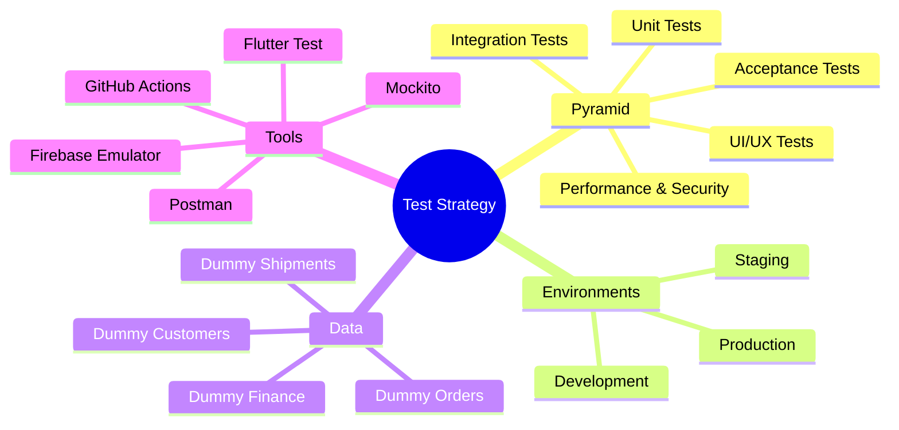
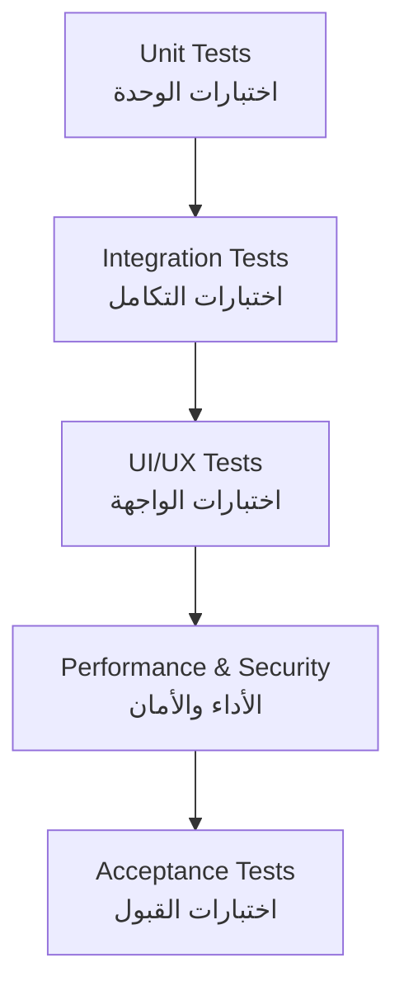
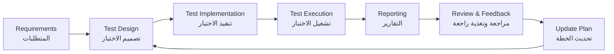

# 🧪 Test Plan / خطة الاختبار

> **Project:** CA Admin  
> **Version:** v0.1 — Owner: Abdullah Alshaif  
> **Last Updated:** 2025-09-08

---

## 1. Introduction / المقدمة

<!-- Centered image using Markdown syntax -->

**EN:**
The Test Plan ensures that CA Admin meets both **functional requirements (Use Cases)** and **non-functional requirements (NFRs)**. It defines the scope, strategy, test types, environments, and acceptance criteria.

**AR:**
تضمن خطة الاختبار أن يلبي نظام CA Admin **المتطلبات الوظيفية (Use Cases)** و **غير الوظيفية (NFRs)**. تحدد نطاق الاختبار، الاستراتيجية، أنواع الاختبارات، بيئات التنفيذ، ومعايير القبول.

---

## 2. Visual Test Strategy / استراتيجية الاختبار (رسم توضيحي)

---

## 3. Test Pyramid / هرم الاختبار

---

## 4. Test Objectives / أهداف الاختبار

- **EN:** Verify functionality, performance, security, and usability.
- **AR:** التحقق من الوظائف، الأداء، الأمان، وسهولة الاستخدام.

---

## 5. Scope / نطاق الاختبار

**In-Scope / ضمن النطاق:**

- Orders: creation, update, status tracking
- Shipments: status updates, driver assignments
- Finance: payments, deposits, deductions, reports
- User Management: roles & permissions (RBAC)
- Offline Sync & Conflict resolution

**Out-of-Scope / خارج النطاق:**

- Payment Gateway integrations (future phases)
- AI/Analytics modules

---

## 6. Test Types / أنواع الاختبارات

| Test Type (EN)    | النوع (AR)       | Purpose / الهدف                                                  |
| ----------------- | ---------------- | ---------------------------------------------------------------- |
| Unit Tests        | اختبارات الوحدة  | Validate individual functions (e.g., calculations)               |
| Integration Tests | اختبارات التكامل | Validate modules working together (Orders ↔ Finance ↔ Shipments) |
| UI/UX Tests       | اختبارات الواجهة | Ensure user-friendly experience (multi-language, RTL/LTR)        |
| Performance Tests | اختبارات الأداء  | Validate response time, load handling                            |
| Security Tests    | اختبارات الأمان  | Validate RBAC, Security Rules                                    |
| Acceptance Tests  | اختبارات القبول  | Validate against Use Cases & User Stories                        |

---

## 7. Test Environments / بيئات الاختبار

- **Development Environment:** Firebase Emulator Suite + Local DB (Hive/SQLite)
- **Staging Environment:** Firebase test project with sample data
- **Production Environment:** Live Firebase project (with restricted access)

---

## 8. Test Data / بيانات الاختبار

**EN:**
Test data includes dummy customers, orders, shipments, and financial records. Sensitive data must not be used in testing.

**AR:**
تتضمن بيانات الاختبار عملاء وهميين، طلبات، شحنات، وسجلات مالية. يُمنع استخدام بيانات حساسة أثناء الاختبار.

---

## 9. Acceptance Criteria / معايير القبول

- **Orders:** Must be created in ≤ 60s, status updated correctly.
- **Shipments:** Driver updates must reflect to customers in ≤ 2 min.
- **Finance:** Balances reconciled automatically, reports generated weekly.
- **NFRs:**
  - Response time < 2s
  - Uptime ≥ 99.5%
  - Multi-language UI works correctly

---

## 10. Test Schedule / جدول الاختبار

- **Unit Testing:** Continuous during development
- **Integration Testing:** End of each sprint
- **System Testing:** Before release candidate
- **User Acceptance Testing (UAT):** By stakeholders before final release

---

## 11. RACI Matrix / مصفوفة المسؤوليات

| Task / المهمة                | Developers | QA/Test Engineer | IT Manager | Finance Officer | Saudi/Yemen Staff |
| ---------------------------- | :--------: | :--------------: | :--------: | :-------------: | :---------------: |
| Write unit/integration tests |     R      |        C         |     I      |        I        |         I         |
| Execute test plan            |     C      |        R         |     A      |        C        |         C         |
| Oversee testing strategy     |     I      |        C         |     R      |        I        |         I         |
| Validate financial cases     |     I      |        C         |     I      |        R        |         I         |
| Validate order/shipment      |     I      |        C         |     I      |        I        |         R         |

Legend: R = Responsible, A = Accountable, C = Consulted, I = Informed

---

## 12. Tools / الأدوات

- **Flutter Test** → Unit & integration testing
- **Mockito** → Mock dependencies
- **Firebase Emulator Suite** → Firestore/Auth/Functions local testing
- **Postman** → API testing
- **GitHub Actions** → CI/CD automated tests

---

## 13. Risk & Mitigation / المخاطر والمعالجات

- **Data conflicts in offline sync** → Use audit logs + conflict resolution
- **Uncovered edge cases** → Expand regression testing
- **Security gaps** → Continuous pen-testing & rule validation

---

## 14. Advanced Testing Tips / نصائح اختبار متقدمة

- Automate regression and smoke tests for every release.
- Use code coverage tools to monitor test completeness.
- Link test cases directly to [Use Cases](../04-use-cases/04-use-cases.md) and [NFRs](../10-nfr-and-quality/10-nfr-and-quality.md).
- Review test results with all stakeholders after each sprint.

---

## 15. FAQ / أسئلة شائعة

### Q: ما الفرق بين اختبار الوحدة واختبار التكامل؟

**A:**

- اختبار الوحدة يركز على وظيفة واحدة أو وحدة برمجية منفردة.
- اختبار التكامل يختبر تفاعل أكثر من وحدة معًا.

### Q: كيف أضمن تغطية كافية للاختبارات؟

**A:**

- استخدم أدوات قياس التغطية البرمجية (Coverage Tools) واستهدف ≥ 70% من منطق الأعمال.

### Q: متى يتم اختبار الأداء والأمان؟

**A:**

- يتم اختبار الأداء والأمان في نهاية كل دورة تطوير رئيسية وقبل الإطلاق النهائي.

---

## 16. Test Traceability Matrix / مصفوفة تتبع الاختبارات

**EN:**
The traceability matrix links each requirement (functional and non-functional) to its corresponding test cases, ensuring full coverage and easy gap analysis.

**AR:**
مصفوفة التتبع تربط كل متطلب (وظيفي أو غير وظيفي) بحالات الاختبار الخاصة به لضمان التغطية الكاملة وسهولة اكتشاف أي نقص.

| Requirement / المتطلب    | Test Case(s) / حالات الاختبار | Status / الحالة |
| ------------------------ | ----------------------------- | --------------- |
| Place Order (FR)         | TC-01, TC-02, TC-03           | Covered         |
| Update Order Status (FR) | TC-04, TC-05                  | Covered         |
| RBAC (NFR)               | TC-10, TC-11                  | Covered         |
| Response Time < 2s (NFR) | TC-20                         | Covered         |
| Multi-language UI (NFR)  | TC-21, TC-22                  | Covered         |

---

## 17. Test Process Flow / سير عمل الاختبار (رسم توضيحي)

---
