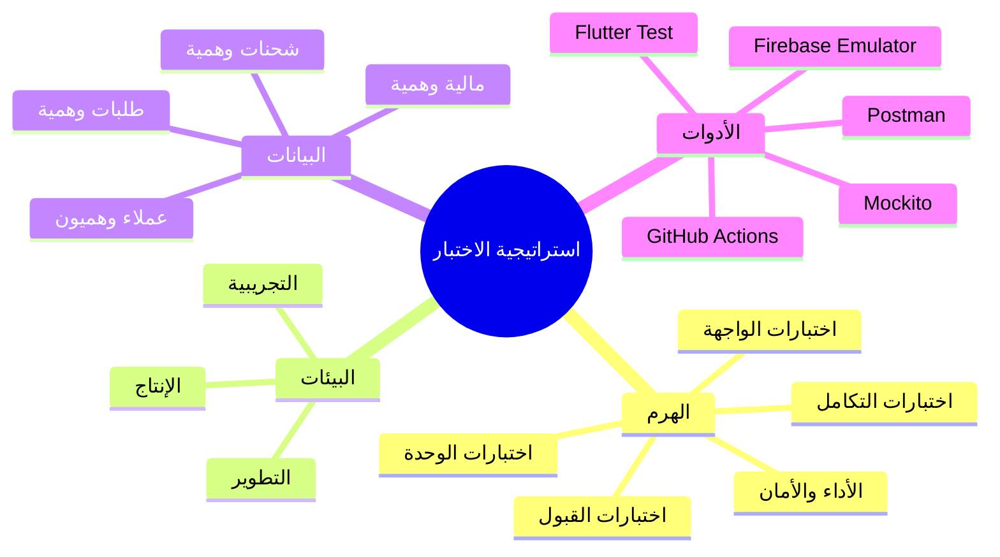
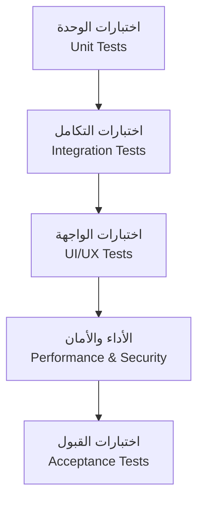
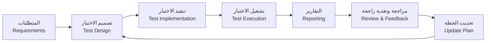

# 🧪 خطة الاختبار | Test Plan

---

> **المشروع:** CA Admin
> **Project:** CA Admin
> **الإصدار:** v0.1 — المالك: عبدالله الشائف
> **Version:** v0.1 — Owner: Abdullah Alshaif
> **آخر تحديث:** 2025-09-08
> **Last Updated:** 2025-09-08

**شرح مختصر:**
توضح هذه الوثيقة كيف يتم اختبار النظام لضمان تحقيق جميع المتطلبات الوظيفية وغير الوظيفية، وتحسين جودة المنتج النهائي.
**Summary:**
This document explains how the system is tested to ensure all functional and non-functional requirements are met, improving the final product quality.

---

## المقدمة | Introduction

تضمن خطة الاختبار أن يلبي نظام CA Admin المتطلبات الوظيفية (Use Cases) وغير الوظيفية (NFRs). تحدد نطاق الاختبار، الاستراتيجية، أنواع الاختبارات، بيئات التنفيذ، ومعايير القبول.

The Test Plan ensures that CA Admin meets both functional requirements (Use Cases) and non-functional requirements (NFRs). It defines the scope, strategy, test types, environments, and acceptance criteria.

---

## 👁️ استراتيجية الاختبار (رسم توضيحي) | Visual Test Strategy

**شرح مختصر:**
مخطط ذهني يوضح عناصر استراتيجية الاختبار.

**Summary:**
Mindmap showing the elements of the test strategy.

---

## 🏛️ هرم الاختبار | Test Pyramid

**شرح مختصر:**
مخطط يوضح تسلسل أنواع الاختبارات من الوحدة حتى القبول.

**Summary:**
Diagram showing the sequence of test types from unit to acceptance.

---

## 🎯 أهداف الاختبار | Test Objectives

**شرح مختصر:**
التحقق من الوظائف، الأداء، الأمان، وسهولة الاستخدام.

**Summary:**
Verify functionality, performance, security, and usability.

---

## 📦 نطاق الاختبار | Scope

**شرح مختصر:**
تحديد ما سيتم اختباره وما هو خارج النطاق.

**Summary:**
Defines what will be tested and what is out of scope.

**ضمن النطاق:**

- الطلبات: الإنشاء، التحديث، تتبع الحالة
- الشحنات: تحديث الحالة، تعيين السائقين
- المالية: المدفوعات، الإيداعات، التقارير
- إدارة المستخدمين: الأدوار والصلاحيات (RBAC)
- المزامنة دون اتصال وحل التعارضات

**In-Scope:**

- Orders: creation, update, status tracking
- Shipments: status updates, driver assignments
- Finance: payments, deposits, deductions, reports
- User Management: roles & permissions (RBAC)
- Offline Sync & Conflict resolution

**خارج النطاق:**

- تكامل بوابات الدفع (مراحل مستقبلية)
- وحدات الذكاء الاصطناعي/التحليلات

**Out-of-Scope:**

- Payment Gateway integrations (future phases)
- AI/Analytics modules

---

## 🧩 أنواع الاختبارات | Test Types

**شرح مختصر:**
جدول يوضح أنواع الاختبارات وأهداف كل نوع.

**Summary:**
Table showing test types and the purpose of each.

| النوع (AR)       | Test Type (EN)    | الهدف / Purpose                                          |
| ---------------- | ----------------- | -------------------------------------------------------- |
| اختبارات الوحدة  | Unit Tests        | التحقق من وظائف منفردة (مثل العمليات الحسابية)           |
| اختبارات التكامل | Integration Tests | التحقق من عمل الوحدات معًا (الطلبات ↔ المالية ↔ الشحنات) |
| اختبارات الواجهة | UI/UX Tests       | ضمان تجربة مستخدم سهلة (ثنائية اللغة، RTL/LTR)           |
| اختبارات الأداء  | Performance Tests | التحقق من زمن الاستجابة وتحمل الضغط                      |
| اختبارات الأمان  | Security Tests    | التحقق من RBAC وقواعد الأمان                             |
| اختبارات القبول  | Acceptance Tests  | التحقق من حالات الاستخدام وقصص المستخدمين                |

---

## 🏞️ بيئات الاختبار | Test Environments

**شرح مختصر:**
توضيح بيئات الاختبار المختلفة.

**Summary:**
Explanation of different test environments.

- بيئة التطوير: Firebase Emulator Suite + قاعدة بيانات محلية (Hive/SQLite)
- بيئة التجريبية: مشروع Firebase تجريبي مع بيانات عينة
- بيئة الإنتاج: مشروع Firebase حي (بوصول مقيد)

- Development Environment: Firebase Emulator Suite + Local DB (Hive/SQLite)
- Staging Environment: Firebase test project with sample data
- Production Environment: Live Firebase project (with restricted access)

---

## 🗂️ بيانات الاختبار | Test Data

**شرح مختصر:**
ما هي البيانات المستخدمة في الاختبار.

**Summary:**
What data is used in testing.

تتضمن بيانات الاختبار عملاء وهميين، طلبات، شحنات، وسجلات مالية. يُمنع استخدام بيانات حساسة أثناء الاختبار.

Test data includes dummy customers, orders, shipments, and financial records. Sensitive data must not be used in testing.

---

## ✅ معايير القبول | Acceptance Criteria

**شرح مختصر:**
شروط نجاح الاختبار لكل وحدة رئيسية.

**Summary:**
Success criteria for each main module.

- الطلبات: يجب إنشاؤها خلال ≤ 60 ثانية، وتحديث الحالة بشكل صحيح
- الشحنات: يجب أن تظهر تحديثات السائق للعملاء خلال ≤ 2 دقيقة
- المالية: تسوية الأرصدة تلقائيًا، وإنشاء التقارير أسبوعيًا
- المتطلبات غير الوظيفية:

  - زمن الاستجابة < 2 ثانية
  - توفر ≥ 99.5%
  - واجهة ثنائية اللغة تعمل بشكل صحيح

- Orders: Must be created in ≤ 60s, status updated correctly.
- Shipments: Driver updates must reflect to customers in ≤ 2 min.
- Finance: Balances reconciled automatically, reports generated weekly.
- NFRs:
  - Response time < 2s
  - Uptime ≥ 99.5%
  - Multi-language UI works correctly

---

## 📅 جدول الاختبار | Test Schedule

**شرح مختصر:**
جدول زمني لأنواع الاختبارات المختلفة.

**Summary:**
Timeline for different test types.

- اختبار الوحدة: مستمر أثناء التطوير
- اختبار التكامل: نهاية كل دورة تطوير
- اختبار النظام: قبل إصدار النسخة النهائية
- اختبار القبول: من قبل المعنيين قبل الإصدار النهائي

- Unit Testing: Continuous during development
- Integration Testing: End of each sprint
- System Testing: Before release candidate
- User Acceptance Testing (UAT): By stakeholders before final release

---

## 🗃️ مصفوفة المسؤوليات | RACI Matrix

**شرح مختصر:**
جدول يوضح توزيع المسؤوليات في عملية الاختبار.

**Summary:**
Table showing responsibility distribution in the testing process.

| المهمة                          | Task                         | المطورون | مهندس الاختبار | مدير التقنية | مسؤول المالية | موظف السعودية/اليمن |
| ------------------------------- | ---------------------------- | -------- | -------------- | ------------ | ------------- | ------------------- |
| كتابة اختبارات الوحدة/التكامل   | Write unit/integration tests | R        | C              | I            | I             | I                   |
| تنفيذ خطة الاختبار              | Execute test plan            | C        | R              | A            | C             | C                   |
| الإشراف على استراتيجية الاختبار | Oversee testing strategy     | I        | C              | R            | I             | I                   |
| التحقق من الحالات المالية       | Validate financial cases     | I        | C              | I            | R             | I                   |
| التحقق من الطلبات/الشحنات       | Validate order/shipment      | I        | C              | I            | I             | R                   |

Legend: R = مسؤول، A = صاحب قرار، C = مستشار، I = مُبلغ

---

## 🛠️ الأدوات | Tools

**شرح مختصر:**
أدوات الاختبار المستخدمة في المشروع.

**Summary:**
Testing tools used in the project.

- Flutter Test → اختبار الوحدة والتكامل
- Mockito → محاكاة التبعيات
- Firebase Emulator Suite → اختبار Firestore/Auth/Functions محليًا
- Postman → اختبار واجهات API
- GitHub Actions → اختبارات تلقائية CI/CD

---

## ⚠️ المخاطر والمعالجات | Risk & Mitigation

**شرح مختصر:**
أهم المخاطر وكيفية معالجتها.

**Summary:**
Main risks and how to mitigate them.

- تعارض البيانات في المزامنة دون اتصال → استخدام سجلات التدقيق + حل التعارضات
- حالات الحافة غير المغطاة → توسيع اختبارات الانحدار
- ثغرات الأمان → اختبار اختراق مستمر + مراجعة القواعد

- Data conflicts in offline sync → Use audit logs + conflict resolution
- Uncovered edge cases → Expand regression testing
- Security gaps → Continuous pen-testing & rule validation

---

## 💡 نصائح اختبار متقدمة | Advanced Testing Tips

**شرح مختصر:**
نصائح لتحسين جودة الاختبارات وتغطيتها.

**Summary:**
Tips to improve test quality and coverage.

- أتمتة اختبارات الانحدار والدخان لكل إصدار
- استخدام أدوات قياس التغطية لمتابعة اكتمال الاختبارات
- ربط حالات الاختبار مباشرة بحالات الاستخدام والمتطلبات غير الوظيفية
- مراجعة نتائج الاختبار مع جميع المعنيين بعد كل دورة تطوير

- Automate regression and smoke tests for every release.
- Use code coverage tools to monitor test completeness.
- Link test cases directly to [Use Cases](../04-use-cases/04-use-cases.md) and [NFRs](../10-nfr-and-quality/10-nfr-and-quality.md).
- Review test results with all stakeholders after each sprint.

---

## ❓ الأسئلة الشائعة | FAQ

**شرح مختصر:**
إجابات على الأسئلة المتكررة حول أنواع الاختبارات والتغطية.

**Summary:**
Answers to common questions about test types and coverage.

### ما الفرق بين اختبار الوحدة واختبار التكامل؟

What is the difference between unit and integration testing?

- اختبار الوحدة يركز على وظيفة واحدة أو وحدة برمجية منفردة.
- اختبار التكامل يختبر تفاعل أكثر من وحدة معًا.

- Unit testing focuses on a single function or module.
- Integration testing checks interaction between multiple modules.

### كيف أضمن تغطية كافية للاختبارات؟

How do I ensure sufficient test coverage?

- استخدم أدوات قياس التغطية البرمجية واستهدف ≥ 70% من منطق الأعمال.
- Use coverage tools and target ≥ 70% of business logic.

### متى يتم اختبار الأداء والأمان؟

When are performance and security tests performed?

- يتم اختبار الأداء والأمان في نهاية كل دورة تطوير رئيسية وقبل الإطلاق النهائي.
- Performance and security tests are done at the end of each major development cycle and before final release.

---

## 🧮 مصفوفة تتبع الاختبارات | Test Traceability Matrix

**شرح مختصر:**
جدول يربط كل متطلب بحالات الاختبار الخاصة به لضمان التغطية الكاملة.

**Summary:**
Table linking each requirement to its test cases for full coverage.

| المتطلب                             | Requirement              | حالات الاختبار      | Test Case(s)        | الحالة | Status  |
| ----------------------------------- | ------------------------ | ------------------- | ------------------- | ------ | ------- |
| إنشاء طلب (وظيفي)                   | Place Order (FR)         | TC-01, TC-02, TC-03 | TC-01, TC-02, TC-03 | مغطى   | Covered |
| تحديث حالة الطلب (وظيفي)            | Update Order Status (FR) | TC-04, TC-05        | TC-04, TC-05        | مغطى   | Covered |
| RBAC (غير وظيفي)                    | RBAC (NFR)               | TC-10, TC-11        | TC-10, TC-11        | مغطى   | Covered |
| زمن الاستجابة < 2 ثانية (غير وظيفي) | Response Time < 2s (NFR) | TC-20               | TC-20               | مغطى   | Covered |
| واجهة ثنائية اللغة (غير وظيفي)      | Multi-language UI (NFR)  | TC-21, TC-22        | TC-21, TC-22        | مغطى   | Covered |

---

## 🔄 سير عمل الاختبار (رسم توضيحي) | Test Process Flow

**شرح مختصر:**
مخطط يوضح خطوات عملية الاختبار من المتطلبات حتى تحديث الخطة.

**Summary:**
Diagram showing the steps of the test process from requirements to plan update.

---

## 🗂️ جدول أنواع الاختبارات مقابل المتطلبات | Test Types vs Requirements Table

**شرح مختصر:**
جدول يوضح كيف تغطي أنواع الاختبارات المتطلبات الوظيفية وغير الوظيفية، ليسهل على القارئ فهم العلاقة بين كل نوع اختبار وكل متطلب.
**Summary:**
Table showing how test types cover functional and non-functional requirements, clarifying the relationship for the reader.

| نوع الاختبار     | يغطي المتطلبات الوظيفية | يغطي المتطلبات غير الوظيفية | شرح مختصر (AR)                | Summary (EN)                |
| ---------------- | ----------------------- | --------------------------- | ----------------------------- | --------------------------- |
| اختبارات الوحدة  | ✅                      | ❌                          | يتحقق من وظائف منفردة         | Verifies single functions   |
| اختبارات التكامل | ✅                      | ❌                          | يتحقق من تفاعل الوحدات        | Verifies module interaction |
| اختبارات الواجهة | ✅                      | ✅                          | يتحقق من تجربة المستخدم       | Verifies user experience    |
| اختبارات الأداء  | ❌                      | ✅                          | يتحقق من سرعة واستقرار النظام | Verifies speed & stability  |
| اختبارات الأمان  | ❌                      | ✅                          | يتحقق من حماية النظام         | Verifies system security    |
| اختبارات القبول  | ✅                      | ✅                          | يتحقق من تحقيق جميع المتطلبات | Verifies all requirements   |
