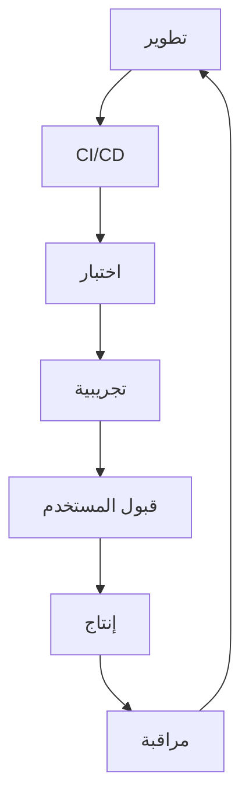
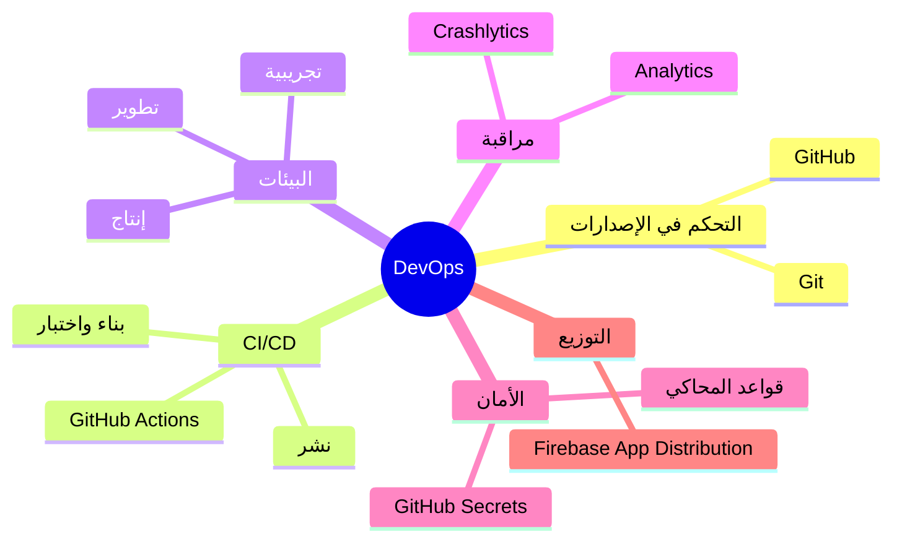
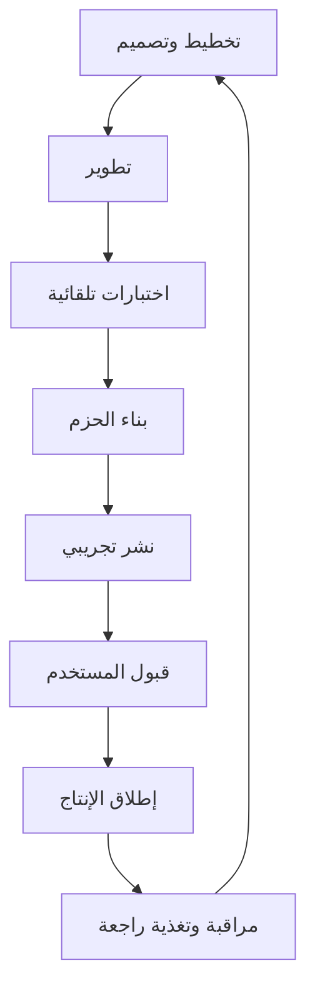
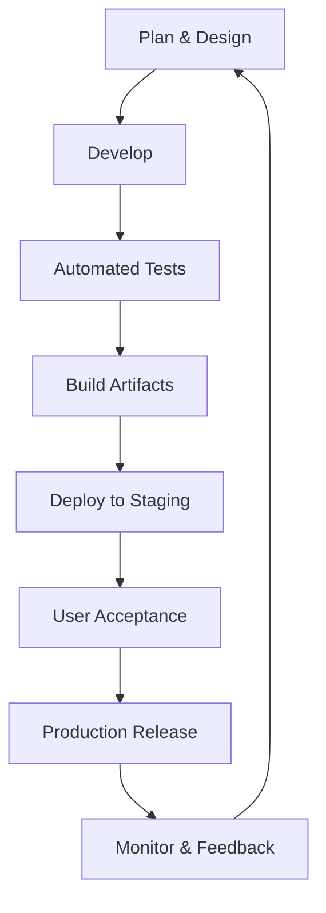
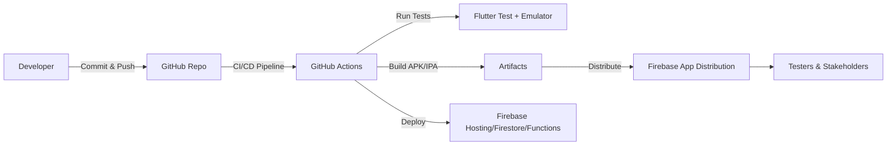
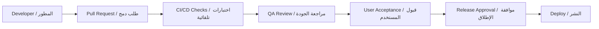

## 🚀 خطة الإطلاق وعمليات DevOps

Release & DevOps Plan

---

> **المشروع:** CA Admin
> **Project:** CA Admin
> **الإصدار:** v0.1 — المالك: عبدالله الشائف
> **Version:** v0.1 — Owner: Abdullah Alshaif
> **آخر تحديث:** 2025-09-08
> **Last Updated:** 2025-09-08

**شرح مختصر:**
يوضح هذا القسم كيف يتم بناء واختبار وإطلاق وصيانة النظام بشكل آمن وسريع عبر جميع البيئات.

**Summary:**
This section explains how the system is built, tested, released, and maintained securely and quickly across all environments.

---

## المقدمة

Introduction


تحدد خطة الإطلاق وعمليات DevOps كيفية بناء واختبار وإطلاق وصيانة نظام CA Admin عبر البيئات المختلفة. تهدف إلى ضمان الموثوقية، السرعة، والأتمتة في دورة التطوير.

The release and DevOps plan defines how CA Admin will be built, tested, released, and maintained across environments. It ensures reliability, speed, and automation in the development lifecycle.

---

## ملخص بصري سريع

Quick Visual Summary

**شرح مختصر:**
مخطط يوضح دورة النشر من التطوير حتى المراقبة.

**Summary:**
Diagram showing the release cycle from development to monitoring.



---

## خريطة DevOps

DevOps Mindmap

**شرح مختصر:**
خريطة ذهنية تلخص عناصر DevOps الأساسية.

**Summary:**
Mindmap summarizing the main DevOps elements.



---

## استراتيجية الإطلاق

Release Strategy

**شرح مختصر:**
نهج تدريجي لإطلاق النظام لضمان الجودة.

**Summary:**
Phased release approach to ensure quality.

1. ألفا (الفريق الداخلي فقط): اختبار الميزات الأساسية
2. بيتا (مستخدمون محددون): ملاحظات من الواقع
3. الإصدار النهائي (عام): إطلاق كامل لجميع المستخدمين

4. Alpha (internal team only): core features tested
5. Beta (selected users): real-world feedback
6. Production (public): full release to all users

---

## دورة حياة الإطلاق (رسم توضيحي)

Release Lifecycle (Visual)

**شرح مختصر:**
مخطط يوضح مراحل دورة حياة الإطلاق من التخطيط حتى المراقبة.

**Summary:**
Diagram showing the release lifecycle stages from planning to monitoring.





---

## 5. Deployment Environments / بيئات النشر

1. **Development:** Firebase Emulator + local DB
2. **Staging:** Firebase test project with sample data
3. **Production:** Firebase production project

---

## 6. DevOps Workflow / سير عمل DevOps



---

## 7. CI/CD Pipeline Stages / مراحل خط أنابيب CI/CD

```mermaid
flowchart TD
  PR[Pull Request / Merge] --> Build[Build (Flutter Android/iOS)]
  Build --> Test[Unit + Integration Tests]
  Test --> Lint[Static Code Analysis]
  Lint --> Staging[Deploy to Staging]
  Staging --> Distribute[Distribute to QA/Stakeholders]
  Distribute --> Prod[Deploy to Production]
```

---

## 8. Tools & Services / الأدوات والخدمات

1. **Version Control:** Git + GitHub
2. **CI/CD:** GitHub Actions
3. **Testing:** Flutter Test, Mockito, Firebase Emulator Suite
4. **Distribution:** Firebase App Distribution (Alpha/Beta testing)
5. **Monitoring:** Firebase Crashlytics + Analytics
6. **Secrets Management:** GitHub Secrets for API keys and tokens

---

## 9. Release Checklist / قائمة مراجعة الإصدار

1. ✅ All unit/integration tests pass (≥ 70% coverage)
2. ✅ Security Rules tested in Emulator
3. ✅ Documentation updated in /docs
4. ✅ App distributed to testers via Firebase App Distribution
5. ✅ Stakeholder sign-off after UAT (User Acceptance Testing)
6. ✅ Tag release in GitHub with version number (e.g., v1.0.0)

---

## 10. Rollback Strategy / إستراتيجية التراجع

**EN:**
If a release fails in production:

1. Rollback to previous stable version in GitHub + Firebase
2. Notify stakeholders and users
3. Investigate logs (Crashlytics, Firebase Console)

**AR:**
إذا فشل الإصدار في بيئة الإنتاج:

1. العودة إلى النسخة المستقرة السابقة عبر GitHub + Firebase
2. إخطار أصحاب المصلحة والمستخدمين
3. مراجعة السجلات (Crashlytics، Firebase Console)

---

## 11. Advanced DevOps Tips / نصائح DevOps متقدمة

1. Use feature flags for safe gradual rollouts.
2. Automate rollback on failed deployments.
3. Monitor Firebase quotas and billing during scale.
4. Document all manual steps in `/docs` for transparency.

---

## 12. FAQ / أسئلة شائعة

### Q: كيف أضمن أمان المفاتيح والرموز السرية؟

**A:**

1. استخدم GitHub Secrets ولا تضع أي مفاتيح في الكود أو ملفات عامة.

### Q: كيف أتعامل مع فشل النشر في الإنتاج؟

**A:**

1. استخدم خطة التراجع (Rollback) وراجع السجلات فورًا، ثم أخبر الفريق والمستخدمين.

### Q: متى يجب تحديث خطة DevOps؟

**A:**

1. عند توسع الفريق أو تغير متطلبات العمل أو إضافة تقنيات جديدة.

---

## 13. Release Versioning & Tagging / ترقيم الإصدارات ووضع العلامات

**EN:**
Follow [Semantic Versioning](https://semver.org/) (MAJOR.MINOR.PATCH) for all releases. Tag each release in GitHub (e.g., v1.0.0) and document changes in a `CHANGELOG.md` file.

**AR:**
اتبع نظام الترقيم الدلالي (MAJOR.MINOR.PATCH) لكل إصدار، وضع علامة (Tag) لكل إصدار في GitHub (مثال: v1.0.0) وسجل التغييرات في ملف `CHANGELOG.md`.

---

## 14. Release Approval Flow / سير موافقة الإطلاق (رسم توضيحي)



---

## 15. Notes / ملاحظات

1. Release plan must stay aligned with [Test Plan](../11-test-plan/11-test-plan.md)
2. DevOps workflow should evolve with team size and project scale
3. Firebase quotas and billing must be monitored during scaling

---
