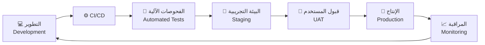
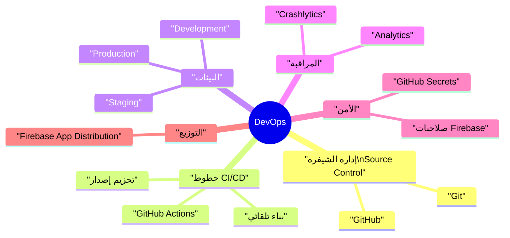
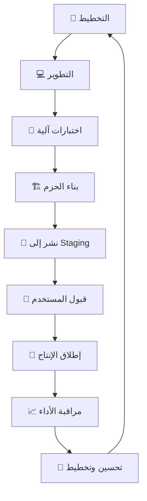
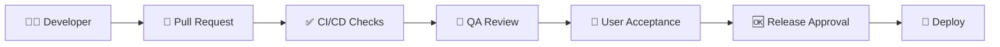

# 🚀 خطة الإصدار وعمليات DevOps | Release & DevOps Plan

> | 🔖  | البيان                         | Details          |
> | --- | ------------------------------ | ---------------- |
> | 🧾  | **النظام / Project**           | CA Admin         |
> | 🧑‍💼  | **مالك المستند / Owner**       | Abdullah Alshaif |
> | 🏷️  | **الإصدار / Version**          | v0.1             |
> | 📅  | **تاريخ الإنشاء / Created On** | 2025-09-08       |
> | 🔁  | **آخر تحديث / Last Updated**   | 2025-09-08       |

**الملخص التنفيذي | Executive Summary:**  
تغطي هذه الخطة كيفية بناء نظام CA Admin، اختباره، إصداره، ومراقبته عبر جميع البيئات مع ضمان الأتمتة، الأمان، وسرعة التوصيل.  
**Summary (EN):** This plan explains how CA Admin is built, tested, released, and continuously monitored across environments to ensure secure, automated, and fast delivery.

---

## 🌟 مقدمة | Introduction

تركز الخطة على الجمع بين فرق التطوير، الاختبار، وعمليات التشغيل ضمن دورة إصدار واحدة متماسكة. يتم ذلك عبر منهجية DevOps التي تعزز السرعة دون التضحية بالجودة.

- 🎯 توحيد العملية من إدارة الشيفرة حتى الاعتماد النهائي (Aligns coding, testing, and approvals).
- 📦 نشر تدريجي يقلل المخاطر ويزيد ثقة أصحاب المصلحة (Gradual deployments mitigate release risk).
- 🔐 تضمين الأمن والمراقبة في كل مرحلة من المراحل (Security & monitoring embedded end-to-end).

---

## 🧷 نظرة بصرية سريعة | Quick Visual Summary

- ♻️ دورة مستمرة تضمن التحسين المستمر بعد كل إصدار.
- 🧪 تبني الصلاحية المبكرة عبر اختبارات آلية صارمة.
- 📈 يتم توجيه التغذية الراجعة مباشرة إلى فريق التطوير لتحسين الإصدار التالي.

---

## 🧠 خريطة DevOps | DevOps Mindmap

- 🗃️ التحكم في النسخ عبر Git/GitHub لضمان تتبع الشيفرة.
- ⚙️ خطوط CI/CD مؤتمتة لتشغيل البناء والاختبارات فور كل دمج.
- 🌐 بيئات متعددة لضمان التحقق قبل الوصول للإنتاج.
- 🔐 إدارة الأسرار والوصول ضمن GitHub وFirebase.
- 📊 مراقبة آنية عبر Crashlytics وAnalytics.

---

## 🧭 إستراتيجية الإصدار | Release Strategy

| المرحلة (AR)  | Phase (EN)         | الهدف                                            | النتيجة المتوقعة                                            |
| ------------- | ------------------ | ------------------------------------------------ | ----------------------------------------------------------- |
| ألفا الداخلية | Internal Alpha     | اختبار الميزات الأساسية داخل الفريق.             | كشف العيوب المبكرة وتأكيد الاستقرار الأولي.                 |
| بيتا المحدودة | Limited Beta       | إشراك مستخدمين مختارين للتغذية الراجعة الواقعية. | فهم سلوك النظام في سيناريوهات حقيقية وتحسين تجربة المستخدم. |
| الإصدار العام | Production Rollout | إطلاق كامل مع دعم مستمر ومراقبة لصيقة.           | منتج مستقر مدعوم بمراقبة نشطة واستعداد للرجوع السريع.       |

---

## 🔁 دورة الإصدار التفصيلية | Release Lifecycle

- 📝 التخطيط: تحديد نطاق الإصدار، الاعتماديات، وخطة التواصل.
- 🧪 الاختبارات: تشغيل وحدات، تكامل، أداء، وأمن قبل أي نشر.
- 🧭 Staging: التحقق من البيانات، السياسات، وتجارب المستخدم الواقعية.
- 🤝 UAT: موافقة أصحاب المصلحة عبر سيناريوهات عمل حقيقية.
- 📈 المراقبة: مراقبة Crashlytics، Analytics، والإنذارات بعد الإطلاق.

---

## ⚙️ خط أنابيب CI/CD | CI/CD Pipeline

```mermaid
flowchart LR
  Commit["📝 Commit"] --> PR["🔀 Pull Request"]
  PR --> Checks["✅ CI Checks\n(Tests + Lint)"]
  Checks --> Build["🏗️ Build Artifacts"]
  Build --> DeployStage["🧭 Deploy to Staging"]
  DeployStage --> QA["🧪 QA & Automated Suites"]
  QA --> Distribute["📦 Firebase App Distribution"]
  Distribute --> Approve["🆗 Release Approval"]
  Approve --> DeployProd["🚀 Deploy to Production"]
  DeployProd --> Post["📈 Post-release Monitoring"]
```

- ✅ كل طلب دمج يجب أن يجتاز اختبارات الوحدة والتكامل وتحليل الشيفرة.
- 📦 البناءات الناجحة تُوزَّع تلقائيًا على فرق QA عبر Firebase App Distribution.
- 🚀 الإنتاج يحدث فقط بعد الموافقات والتوقيع النهائي.
- 📈 يتم جمع مؤشرات الأداء فورًا بعد النشر لتحسين الدورات القادمة.

---

## 🛠️ الأدوات والخدمات | Tools & Services

| فئة الأداة      | Tool Category      | الأدوات المستخدمة                              | الدور الرئيسي                                   |
| --------------- | ------------------ | ---------------------------------------------- | ----------------------------------------------- |
| التحكم في النسخ | Version Control    | Git, GitHub                                    | إدارة الشيفرة، المراجعات، والوسوم.              |
| التكامل المستمر | CI/CD              | GitHub Actions                                 | تشغيل البناءات، الاختبارات، والتحزيم تلقائيًا.  |
| الاختبار        | Testing            | Flutter Test, Mockito, Firebase Emulator Suite | التحقق الآلي من الوظائف، التكامل، وقواعد الأمن. |
| التوزيع         | Distribution       | Firebase App Distribution                      | مشاركة النسخ مع الفاحصين وأصحاب المصلحة.        |
| المراقبة        | Monitoring         | Firebase Crashlytics, Firebase Analytics       | متابعة الأعطال، أداء التطبيق، وسلوك المستخدم.   |
| إدارة الأسرار   | Secrets Management | GitHub Secrets                                 | حماية المفاتيح والرموز المستخدمة في خطوط CI/CD. |

---

## ✅ قائمة فحص الإصدار | Release Checklist

| ✅  | البند (AR)                                                | Item (EN)                                         | القيمة العملية                           |
| --- | --------------------------------------------------------- | ------------------------------------------------- | ---------------------------------------- |
| ☐   | اجتياز جميع اختبارات الوحدة والتكامل مع تغطية ≥ 70%.      | All unit/integration tests pass (≥ 70% coverage). | يقلل مخاطر الانحدار في الإنتاج.          |
| ☐   | اختبار قواعد الأمان في المحاكي وتوثيق النتائج.            | Security Rules validated in Emulator.             | يحمي البيانات ويمنع الثغرات.             |
| ☐   | تحديث الوثائق ذات الصلة داخل مجلد `/docs`.                | Documentation updated in `/docs`.                 | يبقي الفريق على اطلاع ويدعم التتبع.      |
| ☐   | توزيع البناء على المختبرين عبر Firebase App Distribution. | Build distributed via Firebase App Distribution.  | يضمن مراجعة بشرية وتجربة فعلية.          |
| ☐   | الحصول على توقيع أصحاب المصلحة بعد UAT ناجح.              | Stakeholder sign-off after UAT.                   | تأكيد تجاري قبل الوصول للمستخدم النهائي. |
| ☐   | إنشاء وسم GitHub للإصدار (مثل `v1.0.0`).                  | GitHub release tag created.                       | يسهل الرجوع والتتبع التاريخي.            |

> 💡 يفضّل تحويل الخانات إلى ✅ عند الإتمام لتوثيق حالة كل إصدار.

---

## ♻️ إستراتيجية الرجوع للخلف | Rollback Strategy

**AR:**

1. الرجوع إلى الإصدار المستقر السابق (GitHub Release + إعدادات Firebase).
2. إعلام أصحاب المصلحة والمستخدمين بالقنوات الرسمية.
3. تحليل Crashlytics وسجلات Firebase لتحديد السبب الجذري، ثم تحديث خطة الإصدار.

**EN:**

1. Roll back to the last stable GitHub release and corresponding Firebase configuration.
2. Notify stakeholders and users through agreed channels.
3. Inspect Crashlytics and Firebase logs, capture root cause, and feed findings into the next iteration.

---

## 🚀 نصائح DevOps متقدمة | Advanced DevOps Tips

- 🏳️ استخدم أعلام الميزات (Feature Flags) لتفعيل المزايا تدريجيًا دون إعادة نشر كامل.
- 🤖 أتمت الرجوع التلقائي عند فشل النشر مع الاحتفاظ بسجلات واضحة للقرار.
- 💳 راقب حصص Firebase والفوترة أثناء التوسع لتجنّب الانقطاعات غير المتوقعة.
- 🗂️ وثّق أي خطوات يدوية في `/docs` لضمان الشفافية وسهولة التكرار.
- 🔄 جدولة مراجعات دورية لخط الأنابيب لضمان مطابقته لحجم الفريق ونضج المشروع.

---

## 💬 الأسئلة الشائعة | FAQ

### ❓ كيف نحمي بيانات الاعتماد أثناء عملية الإصدار؟

- ✅ استخدم GitHub Secrets لتخزين المفاتيح والرموز الحساسة، ولا تضعها في المستودع.
- 🔐 نفّذ مبدأ أقل صلاحية (Least Privilege) داخل Firebase وGitHub.

### ❓ ماذا يحدث إذا تعطل الإصدار في الإنتاج؟

- ♻️ فعّل خطة الرجوع للخلف وحافظ على الشفافية مع الفريق والمستخدمين.
- 🧾 وثّق السبب الجذري وخطة المعالجة قبل محاولة الإصدار التالي.

### ❓ متى نراجع عملية DevOps؟

- 📅 بعد كل إصدار رئيسي أو تغييرات كبيرة في الفريق.
- 📈 استخدم مؤشرات الأداء (MTTR, Deployment Frequency) لتحديد الحاجة للتحسين.

---

## 🏷️ إدارة الإصدارات والوسوم | Release Versioning & Tagging

- 📌 اتبع [الإصدارات الدلالية](https://semver.org/) بصيغة MAJOR.MINOR.PATCH.
- 🏷️ أنشئ وسمًا في GitHub لكل إصدار (مثل `v1.0.0`) مع ملاحظات في `CHANGELOG.md`.
- 🗓️ حافظ على اتساق الأرقام عبر المستودع، الوثائق، ولوحات المتابعة.

**EN:** Follow Semantic Versioning (MAJOR.MINOR.PATCH), tag each release (e.g., `v1.0.0`), and document changes in `CHANGELOG.md` for auditability.

---

## ✔️ مسار اعتماد الإصدار | Release Approval Flow

- 🎓 يضمن المسار مراجعة تقنية، جودة، وتجارية قبل النشر.
- 🔁 أي فشل يعيد المسار إلى الخطوة السابقة مع خطة معالجة واضحة.

---

## 📊 جدول المراحل مقابل الأدوات | Release Stages vs Tools

| المرحلة           | Stage (EN)          | الأداة أو الخدمة                         | القيمة المضافة                          |
| ----------------- | ------------------- | ---------------------------------------- | --------------------------------------- |
| التطوير           | Development         | Git, GitHub                              | إدارة الشيفرة، المراجعات، وضمان التتبع. |
| التكامل المستمر   | CI Build & Test     | GitHub Actions                           | بناء واختبار تلقائي لكل تغيير.          |
| البيئة التجريبية  | Staging Validation  | Firebase Emulator Suite                  | محاكاة واقعية قبل التشغيل الحي.         |
| التوزيع للمختبرين | Tester Distribution | Firebase App Distribution                | مشاركة سريعة مع QA وأصحاب المصلحة.      |
| الإنتاج           | Production Deploy   | Firebase Hosting / Firestore / Functions | نشر مستقر مع قابلية التوسع.             |
| المراقبة          | Monitoring          | Crashlytics, Analytics                   | مراقبة الأداء، الأعطال، وسلوك المستخدم. |

---

## 📝 ملاحظات ختامية | Notes

- 🔗 يجب أن تظل خطة الإصدار منسجمة مع [خطة الاختبار](../11-test-plan/11-test-plan.md) لضمان التغطية المشتركة.
- 🚀 مراجعة دورية لعمليات DevOps مطلوبة عند توسّع الفريق أو تغيّر المتطلبات.
- 📡 استمر في مراقبة حصص Firebase والفوترة وتحديث حدود التنبيه وفق النمو.
