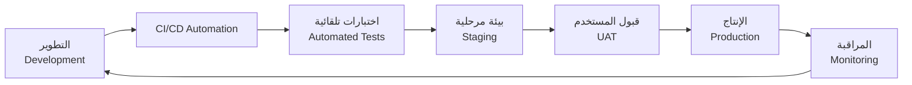
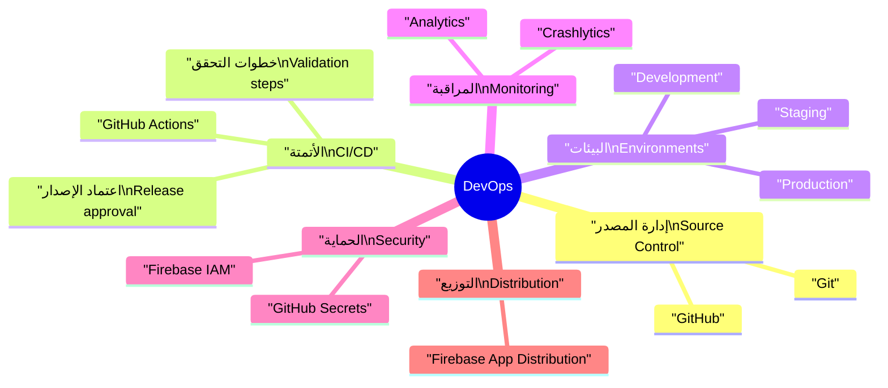
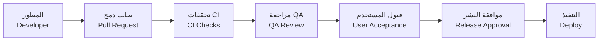

# 🚀 خطة النشر وعمليات التطوير | Release & DevOps Plan

| العنصر             | التفاصيل                                                                                                                                                                                                                                                                       |
| ------------------ | ------------------------------------------------------------------------------------------------------------------------------------------------------------------------------------------------------------------------------------------------------------------------------ |
| المنتج             | منصة الوساطة الشرائية CA Admin CA Admin Shopping Mediation Platform                                                                                                                                                                                                         |
| الإصدار            | 0.1 – آخر تحديث 2025-09-08 – المالك: عبدالله الشائف Version 0.1 – Last updated 2025-09-08 – Owner: Abdullah Alshaif                                                                                                                                                         |
| الهدف              | توحيد مسار النشر والأتمتة لضمان تسليم آمن وسريع Unify release and automation paths for secure, fast delivery                                                                                                                                                                |
| المستندات المساندة | `docs/06-architecture/06-architecture.md`، `docs/11-test-plan/11-test-plan.md`، `docs/08-security-and-roles/08-security-and-roles.md` `docs/06-architecture/06-architecture.md`, `docs/11-test-plan/11-test-plan.md`, `docs/08-security-and-roles/08-security-and-roles.md` |

> 🔑 **الخلاصة السريعة:** تشرح الخطة تدفق العمل من التطوير حتى المراقبة، مع أدوات CI/CD، الضوابط الأمنية، ومراحل الاعتماد.
> 🔑 **Quick Summary:** Outlines the flow from development through monitoring with CI/CD tooling, security safeguards, and approval gates.

---

## 1. نظرة عامة | Overview

- 🧭 تعرض الوثيقة المراحل، الأدوار، والأدوات المستخدمة في سلسلة النشر.
  🧭 Describes stages, roles, and tools involved in the release chain.
- 🎯 تربط مسار DevOps بإدارة المخاطر والحوكمة التشغيلية.
  🎯 Connects DevOps flow to risk management and operational governance.
- 🧠 توضح كيفية مراقبة الأداء والأمان بعد النشر للحفاظ على الجودة.
  🧠 Explains how performance and security are monitored post-release to keep quality high.

---

## 2. مخطط المسار السريع | Quick Release Path

> 📋 يوضح المخطط مسار النشر الكامل مع حلقة التغذية الراجعة.
> 📋 Diagram illustrates the full release loop with feedback.

---

## 3. Mindmap DevOps | DevOps Mindmap

> 🧭 يربط المخطط العناصر الرئيسة لنجاح DevOps: التحكم بالمصدر، الأتمتة، البيئة، المراقبة، والأمن.
> 🧭 Highlights core DevOps pillars: source control, automation, environment management, monitoring, and security.

---

## 4. الأدوار والمهام | Roles & Responsibilities

| الدور Role                                          | المسؤوليات Responsibilities                                                                                                              | الإيقاع Cadence                                                      |
| --------------------------------------------------- | ---------------------------------------------------------------------------------------------------------------------------------------- | -------------------------------------------------------------------- |
| 👨‍💻 قائد DevOps DevOps Lead                       | إدارة خطوط CI/CD، ضبط الأمان، مراجعة التغييرات الحرجة. Manage CI/CD pipelines, enforce security, review critical changes.             | جلسة مراجعة أسبوعية + تقرير شهري. Weekly review + monthly report. |
| 👩‍💻 المطور Developer                              | تنفيذ الطلبات، تحديث الاختبارات، إصلاح الأعطال قبل النشر. Implement features, update tests, fix issues before release.                | Stand-up يومي. Daily stand-up.                                    |
| 🧪 مهندس QA QA Engineer                          | تنفيذ الاختبارات الآلية واليدوية، توثيق العيوب. Run automated/manual tests, document defects.                                         | Sync يومي أثناء إطلاقات رئيسية. Daily sync during major releases. |
| 🛡️ مسؤول الأمن Security Officer                  | مراقبة المفاتيح، مراجعة صلاحيات Firebase، الموافقة الأمنية للنشر. Monitor secrets, review Firebase roles, approve security checklist. | مراجعة شهرية/قبل كل إصدار رئيسي. Monthly or per major release.    |
| 📣 مدير المنتج Product Manager                   | تحديد النطاق، مراجعة نتائج UAT، المصادقة على القرار النهائي. Define scope, review UAT, authorise final decision.                      | مراجعة لكل إصدار رئيسي. Per major release.                        |
| 📣 مدير المنتج Product Manager                   | Define scope, review UAT, authorise final decision.                                                | مراجعة لكل إصدار رئيسي. Per major release.                        |

---

## 5. مراحل النشر والأدوات | Release Stages & Tooling

| المرحلة Stage                          | الأداة Tool                            | الهدف Objective                                                                               |
| -------------------------------------- | -------------------------------------- | --------------------------------------------------------------------------------------------- |
| التطوير Development                 | Git، GitHub                            | إدارة المصدر، فروع الميزة، مراجعة الشيفرة. Source control, feature branches, code review.  |
| البناء والاختبار CI                    | GitHub Actions                         | بناء التطبيقات، تشغيل اختبارات الوحدة والتكامل. Build apps and run unit/integration tests. |
| البيئة المرحلية Staging             | Firebase Emulator، Firestore test      | اختبار وظائف كاملة بدون تعريض الإنتاج. Full feature tests without production impact.       |
| توزيع للمختبرين Tester Distribution | Firebase App Distribution              | إتاحة النسخ للمختبرين وفرق UAT بسرعة. Deliver builds to testers and UAT teams quickly.     |
| الإنتاج Production Deploy           | Firebase Hosting، Firestore، Functions | نشر الخادم والتطبيقات النهائية بشكل آمن. Deploy final apps and backend securely.           |
| المراقبة Monitoring                 | Crashlytics، Firebase Analytics        | متابعة الأخطاء والأداء بعد النشر. Track errors and performance post-release.               |

---

## 6. سياسات الإصدار والترقيم | Release Policies & Versioning

- 🔖 استخدام [Semantic Versioning](https://semver.org/) بصيغة MAJOR.MINOR.PATCH.
  🔖 Adopt semantic versioning using MAJOR.MINOR.PATCH format.
- 🏷️ وضع وسم Git لكل إصدار مثل `v1.0.0` مع تحديث `CHANGELOG.md`.
  🏷️ Tag each release (e.g., `v1.0.0`) and update `CHANGELOG.md`.
- 📄 توثيق طرود النشر (build artifacts) والاعتماد النهائي للرجوع المستقبلي.
  📄 Document build artifacts and release approvals for future reference.

---

## 7. تدفق الموافقة على النشر | Release Approval Flow

> 📋 يضمن التدفق مرور كل إصدار بمراحله الضرورية قبل الإطلاق.
> 📋 Ensures each release passes required gates before going live.

---

## 8. مراقبة DevOps ومؤشرات القياس | DevOps Monitoring & Metrics

| المؤشر Metric                             | الهدف Target                                                   | المقياس Measure            |
| ----------------------------------------- | -------------------------------------------------------------- | -------------------------- |
| ⏱️ زمن البناء Build Time               | ≤10 دقائق ≤10 minutes                                       | GitHub Actions logs        |
| 🔁 تكرار النشر Deployment Frequency    | نشر أسبوعي للأجزاء الأساسية Weekly core deployments         | GitHub Release tags        |
| 🛠️ زمن معالجة العطل MTTR               | ≤2 ساعات للأعطال المتوسطة ≤2 hours for medium incidents     | Incident logs & monitoring |
| 🧪 نسبة نجاح الاختبارات Test Pass Rate | 95% لكل خط نشر 95% per pipeline                             | CI summary reports         |
| 🔐 توافق الأمان Security Compliance    | مراجعة شهرية للأدوار والمفاتيح Monthly role & secret review | Audit checklist            |

---

## 9. ملاحظات تشغيلية | Operational Notes

- 🧭 راجع خطة الاختبار قبل كل نشر للتأكد من تغطية الحالات الحرجة.
  🧭 Review test plan before every release to ensure critical coverage.
- 🔐 حدّث المفاتيح السرية باستخدام GitHub Secrets أو Firebase IAM قبل الإطلاق.
  🔐 Refresh secrets via GitHub Secrets/Firebase IAM prior to release.
- ⚙️ راقب المقاييس باستمرار وقم بتوثيق الاختلافات وأسبابها.
  ⚙️ Continuously monitor metrics and document deviations with reasons.
- 🧩 حافظ على توافق DevOps مع المتطلبات غير الوظيفية عبر مراجعات دورية.
  🧩 Align DevOps practices with NFRs through periodic reviews.

> 🧾 **ملاحظة ختامية:** قم بتحديث هذه الخطة عند إدخال أدوات جديدة أو تعديل سياسات النشر للتأكد من بقاء جميع الفرق على المسار ذاته.
> 🧾 **Closing Note:** Update this plan whenever new tools or release policies are introduced to keep all teams aligned.
