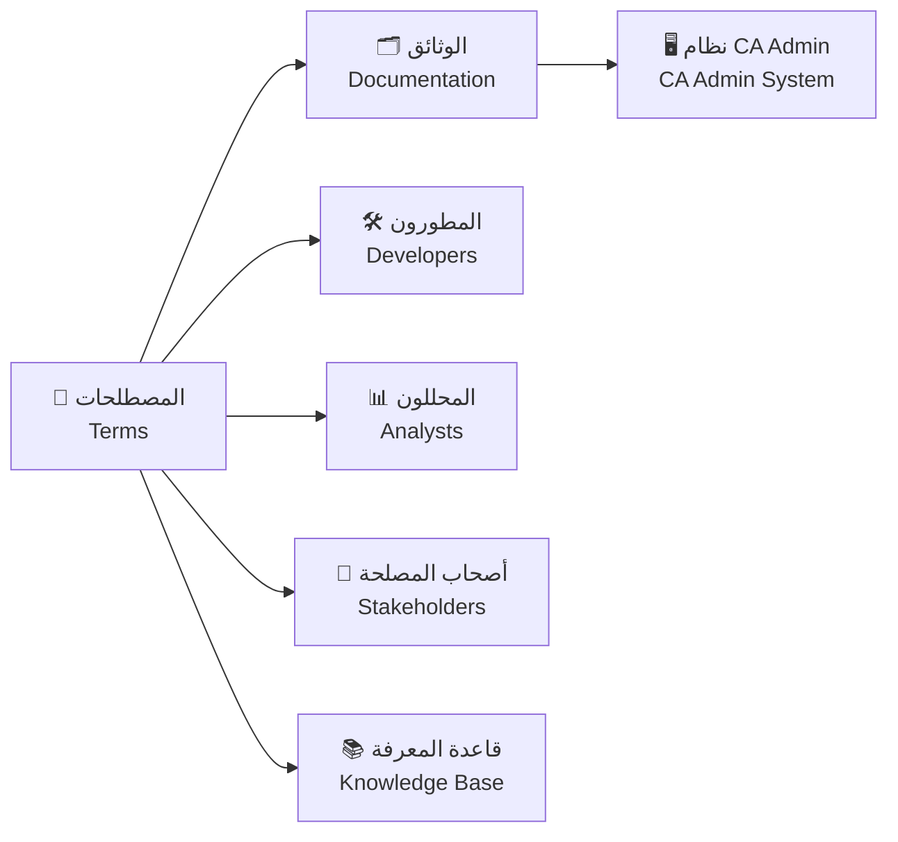
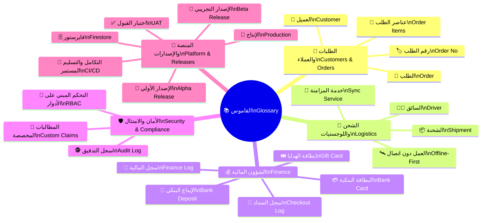
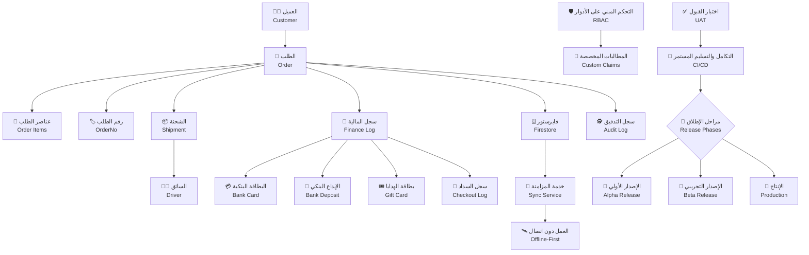

# 📚 قاموس المصطلحات | Glossary

| العنصر                         | القيمة                             |
| ------------------------------ | ---------------------------------- |
| 🏷️ المشروع Project          | منصة CA Admin CA Admin Platform |
| 👤 المالك Owner             | عبدالله الشايع Abdullah Alshaif |
| 🔢 الإصدار Version          | الإصدار 0.1 Version 0.1         |
| 📅 تاريخ الإنشاء Created On | 08-09-2025 2025-09-08           |
| 🔁 آخر تحديث Last Updated   | 08-09-2025 2025-09-08           |

## 🧭 الملخص التنفيذي | Executive Summary

🧭 يوفّر القاموس مركزًا موحدًا للمصطلحات التشغيلية الخاصة بمنصة CA Admin لضمان فهم واحد بين الفرق الفنية وغير الفنية.
🧭 The glossary centralizes CA Admin operational terminology so technical and business teams share a single understanding.

🧷 يساعد على ضبط جودة الوثائق، نماذج البيانات، وخطط الاختبار من خلال تعريفات دقيقة وقابلة للتتبع.
🧷 It safeguards documentation, data models, and test plans with precise, traceable definitions.

---

## 📖 المقدمة | Introduction

- 📘 يحدد القاموس المصطلحات الرسمية المعتمدة عبر الوثائق والمنتج لضمان الاتساق الدلالي.
  📘 The glossary defines the official terms used across documentation and product to keep semantics aligned.
- 🧩 يربط كل مصطلح بسياق الاستخدام الأساسي مثل نماذج البيانات أو تدفقات العمليات لتسهيل التتبع.
  🧩 Each term is tied to its primary usage context—data models or process flows—to simplify traceability.
- 🤝 يبني لغة مشتركة بين الفرق التقنية والتجارية ويُقلّل الالتباس أثناء التواصل اليومي.
  🤝 It builds a shared language between technical and business teams, reducing ambiguity in daily collaboration.

---

## 🗺️ نظرة مرئية | Visual Overview

- 🔄 يعرض المخطط كيفية تدفق المصطلحات المعتمدة إلى فرق المنتج لضمان الرسائل الموحدة.
  🔄 The diagram shows how approved terms flow into product teams to keep messaging aligned.
- 🧭 يربط الوثائق بالنظام التشغيلي ليصبح القاموس مرجعًا مباشرًا أثناء التطوير والتنفيذ.
  🧭 It links documentation to the operational platform so the glossary becomes a live reference during delivery.
- 🗂️ يوضح دور قاعدة المعرفة في حفظ التعريفات وتحديثها بشكل مركزي.
  🗂️ It highlights the knowledge base as the central store for maintaining and updating definitions.

---

## 🌳 خريطة المصطلحات الذهنية | Glossary Mindmap

- 🌐 تساعد الخريطة على رؤية مجموعات المصطلحات وتحديد العلاقات القوية بينها بسرعة.
  🌐 The mindmap reveals clustered groups of terms and surfaces strong relationships at a glance.
- 🧩 تمكن الفرق من اختيار المصطلحات حسب المجال، ما يسهّل التخطيط والتحليل الموجه.
  🧩 Teams can pick terms by domain, making targeted planning and analysis easier.
- 🧠 تدعم التدريب السريع للأعضاء الجدد عبر استعراض بصري مبسط للمفاهيم الأساسية.
  🧠 It accelerates onboarding by offering a visual tour of foundational concepts.

---

## 🗂️ جدول المصطلحات | Terms Table

| #   | المصطلح                               | التعريف                                                                                                                                            | مجالات الاستخدام                                                                 | ملاحظات مفتاحية                                                                                                                     |
| --- | ------------------------------------- | -------------------------------------------------------------------------------------------------------------------------------------------------- | -------------------------------------------------------------------------------- | ----------------------------------------------------------------------------------------------------------------------------------- |
| 1   | 🧑‍💼 العميل Customer                 | المستخدم النهائي الذي يطلب المنتجات عبر منصة CA Admin. End user who requests products via CA Admin.                                             | قصص المستخدم، نموذج البيانات. User Stories, Data Model.                       | يحدد مالك كل عملية بيع ويستخدم في تقارير النشاط الدورية. Identifies the owner of each sale and feeds recurring activity reports. |
| 2   | 📝 الطلب Order                     | طلب العميل الذي يجمع الروابط والكميات والملاحظات الخاصة بالمنتجات. Customer submission bundling product links, quantities, and notes.           | نموذج البيانات، خطة الاختبار. Data Model, Test Plan.                          | يمثل الوحدة الرئيسية للتتبع المالي واللوجستي في النظام. Acts as the primary unit for financial and logistics tracking.           |
| 3   | 🏷️ رقم الطلب OrderNo               | المعرّف الفريد الذي يميّز كل طلب عن غيره داخل النظام. Unique identifier assigned to every order in the platform.                                | تكامل النظم، التسويات المالية. Systems Integration, Financial Reconciliation. | ضروري للربط مع الأنظمة الخارجية وتقارير الامتثال. Required for external system links and compliance reports.                     |
| 4   | 🎁 عناصر الطلب Order Items         | المنتجات الفردية المرتبطة بطلب محدد مع الكمية والسعر لكل عنصر. Individual products tied to an order with quantity and price per line.           | نموذج البيانات، تدفقات العمليات. Data Model, Process Flows.                   | تُستخدم لحساب تكلفة الطلب ومراقبة المخزون. Used to calculate order cost and monitor inventory.                                   |
| 5   | 📦 الشحنة Shipment                 | الطرود التي تُنقل من السعودية إلى اليمن وترتبط بواحد أو أكثر من الطلبات. Packages transported from KSA to Yemen linked to one or more orders.   | نموذج البيانات، خطة الاختبار. Data Model, Test Plan.                          | تربط الطلبات بسجلات التتبع اللوجستية وواجهات شركات الشحن. Ties orders to logistics tracking records and carrier APIs.            |
| 6   | 🧑‍✈️ السائق Driver                   | الشخص المسؤول عن نقل الشحنات والتواصل مع المستلمين. Person responsible for transporting shipments and liaising with recipients.                 | العمليات الميدانية، خطة الدعم. Field Operations, Support Plan.                | يحدد المسؤوليات اليومية ويغذي سجلات الأداء الميداني. Defines daily responsibilities and feeds field performance logs.            |
| 7   | 📑 سجل المالية Finance Log         | سجل المعاملات المالية بما في ذلك المدفوعات، الإيداعات، والخصومات. Ledger of financial transactions covering payments, deposits, and deductions. | المالية، خطة الاختبار. Finance, Test Plan.                                    | يدعم المطابقة مع النظام البنكي وتقارير التدقيق. Supports bank reconciliation and audit reporting.                                |
| 8   | 💳 البطاقة البنكية Bank Card       | بطاقة تملكها الشركة وتُستخدم لإتمام المدفوعات الرسمية. Company-owned bank card used to execute official payments.                               | المالية، إجراءات الامتثال. Finance, Compliance Procedures.                    | يُراقَب رصيدها عبر سجل المالية والإيداعات المرتبطة بها. Balance is monitored via the finance log and linked deposits.            |
| 9   | 🏦 الإيداع البنكي Bank Deposit     | الأموال المضافة إلى البطاقة البنكية لدعم عمليات الشراء. Funds credited to the bank card to support purchasing operations.                       | المالية، التقارير الشهرية. Finance, Monthly Reporting.                        | يسهّل تتبّع التدفقات النقدية ويضمن سيولة كافية. Facilitates cash-flow tracking and ensures sufficient liquidity.                 |
| 10  | 🎟️ بطاقة الهدايا Gift Card         | بطاقة ترويجية تُستخدم لتقديم خصومات أو رصيد إضافي للعميل. Promotional card used to grant customer discounts or extra credit.                    | المالية، الحملات التسويقية. Finance, Marketing Campaigns.                     | تُدار صلاحيتها ضمن سجل المالية وتدقيق العروض الترويجية. Validity is managed within the finance log and promo audits.             |
| 11  | 🧾 سجل السداد Checkout Log         | سجل المصروفات التي تتم أثناء الشراء عبر المنصة. Record of expenses incurred during checkout through the platform.                               | المالية، المشتريات. Finance, Procurement.                                     | يقدّم شفافية لحساب تكلفة الطلب وحسابات الموردين. Provides transparency for order costing and vendor accounts.                    |
| 12  | 🛡️ التحكم المبني على الأدوار RBAC  | آلية تحديد صلاحيات المستخدمين بناءً على أدوارهم في المنصة. Mechanism that grants user permissions based on roles within the platform.           | الأمان، إدارة الحسابات. Security, Account Management.                         | يعد أساس تعريف الأدوار وربطها بالعمليات الحساسة. Forms the basis for defining roles and linking them to sensitive operations.    |
| 13  | 🧾 المطالبات المخصصة Custom Claims | قواعد إضافية في مصادقة Firebase لضبط صلاحيات دقيقة لكل دور. Additional Firebase auth rules enabling granular role permissions.                  | الأمان، الواجهة الخلفية. Security, Backend.                                   | تعزز RBAC وتوفر مرونة في سيناريوهات الأعمال المعقّدة. Enhances RBAC and supports complex business scenarios.                     |
| 14  | 🗄️ فايرستور Firestore              | قاعدة بيانات NoSQL سحابية تُستخدم لتخزين بيانات المنصة. Cloud NoSQL database used to persist platform data.                                     | نموذج البيانات، التكامل. Data Model, Integration.                             | يمكّن من التحديث الفوري للبيانات ودعم العمل دون اتصال. Enables real-time updates and offline-first capabilities.                 |
| 15  | 🕵️ سجل التدقيق Audit Log           | تسلسل زمني للأحداث الرئيسية لدعم الالتزام والمتابعة. Chronological trail of key events to support compliance and monitoring.                    | الأمان، المالية. Security, Finance.                                           | ضروري لتتبّع التغييرات الحساسة وإثبات الامتثال. Essential for tracking sensitive changes and proving compliance.                 |
| 16  | 🛰️ العمل دون اتصال Offline-First   | نمط معماري يعتمد على مزامنة البيانات مع إمكانية العمل بدون اتصال دائم. Architectural pattern prioritizing data sync with offline capability.    | الهندسة المعمارية، تدفقات العمليات. Architecture, Process Flows.              | يضمن استمرار الخدمة عند انقطاع الشبكة ويقلل فقدان البيانات. Keeps service continuity during outages and minimizes data loss.     |
| 17  | 🔄 خدمة المزامنة Sync Service      | خدمة مسؤولة عن مزامنة البيانات بين العملاء والنظام السحابي. Service that synchronizes data between clients and the cloud system.                | تدفقات العمليات، البنية الخلفية. Process Flows, Backend.                      | تنفذ قواعد الدمج وحلّ التعارضات بين المصادر المتعددة. Applies merge rules and resolves conflicts across sources.                 |
| 18  | ✅ اختبار القبول UAT               | مرحلة يقيم فيها المستخدمون النهائيون جاهزية النظام قبل الإطلاق. Phase where end users assess system readiness prior to launch.                  | خطة الاختبار، إدارة الإصدارات. Test Plan, Release Management.                 | يحدد التوقيع النهائي قبل الانتقال إلى بيئة الإنتاج. Sets the final sign-off before moving to production.                         |
| 19  | 🔄 التكامل والتسليم المستمر CI/CD  | سلسلة ممارسات لأتمتة الدمج والنشر بشكل متكرر. Set of practices automating integration and frequent deployments.                                 | الإصدار والتشغيل، DevOps. Release & Operations, DevOps.                       | يقلل مخاطر النشر ويوفر ملاحظات سريعة للفرق الهندسية. Reduces deployment risk and delivers rapid feedback to engineering teams.   |
| 20  | 🧪 الإصدار الأولي Alpha Release    | نسخة أولية لاختبار الخصائص مع فريق داخلي محدود. Early build used for internal limited feature testing.                                          | خطة الإصدار، ضمان الجودة. Release Plan, Quality Assurance.                    | يكشف العيوب الحرجة قبل مشاركة العملاء الحقيقيين. Exposes critical defects before external exposure.                              |
| 21  | 🧭 الإصدار التجريبي Beta Release   | نسخة تجريبية موجّهة لمجموعة مختارة من المستخدمين الخارجيين. Pre-release build shared with a curated external audience.                          | خطة الإصدار، تجربة المستخدم. Release Plan, User Experience.                   | يجمع تعقيبات الاستخدام ويساعد على ضبط خارطة الطريق. Collects usage feedback and sharpens the roadmap.                            |
| 22  | 🚀 الإنتاج Production              | البيئة الحية التي تخدم جميع المستخدمين وتستقبل الطلبات الفعلية. Live environment serving all users and processing real orders.                  | خطة الإصدار، مراقبة التشغيل. Release Plan, Operational Monitoring.            | يتطلب مراقبة لحظية وتنبيهات استباقية لأي انقطاع. Demands real-time monitoring and proactive outage alerts.                       |

---

## 🔗 مخطط العلاقات بين المصطلحات | Term Relationships Diagram

- 🧭 يوضح الرسم تحرّك البيانات من الطلب حتى التقارير المالية لضمان فهم كامل لدورة الحياة.
  🧭 The chart explains data movement from order to financial reporting to clarify the lifecycle.
- 🧩 يربط عناصر الأمن مثل RBAC بالمطالبات المخصصة لإظهار تأثيرها على الوصول.
  🧩 It links security elements like RBAC to custom claims to illustrate access impacts.
- 🚀 يبرز انتقال النتائج النهائية عبر مراحل الإطلاق حتى الإنتاج لمواءمة فرق DevOps.
  🚀 It highlights how deliverables travel through release stages to production, aligning DevOps teams.

---

## ✂️ الاختصارات الشائعة | Common Abbreviations

| الاختصار | المصطلح الكامل                               | الترجمة                                                                           | الاستخدام                                                                                                                           |
| -------- | -------------------------------------------- | --------------------------------------------------------------------------------- | ----------------------------------------------------------------------------------------------------------------------------------- |
| UAT      | User Acceptance Testing                      | اختبار قبول المستخدمين User Acceptance Testing                                 | يستخدم لضمان رضا المستخدم النهائي قبل الإطلاق الرسمي. Ensures end-user satisfaction before the formal launch.                    |
| CI/CD    | Continuous Integration / Continuous Delivery | التكامل المستمر / التسليم المستمر Continuous Integration / Continuous Delivery | يدعم أتمتة البناء والنشر المتكرر ويقلل مخاطر الإصدارات. Automates frequent builds and releases while reducing deployment risk.   |
| RBAC     | Role-Based Access Control                    | التحكم بالصلاحيات بناءً على الأدوار Role-Based Access Control                  | يحدد مستويات الوصول في النظام ويؤسس للسياسات الأمنية. Defines access levels in the system and underpins security policies.       |
| API      | Application Programming Interface            | واجهة برمجة التطبيقات Application Programming Interface                        | يربط المنصة بالأنظمة الخارجية ويتيح التكامل المعياري. Connects the platform to external systems and enables modular integration. |
| DB       | Database                                     | قاعدة البيانات Database                                                        | يخزن البيانات الهيكلية ويخدم الاستعلامات الداخلية والخارجية. Stores structured data and powers internal and external queries.    |

---

## ❓ الأسئلة المتكررة | Frequently Asked Questions

### ❔ كيف أضيف مصطلحًا جديدًا؟

How do I add a new term?

- ✅ راجع سياسات التسمية في دليل الحوكمة قبل اقتراح المصطلح الجديد.
  ✅ Review the naming policy in the governance guide before proposing a new term.
- 📬 أرسل التعريف المقترح عبر نموذج إدارة المعرفة ليتم مراجعته من مالك القاموس.
  📬 Submit the proposed definition through the knowledge management form for glossary owner review.

### ❔ من المسؤول عن تحديث القاموس؟

Who is responsible for updating the glossary?

- 👤 يتحمل مالك القاموس مسؤولية التحديثات الدورية ومراجعة التعديلات مع الفرق الوظيفية.
  👤 The glossary owner manages periodic updates and reviews changes with functional teams.
- 🤝 يمكن لقادة المنتجات إرسال طلبات التحديث بعد اعتمادها من فريق الجودة أو التدقيق.
  🤝 Product leads may submit update requests once validated by the quality or audit team.

### ❔ ما المتطلبات قبل نشر القاموس على النظام؟

What are the prerequisites before publishing the glossary to the system?

- 🧪 يجب إكمال قائمة التحقق بعنوان "اختبار القاموس" والتأكد من اتساق التعريفات مع الوثائق.
  🧪 Complete the "Glossary Test" checklist and confirm definitions align with documentation.
- 📊 ينبغي توثيق سجل المراجعة النهائي وحفظه في قاعدة المعرفة لسهولة الرجوع إليه.
  📊 Record the final review log and store it in the knowledge base for quick reference.

---

## 📝 ملاحظات | Notes

- 🧾 يُنصح بمراجعة القاموس شهريًا لضمان توافقه مع التغييرات في العمليات والمنتج.
  🧾 Review the glossary monthly to keep it aligned with evolving processes and product changes.
- 🧠 نفّذ جلسات توعوية مختصرة للفرق الجديدة لتسريع اعتمادهم للمصطلحات الموحدة.
  🧠 Run short enablement sessions for new teams to accelerate adoption of the unified vocabulary.
- 🛠️ حافظ على ربط القاموس بالوثائق الداعمة (مثل مخططات البيانات) لتحقيق أقصى قيمة تشغيلية.
  🛠️ Keep the glossary linked to supporting artifacts such as data diagrams to unlock maximum operational value.

---
