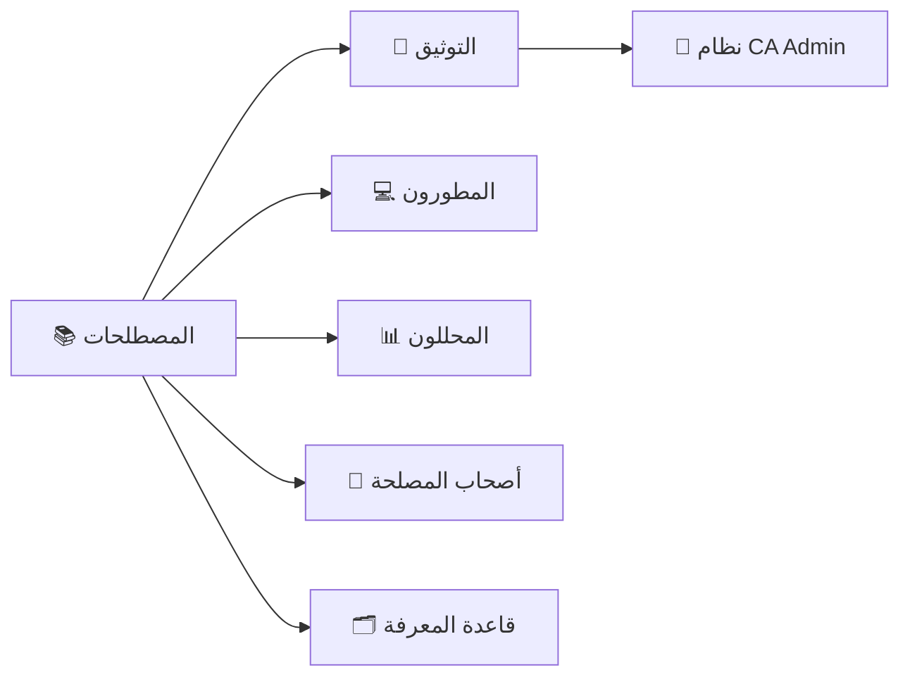
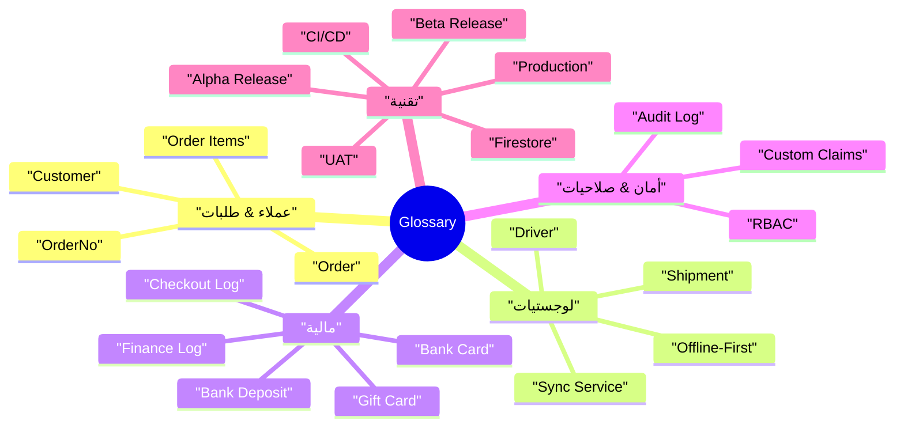
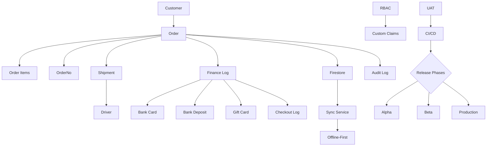

# 📚 القاموس | Glossary

> | 🔖  | البيان                         | Details          |
> | --- | ------------------------------ | ---------------- |
> | 🧾  | **النظام / Project**           | CA Admin         |
> | 🧑‍💼  | **مالك المستند / Owner**       | Abdullah Alshaif |
> | 🏷️  | **الإصدار / Version**          | v0.1             |
> | 📅  | **تاريخ الإنشاء / Created On** | 2025-09-08       |
> | 🔁  | **آخر تحديث / Last Updated**   | 2025-09-08       |

**الملخص التنفيذي | Executive Summary:**  
يوفّر هذا القاموس مرجعًا موحدًا للمصطلحات المستخدمة في منظومة CA Admin، لضمان فهم متسق بين المطور، المحلل، صاحب المصلحة، والمراجع.  
**Summary (EN):** This glossary centralizes CA Admin terminology so developers, analysts, stakeholders, and auditors share the same vocabulary and context.

---

## 🌟 مقدمة | Introduction

- 🗃️ يحدد المصطلحات الرسمية المستخدمة في التوثيق والمنتج (Defines official terminology across docs & product).
- 🧭 يربط كل مصطلح بخانة الاستخدام الأساسية لتسهيل الرجوع السريع (Connects terms to primary usage areas).
- 🤝 يبني لغة مشتركة تسهّل النقاشات التقنية والتجارية (Builds a shared language between technical and business teams).

---

## 🧷 نظرة بصرية سريعة | Visual Overview

- 📚 المصطلحات في قلب العملية؛ تغذي الوثائق وتدعم جميع الأدوار.
- 🧠 الوثائق تعيد تغذية النظام بالإيضاحات، ما يعزز قابلية الصيانة.
- 🗂️ قاعدة المعرفة تستفيد من القاموس لتوثيق القرارات والتغييرات.

---

## 🧠 خريطة ذهنية للمصطلحات | Glossary Mindmap

- 🎯 تصنيف المصطلحات يسهل الوصول السريع للموضوع المطلوب.
- 🔐 إبراز محاور الأمان والمالية يوضح أهمية الضوابط التشغيلية.
- ⚙️ ربط التقنية بالعمليات (CI/CD, Releases) يساعد فريق DevOps.

---

## 🗂️ جدول المصطلحات | Terms Table

| #   | Term (EN)     | المصطلح (AR)          | Definition (EN)                                                    | التعريف (AR)                                                             | أين يُستخدم؟ / Key Usage  |
| --- | ------------- | --------------------- | ------------------------------------------------------------------ | ------------------------------------------------------------------------ | ------------------------- | --- | --- | ----- | ------- | ------------------------------------------------------------------- | ------------------------------------------------------------- | ----------------------- |
| 1   | Customer      | العميل                | End user who requests products via CA Admin.                       | المستخدم النهائي الذي يطلب منتجات عبر النظام.                            | طلبات، دعم العملاء        | `n  | 2   | Order | الطلبية | A customer request containing product links, quantities, and notes. | طلب العميل الذي يحتوي على روابط المنتجات والكميات والملاحظات. | بوابة الطلبات، التقارير |
| 3   | OrderNo       | رقم الطلب             | Unique identifier for each order.                                  | معرف فريد لكل طلبية.                                                     | الربط مع الشحنات والسجلات |
| 4   | Order Items   | عناصر الطلب           | Individual products linked to an order.                            | المنتجات المفصلة المرتبطة بالطلبية.                                      | مخزون، تقارير مالية       |
| 5   | Shipment      | الشحنة                | Package(s) transported from KSA to Yemen, linked to orders.        | الطرد أو الطرود التي يتم شحنها من السعودية إلى اليمن والمرتبطة بالطلبات. | اللوجستيات، تتبع الحالة   |
| 6   | Driver        | السائق                | Person responsible for transporting shipments.                     | الشخص المسؤول عن نقل الشحنات.                                            | التخصيص، تتبع الموقع      |
| 7   | Finance Log   | سجل مالي              | Record of financial transactions (payments, deposits, deductions). | سجل للعمليات المالية (مدفوعات، إيداعات، خصومات).                         | المالية، تدقيق            |
| 8   | Bank Card     | البطاقة البنكية       | Company-owned bank card used for transactions.                     | بطاقة بنكية مملوكة للشركة تُستخدم في العمليات.                           | الدفع، السجلات            |
| 9   | Bank Deposit  | الإيداع البنكي        | Cash added to the bank card.                                       | إيداع نقدي في البطاقة البنكية.                                           | التسوية، تتبع الرصيد      |
| 10  | Gift Card     | بطاقة هدية            | Promo card used for customer discounts.                            | بطاقة ترويجية لخصم العملاء.                                              | التسويق، التقارير         |
| 11  | Checkout Log  | سجل الخروج            | Record of expenses during shopping.                                | سجل بالمصروفات أثناء الشراء.                                             | محاسبة، تدقيق             |
| 12  | RBAC          | التحكم بالأدوار       | Role-based access control for users.                               | التحكم المبني على الأدوار للمستخدمين.                                    | الأمان، إدارة المستخدمين  |
| 13  | Custom Claims | صلاحيات مخصصة         | Additional Firebase auth rules for roles.                          | صلاحيات إضافية في Firebase للمستخدمين.                                   | الأمان، المصادقة          |
| 14  | Firestore     | Firestore             | Cloud NoSQL database from Firebase.                                | قاعدة بيانات سحابية NoSQL من Firebase.                                   | نموذج البيانات، استعلامات |
| 15  | Audit Log     | سجل التدقيق           | Trail of key actions for compliance.                               | سجل بالأحداث الأساسية لأغراض الامتثال.                                   | الأمان، التقارير          |
| 16  | Offline-First | دون إنترنت أولًا      | Capability to work offline and sync later.                         | القدرة على العمل دون اتصال ثم المزامنة لاحقًا.                           | تجربة المستخدم، المزامنة  |
| 17  | Sync Service  | خدمة المزامنة         | Handles data sync between devices and cloud.                       | تدير مزامنة البيانات بين الأجهزة والسحابة.                               | العمليات، الأداء          |
| 18  | UAT           | اختبار القبول         | Final validation by stakeholders before release.                   | التحقق النهائي من أصحاب المصلحة قبل الإصدار.                             | خطة الاختبار، الإصدار     |
| 19  | CI/CD         | التكامل/النشر المستمر | Automated build, test, deploy pipeline.                            | خط آلي للبناء، الاختبار، والنشر.                                         | DevOps، مراقبة الجودة     |
| 20  | Alpha Release | الإصدار الأولي        | Internal build for core team.                                      | إصدار داخلي للفريق الأساسي.                                              | خطة الإصدار               |
| 21  | Beta Release  | الإصدار التجريبي      | Build for limited external users.                                  | إصدار لمجموعة خارجية محدودة.                                             | خطة الإصدار               |
| 22  | Production    | الإنتاج               | Live environment for end users.                                    | البيئة الفعلية للمستخدمين.                                               | دعم وتشغيل                |

---

## 🔍 علاقات المصطلحات | Term Relationships Diagram

- 🔗 يوضح كيف تتشارك المصطلحات في نفس السياق التشغيلي.
- 🧩 يبرز الترابط بين اللوجستيات والمالية والتقنية.
- 📦 يساعد في فهم الاعتماديات قبل التعديلات أو الإصدارات.

---

## 🔤 قائمة الاختصارات الشائعة | Common Abbreviations

| Abbreviation | Full Term (EN)                               | المصطلح الكامل (AR)       | ماذا يعني عمليًا؟                          |
| ------------ | -------------------------------------------- | ------------------------- | ------------------------------------------ |
| UAT          | User Acceptance Testing                      | اختبار القبول             | موافقة الأعمال قبل الإصدار النهائي         |
| CI/CD        | Continuous Integration / Continuous Delivery | التكامل/النشر المستمر     | أتمتة البناء/النشر لضمان إصدار سريع        |
| RBAC         | Role-Based Access Control                    | التحكم المبني على الأدوار | ضبط صلاحيات المستخدمين بناءً على أدوارهم   |
| API          | Application Programming Interface            | واجهة برمجة التطبيقات     | تمكين التكامل مع الأنظمة أو الخدمات الأخرى |
| DB           | Database                                     | قاعدة بيانات              | تخزين منظم للبيانات للرجوع والتحليل        |

---

## 🗂️ ربط المصطلحات بالأقسام | Terms vs Sections

| المصطلح (AR)     | Term (EN)     | القسم المرتبط                | Linked Section              | لماذا؟                                     |
| ---------------- | ------------- | ---------------------------- | --------------------------- | ------------------------------------------ |
| العميل           | Customer      | قصص المستخدم، نموذج البيانات | User Stories, Data Model    | يعرّف سيناريوهات الاستخدام وتدفق البيانات  |
| الطلبية          | Order         | نموذج البيانات، خطة الاختبار | Data Model, Test Plan       | محور سير العمل والتغطية الاختبارية         |
| الشحنة           | Shipment      | نموذج البيانات، خطة الاختبار | Data Model, Test Plan       | جزء أساسي من اللوجستيات والمتابعة          |
| السائق           | Driver        | نموذج البيانات               | Data Model                  | يحدد هيكل التخصيص والتتبع                  |
| سجل مالي         | Finance Log   | المالية، خطة الاختبار        | Finance, Test Plan          | يُستخدم للتسويات والتدقيق                  |
| البطاقة البنكية  | Bank Card     | المالية                      | Finance                     | تدفقات المدفوعات وإدارة الرصيد             |
| بطاقة هدية       | Gift Card     | المالية                      | Finance                     | سياسات العروض والمكافآت                    |
| سجل الخروج       | Checkout Log  | المالية                      | Finance                     | مراقبة المصروفات في الرحلات الشرائية       |
| التحكم بالأدوار  | RBAC          | الأمان والأدوار              | Security & Roles            | حوكمة الوصول للمستخدمين                    |
| Firestore        | Firestore     | نموذج البيانات               | Data Model                  | قاعدة البيانات المركزية للتطبيق            |
| دون إنترنت أولًا | Offline-First | العمارة، العمليات            | Architecture, Process Flows | تصميم يدعم العمل في البيئات منخفضة الاتصال |
| خدمة المزامنة    | Sync Service  | العمليات                     | Process Flows               | يضمن توحيد البيانات عبر القنوات            |
| سجل التدقيق      | Audit Log     | الأمان، المالية              | Security, Finance           | توثيق الامتثال والشفافية                   |
| اختبار القبول    | UAT           | خطة الاختبار                 | Test Plan                   | خطوة الموافقة قبل الإصدار                  |
| CI/CD            | CI/CD         | خطة الإصدار وDevOps          | Release & DevOps            | أتمتة الغطاء الاختباري والإصدار            |
| الإصدار الأولي   | Alpha Release | خطة الإصدار                  | Release Plan                | بناء داخلي لجمع تعليقات الفريق             |
| الإصدار التجريبي | Beta Release  | خطة الإصدار                  | Release Plan                | اختبار خارجي مضبوط                         |
| الإنتاج          | Production    | خطة الإصدار                  | Release Plan                | البيئة الفعلية للعملاء                     |

---

## ❓ الأسئلة الشائعة | FAQ

### لماذا أستخدم هذا القاموس؟

- ✅ لتقليل الغموض في الاجتماعات والمستندات.
- 📌 لمواءمة المصطلحات بين الفرق التقنية وغير التقنية.

### كيف أضيف مصطلحًا جديدًا؟

- 🧾 راجع إدارة المشروع أو محلل النظام.
- ✍️ أضف المصطلح إلى الجدول مع تعريف عربي/إنجليزي، وسياق الاستخدام.

### هل يمكن ربط المصطلحات بأجزاء أخرى من التوثيق؟

- 🔗 نعم، استخدم قسم "ربط المصطلحات بالأقسام" للرجوع السريع.
- 🧭 أضف روابط مباشرة داخل الملفات الأخرى عند الحاجة.

---

## 📝 ملاحظات ختامية | Notes

- 🔄 حدّث القاموس عند إضافة ميزات رئيسية أو تغيير السياسات.
- 🧠 استخدم القاموس خلال مراجعات التصميم لتقليل التباينات اللفظية.
- 📣 شارك القاموس مع الفرق الخارجية (دعم، تسويق) عند الضرورة.
