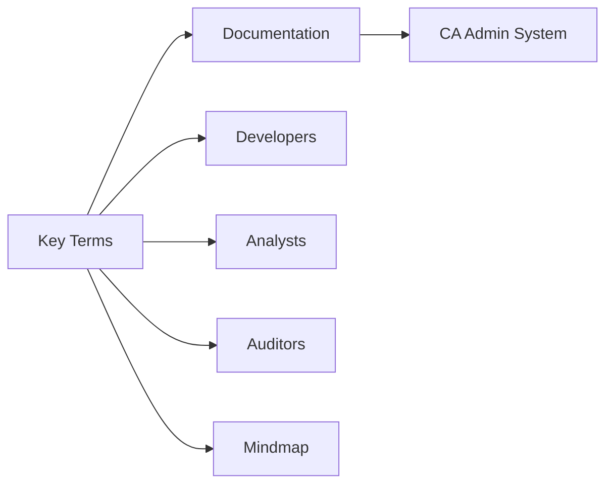
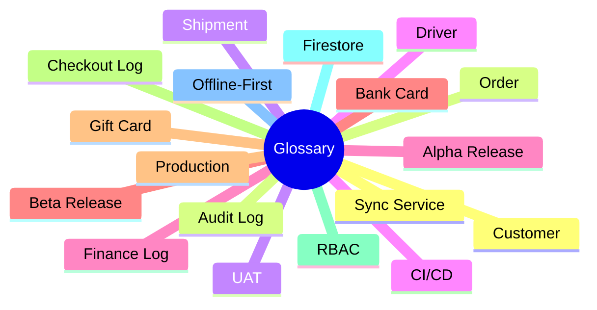
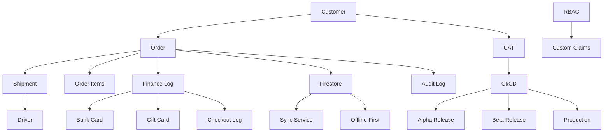

# 📚 Glossary / القاموس

> **Project:** CA Admin  
> **Version:** v0.1 — Owner: Abdullah Alshaif  
> **Last Updated:** 2025-09-08

---

## 1. Introduction / المقدمة

**EN:**
This glossary defines key terms used in the CA Admin system documentation. It ensures consistent understanding across stakeholders, developers, and auditors.

**AR:**
يعرّف هذا القاموس المصطلحات الرئيسية المستخدمة في توثيق نظام CA Admin. ويساعد على ضمان فهم موحد بين أصحاب المصلحة، المطورين، والمراجعين.

---

## 2. Visual Summary / ملخص بصري

---

## 3. Glossary Mindmap / خريطة ذهنية للمصطلحات

---

## 4. Terms Table / جدول المصطلحات

| #   | Term (EN)         | المصطلح (AR)           | Definition (EN)                                                     | التعريف (AR)                                                               |
| --- | ----------------- | ---------------------- | ------------------------------------------------------------------- | -------------------------------------------------------------------------- |
| 1   | **Customer**      | العميل                 | End user who requests products via CA Admin.                        | المستخدم النهائي الذي يطلب منتجات عبر النظام.                              |
| 2   | **Order**         | الطلبية                | A customer request containing product links, quantities, and notes. | طلب العميل الذي يحتوي على روابط المنتجات والكميات والملاحظات.              |
| 3   | **OrderNo**       | رقم الطلب              | Unique identifier for each order.                                   | معرف فريد لكل طلبية.                                                       |
| 4   | **Order Items**   | عناصر الطلب            | Individual products linked to an order.                             | المنتجات المفصلة المرتبطة بالطلبية.                                        |
| 5   | **Shipment**      | الشحنة                 | Package(s) transported from KSA to Yemen, linked to orders.         | الطرد أو الطرود التي يتم شحنها من السعودية إلى اليمن والمرتبطة بالطلبات.   |
| 6   | **Driver**        | السائق                 | Person responsible for transporting shipments.                      | الشخص المسؤول عن نقل الشحنات.                                              |
| 7   | **Finance Log**   | سجل مالي               | Record of financial transactions (payments, deposits, deductions).  | سجل للعمليات المالية (مدفوعات، إيداعات، خصومات).                           |
| 8   | **Bank Card**     | البطاقة البنكية        | Company-owned bank card used for transactions.                      | بطاقة بنكية مملوكة للشركة تُستخدم في العمليات.                             |
| 9   | **Bank Deposit**  | إيداع بنكي             | Amount credited into a bank card.                                   | المبلغ المودع في البطاقة البنكية.                                          |
| 10  | **Bank Payment**  | دفعة بنكية             | Amount debited from a bank card.                                    | المبلغ المدفوع من البطاقة البنكية.                                         |
| 11  | **Gift Card**     | بطاقة هدية             | Prepaid card (e.g., Shein gift card) used for purchases or refunds. | بطاقة مدفوعة مسبقًا (مثل بطاقة هدية شي إن) تُستخدم في الشراء أو الاسترجاع. |
| 12  | **Checkout Log**  | سجل الخروج             | Summary record of reconciled balances for auditing.                 | سجل ملخص للمبالغ المطابقة بهدف التدقيق.                                    |
| 13  | **RBAC**          | التحكم بالأدوار        | Role-Based Access Control: defines permissions by role.             | التحكم المبني على الأدوار: يحدد الصلاحيات حسب الدور.                       |
| 14  | **Custom Claims** | صلاحيات مخصصة          | Firebase Auth feature to assign roles to users.                     | ميزة في Firebase Auth لتعيين أدوار للمستخدمين.                             |
| 15  | **Firestore**     | قاعدة بيانات Firestore | NoSQL database used as the backend for CA Admin.                    | قاعدة بيانات NoSQL تُستخدم كخلفية لتطبيق CA Admin.                         |
| 16  | **Offline-First** | دون إنترنت أولاً       | Design principle where app works offline and syncs later.           | مبدأ تصميم بحيث يعمل التطبيق بدون إنترنت ويزامن لاحقًا.                    |
| 17  | **Sync Service**  | خدمة المزامنة          | Component that handles offline-to-online synchronization.           | مكون مسؤول عن المزامنة من وضع دون إنترنت إلى متصل.                         |
| 18  | **Audit Log**     | سجل التدقيق            | Record of all changes for compliance and reviews.                   | سجل لجميع التغييرات لأغراض المراجعة والامتثال.                             |
| 19  | **UAT**           | اختبار القبول          | User Acceptance Testing: verifying system meets stakeholder needs.  | اختبار القبول من المستخدم: التحقق من أن النظام يلبي متطلبات أصحاب المصلحة. |
| 20  | **CI/CD**         | التكامل/النشر المستمر  | Continuous Integration & Continuous Delivery pipeline.              | خط أنابيب التكامل المستمر والتوزيع المستمر.                                |
| 21  | **Alpha Release** | الإصدار الأولي         | Internal-only release for testing.                                  | إصدار أولي داخلي للاختبار.                                                 |
| 22  | **Beta Release**  | الإصدار التجريبي       | Release to selected users for feedback.                             | إصدار لمستخدمين محددين لأخذ الملاحظات.                                     |
| 23  | **Production**    | الإنتاج                | Final public release for all users.                                 | الإصدار النهائي المتاح لجميع المستخدمين.                                   |

---

## 5. Usage Tips & Best Practices / نصائح الاستخدام وأفضل الممارسات

1. **Keep the glossary updated:** Add new terms as the system evolves.
2. **Use terms consistently:** All team members should use these terms in code, documentation, and communication.
3. **Reference related docs:** Link terms to [Vision](../01-vision/01-vision.md), [Stakeholders](../02-stakeholders/02-stakeholders.md), [Data Model](../05-data-model/05-data-model.md), and [Security](../08-security-and-roles/08-security-and-roles.md) for context.
4. **Review regularly:** Analysts and developers should review the glossary before starting new features or documentation.

---

## 6. Notes / ملاحظات

1. This glossary should be updated whenever new business or technical terms appear.
2. It complements the main documentation and helps unify understanding across the team.

---

## 7. Common Abbreviations / الاختصارات الشائعة

| Abbreviation | Full Term (EN)                               | المصطلح الكامل (AR)       |
| ------------ | -------------------------------------------- | ------------------------- |
| UAT          | User Acceptance Testing                      | اختبار القبول             |
| CI/CD        | Continuous Integration / Continuous Delivery | التكامل/النشر المستمر     |
| RBAC         | Role-Based Access Control                    | التحكم المبني على الأدوار |
| API          | Application Programming Interface            | واجهة برمجة التطبيقات     |
| DB           | Database                                     | قاعدة بيانات              |

---

## 8. Term Relationships Diagram / رسم توضيحي لعلاقات المصطلحات

---

## 9. FAQ / الأسئلة الشائعة

### Q1: لماذا يجب أن أستخدم هذا القاموس؟

لضمان توحيد المصطلحات بين جميع أعضاء الفريق وتسهيل التواصل بين المطورين والمحللين وأصحاب المصلحة.

### Q2: كيف أضيف مصطلحًا جديدًا؟

راجع مع مدير المشروع أو محلل النظام، ثم أضف المصطلح إلى الجدول مع تعريف واضح باللغتين.

### Q3: هل يمكن ربط المصطلحات بأجزاء أخرى من التوثيق؟

نعم، يفضل ربط المصطلحات بالوثائق ذات الصلة مثل الرؤية، نموذج البيانات، أو خطة الأمان.

---
