# 📚 القاموس

Glossary

---

> **المشروع:** CA Admin
> **Project:** CA Admin
> **الإصدار:** v0.1 — المالك: عبدالله الشائف
> **Version:** v0.1 — Owner: Abdullah Alshaif
> **آخر تحديث:** 2025-09-08
> **Last Updated:** 2025-09-08

**شرح مختصر:**
يوضح هذا القاموس جميع المصطلحات الرئيسية المستخدمة في النظام لضمان فهم موحد بين جميع الأطراف.

**Summary:**
This glossary explains all key terms used in the system to ensure unified understanding among all parties.

---

## المقدمة

Introduction

يعرف هذا القاموس المصطلحات الرئيسية المستخدمة في توثيق نظام CA Admin. ويساعد على ضمان فهم موحد بين أصحاب المصلحة، المطورين، والمراجعين.

This glossary defines key terms used in the CA Admin system documentation. It ensures consistent understanding across stakeholders, developers, and auditors.

---

## ملخص بصري

Visual Summary

**شرح مختصر:**
مخطط يوضح كيف ترتبط المصطلحات الرئيسية بجميع عناصر النظام.

**Summary:**
Diagram showing how key terms relate to all system elements.

```mermaid
flowchart LR
 Terms["المصطلحات الرئيسية"] --> Docs["التوثيق"]
 Terms --> Devs["المطورون"]
 Terms --> Analysts["المحللون"]
 Terms --> Auditors["المراجعون"]
 Docs --> System["نظام CA Admin"]
 Terms --> Mindmap["خريطة ذهنية"]
```

---

## خريطة ذهنية للمصطلحات

Glossary Mindmap

**شرح مختصر:**
خريطة ذهنية تلخص أهم المصطلحات المستخدمة في النظام.

**Summary:**
Mindmap summarizing the main terms used in the system.

```mermaid
mindmap
  root((القاموس))
    العميل
    الطلبية
    الشحنة
    السائق
    سجل مالي
    البطاقة البنكية
    بطاقة هدية
    سجل الخروج
    التحكم بالأدوار
    Firestore
    دون إنترنت أولاً
    خدمة المزامنة
    سجل التدقيق
    اختبار القبول
    CI/CD
    الإصدار الأولي
    الإصدار التجريبي
    الإنتاج
```

---

## جدول المصطلحات

Terms Table

**شرح مختصر:**
جدول يوضح تعريف كل مصطلح باللغتين.

**Summary:**
Table showing the definition of each term in both languages.

| #   | Term (EN)         | المصطلح (AR)           | Definition (EN)                                                     | التعريف (AR)                                                               |
| --- | ----------------- | ---------------------- | ------------------------------------------------------------------- | -------------------------------------------------------------------------- |
| 1   | **Customer**      | العميل                 | End user who requests products via CA Admin.                        | المستخدم النهائي الذي يطلب منتجات عبر النظام.                              |
| 2   | **Order**         | الطلبية                | A customer request containing product links, quantities, and notes. | طلب العميل الذي يحتوي على روابط المنتجات والكميات والملاحظات.              |
| 3   | **OrderNo**       | رقم الطلب              | Unique identifier for each order.                                   | معرف فريد لكل طلبية.                                                       |
| 4   | **Order Items**   | عناصر الطلب            | Individual products linked to an order.                             | المنتجات المفصلة المرتبطة بالطلبية.                                        |
| 5   | **Shipment**      | الشحنة                 | Package(s) transported from KSA to Yemen, linked to orders.         | الطرد أو الطرود التي يتم شحنها من السعودية إلى اليمن والمرتبطة بالطلبات.   |
| 6   | **Driver**        | السائق                 | Person responsible for transporting shipments.                      | الشخص المسؤول عن نقل الشحنات.                                              |
| 7   | **Finance Log**   | سجل مالي               | Record of financial transactions (payments, deposits, deductions).  | سجل للعمليات المالية (مدفوعات، إيداعات، خصومات).                           |
| 8   | **Bank Card**     | البطاقة البنكية        | Company-owned bank card used for transactions.                      | بطاقة بنكية مملوكة للشركة تُستخدم في العمليات.                             |
| 9   | **Bank Deposit**  | إيداع بنكي             | Amount credited into a bank card.                                   | المبلغ المودع في البطاقة البنكية.                                          |
| 10  | **Bank Payment**  | دفعة بنكية             | Amount debited from a bank card.                                    | المبلغ المدفوع من البطاقة البنكية.                                         |
| 11  | **Gift Card**     | بطاقة هدية             | Prepaid card (e.g., Shein gift card) used for purchases or refunds. | بطاقة مدفوعة مسبقًا (مثل بطاقة هدية شي إن) تُستخدم في الشراء أو الاسترجاع. |
| 12  | **Checkout Log**  | سجل الخروج             | Summary record of reconciled balances for auditing.                 | سجل ملخص للمبالغ المطابقة بهدف التدقيق.                                    |
| 13  | **RBAC**          | التحكم بالأدوار        | Role-Based Access Control: defines permissions by role.             | التحكم المبني على الأدوار: يحدد الصلاحيات حسب الدور.                       |
| 14  | **Custom Claims** | صلاحيات مخصصة          | Firebase Auth feature to assign roles to users.                     | ميزة في Firebase Auth لتعيين أدوار للمستخدمين.                             |
| 15  | **Firestore**     | قاعدة بيانات Firestore | NoSQL database used as the backend for CA Admin.                    | قاعدة بيانات NoSQL تُستخدم كخلفية لتطبيق CA Admin.                         |
| 16  | **Offline-First** | دون إنترنت أولاً       | Design principle where app works offline and syncs later.           | مبدأ تصميم بحيث يعمل التطبيق بدون إنترنت ويزامن لاحقًا.                    |
| 17  | **Sync Service**  | خدمة المزامنة          | Component that handles offline-to-online synchronization.           | مكون مسؤول عن المزامنة من وضع دون إنترنت إلى متصل.                         |
| 18  | **Audit Log**     | سجل التدقيق            | Record of all changes for compliance and reviews.                   | سجل لجميع التغييرات لأغراض المراجعة والامتثال.                             |
| 19  | **UAT**           | اختبار القبول          | User Acceptance Testing: verifying system meets stakeholder needs.  | اختبار القبول من المستخدم: التحقق من أن النظام يلبي متطلبات أصحاب المصلحة. |
| 20  | **CI/CD**         | التكامل/النشر المستمر  | Continuous Integration & Continuous Delivery pipeline.              | خط أنابيب التكامل المستمر والتوزيع المستمر.                                |
| 21  | **Alpha Release** | الإصدار الأولي         | Internal-only release for testing.                                  | إصدار أولي داخلي للاختبار.                                                 |
| 22  | **Beta Release**  | الإصدار التجريبي       | Release to selected users for feedback.                             | إصدار لمستخدمين محددين لأخذ الملاحظات.                                     |
| 23  | **Production**    | الإنتاج                | Final public release for all users.                                 | الإصدار النهائي المتاح لجميع المستخدمين.                                   |

---

## 5. Usage Tips & Best Practices / نصائح الاستخدام وأفضل الممارسات

1. **Keep the glossary updated:** Add new terms as the system evolves.
2. **Use terms consistently:** All team members should use these terms in code, documentation, and communication.
3. **Reference related docs:** Link terms to [Vision](../01-vision/01-vision.md), [Stakeholders](../02-stakeholders/02-stakeholders.md), [Data Model](../05-data-model/05-data-model.md), and [Security](../08-security-and-roles/08-security-and-roles.md) for context.
4. **Review regularly:** Analysts and developers should review the glossary before starting new features or documentation.

---

## 6. Notes / ملاحظات

1. This glossary should be updated whenever new business or technical terms appear.
2. It complements the main documentation and helps unify understanding across the team.

---

## 7. Common Abbreviations / الاختصارات الشائعة

| Abbreviation | Full Term (EN)                               | المصطلح الكامل (AR)       |
| ------------ | -------------------------------------------- | ------------------------- |
| UAT          | User Acceptance Testing                      | اختبار القبول             |
| CI/CD        | Continuous Integration / Continuous Delivery | التكامل/النشر المستمر     |
| RBAC         | Role-Based Access Control                    | التحكم المبني على الأدوار |
| API          | Application Programming Interface            | واجهة برمجة التطبيقات     |
| DB           | Database                                     | قاعدة بيانات              |

---

## 8. Term Relationships Diagram / رسم توضيحي لعلاقات المصطلحات

---

## 9. FAQ / الأسئلة الشائعة

### Q1: لماذا يجب أن أستخدم هذا القاموس؟

لضمان توحيد المصطلحات بين جميع أعضاء الفريق وتسهيل التواصل بين المطورين والمحللين وأصحاب المصلحة.

### Q2: كيف أضيف مصطلحًا جديدًا؟

راجع مع مدير المشروع أو محلل النظام، ثم أضف المصطلح إلى الجدول مع تعريف واضح باللغتين.

### Q3: هل يمكن ربط المصطلحات بأجزاء أخرى من التوثيق؟

نعم، يفضل ربط المصطلحات بالوثائق ذات الصلة مثل الرؤية، نموذج البيانات، أو خطة الأمان.

---
