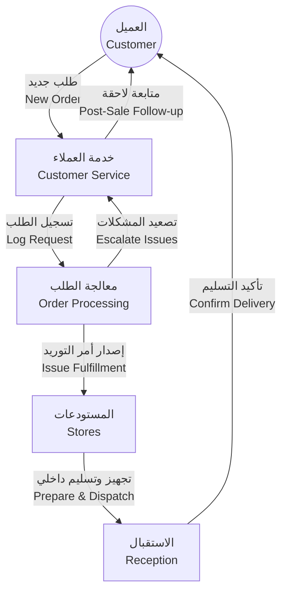
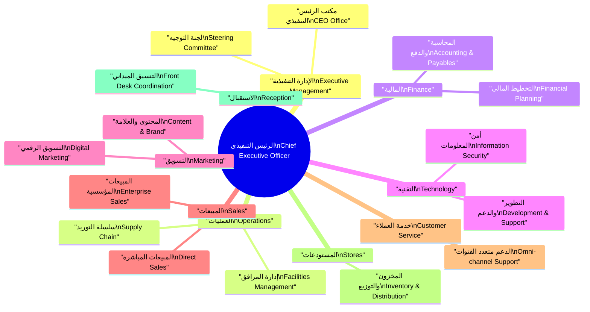

# الهيكل التنظيمي والبنية

Organizational Hierarchy & Structure

| العنصر Item            | التفاصيل Details                                                                                                                                                                  |
| ------------------------- | ------------------------------------------------------------------------------------------------------------------------------------------------------------------------------------ |
| المؤسسة Organization   | الإدارة العامة CA Admin DmG CA Admin DmG Headquarters                                                                                                                             |
| المالك Owner           | عبد الله الشائف Abdullah Alshaif                                                                                                                                                  |
| الغرض Purpose          | توضيح الهيكل التنظيمي ومسارات المسؤولية لدعم سرعة القرار وتنسيق الجهود. Clarify the organizational structure and accountability paths to support fast decisions and coordination. |
| آخر تحديث Last Updated | 2025-09-08 2025-09-08                                                                                                                                                             |

**ملخص تنفيذي:**  
يركز هذا المستند على إبراز الروابط بين الأقسام، مستويات الحوكمة، ومسؤوليات الأدوار لضمان شفافية الأداء.  
**Executive Summary:**  
This document highlights inter-department links, governance layers, and role responsibilities to ensure performance transparency.

---

## سير العمل بين الأقسام

Cross-Department Workflow

- يوضح الرسم مسار رحلة الطلب من الاستلام حتى الإغلاق.  
  The diagram illustrates the order journey from intake to closure.
- يدعم فهم الاعتماد المتبادل بين الفرق التشغيلية والواجهات الأمامية.  
  It supports understanding of interdependencies between operational teams and front offices.
- يساعد على تحديد نقاط القياس والرقابة في كل مرحلة.  
  It helps pinpoint measurement and control checkpoints at each stage.

---

## ملخص سير العمل السريع

Quick Workflow Summary

1. يرسل العميل طلبًا جديدًا عبر القنوات الرقمية أو الهاتفية.  
   The customer submits a new request through digital or phone channels.
2. يجمع فريق خدمة العملاء البيانات ويؤكد النطاق مع العميل.  
   The customer service team gathers data and confirms scope with the customer.
3. يراجع فريق معالجة الطلب المستندات ويصدر الفاتورة الأولية.  
   The order processing team reviews documentation and issues the initial invoice.
4. تهيئ المستودعات المواد وتنسق الشحن الداخلي أو الخارجي.  
   The stores team prepares materials and coordinates internal or external dispatch.
5. يتولى فريق الاستقبال التسليم النهائي ويتابع التحصيل.  
   The reception team completes final handover and manages collection.
6. تُسجل جميع الخطوات وتُراقب مؤشرات الأداء رقميًا.  
   All steps are logged and monitored through digital performance indicators.

---

## الأدوار والمسؤوليات الرئيسية

Key Roles & Responsibilities

| الفريق Team                           | المسؤوليات الرئيسية Key Responsibilities                                                                                                                                             | خط التقارير Reporting Line                                                         |
| ---------------------------------------- | --------------------------------------------------------------------------------------------------------------------------------------------------------------------------------------- | ------------------------------------------------------------------------------------- |
| خدمة العملاء Customer Service         | استقبال الطلبات، توثيق التفاصيل، المتابعة الاستباقية مع العملاء، وإدارة التعليقات. Capture requests, document details, follow up proactively with customers, and manage feedback.    | مشرف خدمة العملاء ← مدير القسم. Customer Service Supervisor → Department Manager.  |
| معالجة الطلب Order Processing         | مراجعة الطلبات، تدقيق الاستحقاقات، إصدار أوامر التنفيذ والفواتير، وضبط الجودة. Review orders, verify entitlements, issue execution orders and invoices, and enforce quality control. | قائد معالجة الطلب ← مدير العمليات. Order Processing Lead → Operations Manager.     |
| المستودعات Stores                     | جدولة التجهيز، مراقبة المخزون، إنشاء محاضر التسليم، وضمان السلامة. Schedule preparation, monitor inventory, generate dispatch notes, and ensure safety.                              | مشرف المستودعات ← مدير العمليات. Stores Supervisor → Operations Manager.           |
| الاستقبال Reception                   | تنظيم زيارات العملاء، تسليم الطلبات، إدارة سجلات الاستلام، وتوثيق التحصيلات. Arrange customer visits, hand over orders, manage receipt logs, and document collections.               | مسؤول الاستقبال ← مدير الخدمات المشتركة. Reception Lead → Shared Services Manager. |
| الإدارة القسمية Department Management | وضع مؤشرات الأداء، توجيه خطط التحسين، تنسيق الجداول، وإدارة المخاطر. Set performance indicators, steer improvement plans, coordinate schedules, and manage risks.                    | المدير التنفيذي ← الرئيس التنفيذي. Executive Director → Chief Executive Officer.   |

---

## المخطط التنظيمي التنفيذي

Executive Organization Chart

---

## الإدارات والفرق الفرعية

Departments & Sub-teams

### 1. الإدارة التنفيذية (Executive Management)

Executive Management

- تقود استراتيجية المؤسسة وتضمن التوافق مع التوجهات طويلة المدى.  
  Leads the corporate strategy and ensures alignment with long-term directions.
- تدير التواصل مع مجلس الإدارة والشركاء الرئيسيين.  
  Manages communication with the board and principal partners.
- تراقب تحقيق مؤشرات الأداء وتدعم مبادرات التحسين.  
  Oversees performance metrics and supports improvement initiatives.

### 2. إدارة العمليات (Operations)

Operations

- تشغل العمليات اليومية وتنسق الموارد عبر الأقسام الداعمة.  
  Runs day-to-day operations and coordinates resources across support teams.
- تطبق سياسات الجودة والسلامة في خطوط الخدمة.  
  Enforces quality and safety policies across service lines.
- تتابع المخاطر التشغيلية وتنفذ خطط الاستمرارية.  
  Tracks operational risks and executes continuity plans.

### 3. الإدارة المالية (Finance)

Finance

- تصمم الميزانيات وتعالج التنبؤات النقدية والربحية.  
  Designs budgets and manages cash and profitability forecasts.
- تضمن دقة السجلات المحاسبية والامتثال للوائح.  
  Ensures accuracy of accounting records and regulatory compliance.
- تقدم تحليلات مالية لدعم القرارات الاستثمارية.  
  Provides financial analysis to inform investment decisions.

### 4. إدارة التقنية (Technology)

Technology

- تطور الأنظمة الداعمة للعمليات وتكامل البيانات.  
  Develops operational systems and data integrations.
- تشرف على البنية التحتية والأمن السيبراني.  
  Oversees infrastructure and cybersecurity.
- تدير مكتب إدارة المشاريع التقنية ودعم المستخدمين.  
  Manages the technology PMO and user support services.

### 5. إدارة التسويق (Marketing)

Marketing

#### أ) فريق التسويق الرقمي

Digital Marketing Team

- يبني الحملات الرقمية ويعزز الحضور عبر المنصات.  
  Builds digital campaigns and strengthens multi-platform presence.
- يحلل بيانات الزوار لتحسين معدلات التحويل.  
  Analyzes visitor data to optimize conversion rates.
- يدير الإعلانات المدفوعة ويقيس العائد على الاستثمار.  
  Manages paid media and measures return on investment.

#### ب) فريق التسويق الميداني

Field Marketing Team

- ينظم الفعاليات والمعارض لدعم المبيعات.  
  Organizes events and exhibitions to support sales.
- يتعاون مع الفرق الميدانية لتخصيص العروض.  
  Collaborates with field teams to tailor offerings.
- يجمع ردود الأفعال من السوق وينقلها للتطوير.  
  Collects market feedback and relays it for development.

### 6. إدارة المبيعات (Sales)

Sales

#### أ) المبيعات المؤسسية

Enterprise Sales

- يبني علاقات مع العملاء الرئيسيين ويغلق الصفقات الكبرى.  
  Builds relationships with key clients and closes large deals.
- يصمم حلولًا مخصصة لتلبية احتياجات المؤسسات.  
  Designs tailored solutions to meet enterprise needs.
- يقود مفاوضات العقود وشروط الخدمة.  
  Leads contract negotiations and service terms.

#### ب) المبيعات المباشرة

Direct Sales

- يدير قنوات البيع المباشر والطلبات المتكررة.  
  Manages direct sales channels and repeat orders.
- يطور قوائم العملاء المحتملين ويعزز فرص الترقيات.  
  Develops prospect lists and boosts upsell opportunities.
- يتابع التسليم لضمان رضا العملاء النهائيين.  
  Tracks fulfillment to ensure end-customer satisfaction.

### 7. إدارة خدمة العملاء (Customer Service)

Customer Service

- يدير مركز الاتصال والقنوات الرقمية الفورية.  
  Operates the contact center and instant digital channels.
- يوفر قاعدة معرفة محدثة لفرق الدعم.  
  Provides an updated knowledge base for support teams.
- يحلل مؤشرات رضا العملاء ويقترح التحسينات.  
  Analyzes customer satisfaction metrics and suggests improvements.

### 8. إدارة المستودعات (Stores)

Stores

- يتحكم في مستويات المخزون ويمنع النقص أو الفائض.  
  Controls inventory levels and prevents shortages or overstock.
- يطبق إجراءات السلامة والجودة في التجهيز والتخزين.  
  Enforces safety and quality procedures in preparation and storage.
- يدير عمليات الجرد الدوري والتقارير اللوجستية.  
  Manages periodic counts and logistical reporting.

### 9. إدارة الاستقبال (Reception)

Reception

- ينسق استقبال العملاء والزوار ويوجههم.  
  Coordinates the reception of customers and visitors and guides them.
- يتابع جداول التسليم والحجوزات المسبقة.  
  Tracks delivery schedules and pre-arranged appointments.
- يوثق التحصيلات النقدية ويضمن توافقها مع التقارير المالية.  
  Documents cash collections and aligns them with financial reports.

---

## ملاحظات عملية

Practical Notes

- استخدم لوحة معلومات الأداء لمراقبة المهام اليومية وتحديد الاختناقات.  
  Use the performance dashboard to monitor daily tasks and identify bottlenecks.
- نسّق اجتماعات أسبوعية بين العمليات والتقنية لضمان جاهزية الأنظمة.  
  Coordinate weekly syncs between operations and technology to ensure system readiness.
- راجع سياسات المخزون والخدمة ربع سنويًا لتقليل المخاطر.  
  Review inventory and service policies quarterly to reduce risks.
- حدّث بيانات الموظفين في أنظمة الموارد البشرية والـ ERP فورًا عند أي تغيير.  
  Update employee records in HR and ERP systems immediately after any change.

---

## تحسينات مستقبلية

Future Enhancements

1. نشر أتمتة للمراجعات المالية والتشغيلية لزيادة الكفاءة.  
   Deploy automation for financial and operational reviews to increase efficiency.
2. إنشاء مراكز معرفة تفاعلية تربط التدريب بالأداء.  
   Create interactive knowledge hubs linking training to performance.
3. تبني تحليلات تنبؤية لدعم التخطيط الاستراتيجي.  
   Adopt predictive analytics to support strategic planning.
4. تطوير لوحة تحكم موحدة لمتابعة دورة حياة الطلب.  
   Develop a unified dashboard to track the order lifecycle.

---

## كيفية الاستخدام

How To Use

- ابدأ بمراجعة المخطط التنفيذي لتحديد جهة الاتصال المناسبة.  
  Start by reviewing the executive chart to identify the right contact point.
- انتقل إلى جدول الأدوار لفهم المسؤوليات ومسارات التصعيد.  
  Move to the roles table to understand responsibilities and escalation paths.
- راجع سير العمل السريع قبل تنفيذ أي تحسينات أو تغييرات.  
  Check the quick workflow summary before implementing enhancements or changes.
- استخدم الملاحظات العملية كقائمة تحقق للعمليات اليومية.  
  Use the practical notes as a daily operations checklist.
- شارك خطط التحسين المستقبلية مع قادة الفرق لتوحيد الأولويات.  
  Share the future enhancements with team leaders to align priorities.
