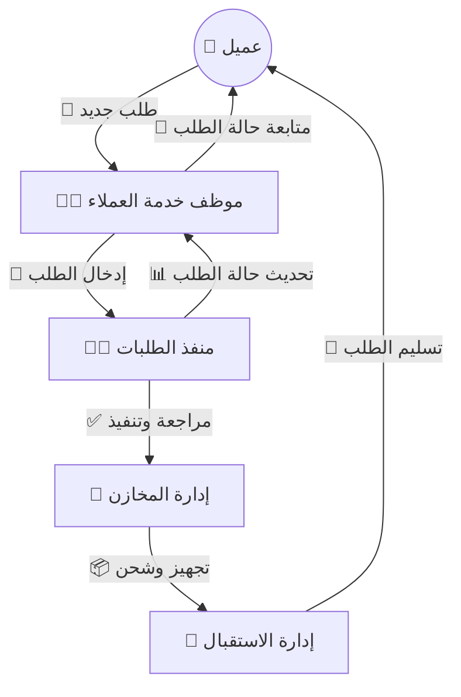
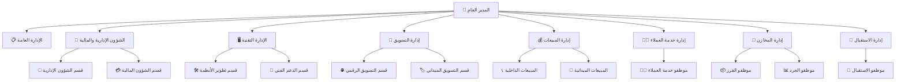

# 🏢 الهيكل التنظيمي والتسلسل الهرمي

---

## 🛠️ سير العمل الرقمي بين الأقسام

---

## ⚡ ملخص سير العمل السريع

1. العميل يرسل طلب جديد.
2. موظف خدمة العملاء يدخله في النظام ويتابع مع العميل.
3. منفذ الطلبات يراجع الطلب وينفذه ويصدر الفاتورة.
4. إدارة المخازن تجهز وتفرز الطلب للشحن.
5. الاستقبال يسلم الطلب للعميل ويستلم المستحقات.
6. كل خطوة موثقة رقمياً ويمكن تتبعها من قبل الإدارة.

---

---

## 👥 ملخص أدوار الموظفين الرئيسيين

| الدور                | المهام الرئيسية                                           | التفاعل مع الأقسام      |
| -------------------- | --------------------------------------------------------- | ----------------------- |
| 🧑‍💼 موظف خدمة العملاء | استقبال الطلبات، إدخالها بالنظام، متابعة العملاء          | منفذ الطلبات، الاستقبال |
| 🧑‍💻 منفذ الطلبات      | مراجعة الطلبات، تنفيذها، تحديث الحالة، إصدار الفواتير     | خدمة العملاء، المخازن   |
| 🏬 موظفو المخازن     | تجهيز وفرز الطلبيات، الجرد، تجهيز الشحنات                 | منفذ الطلبات، الاستقبال |
| 🎫 موظفو الاستقبال   | استقبال العملاء، تسليم الطلبيات، استلام المستحقات المالية | خدمة العملاء، المخازن   |
| 👔 مدير القسم        | الإشراف، اتخاذ القرارات، التنسيق بين الفرق                | جميع الأقسام            |

---

---

## 🗂️ ملخص هرمي

| المستوى | الإدارة/القسم               | الوصف المختصر                                                |
| ------- | --------------------------- | ------------------------------------------------------------ |
| 1       | 👔 المدير العام             | أعلى سلطة تنفيذية، يضع الاستراتيجيات ويتخذ القرارات النهائية |
| 2       | 📋 الإدارة العامة           | تنسيق مهام المدير العام، الاجتماعات، المراسلات               |
| 3       | 💼 الشؤون الإدارية والمالية | إدارة الموارد البشرية والمالية، السياسات، الميزانية          |
| 4       | 🖥️ الإدارة التقنية          | تطوير الأنظمة، الدعم الفني، الشبكات                          |
| 5       | 📢 إدارة التسويق            | الحملات التسويقية، الفعاليات، الدراسات السوقية               |
| 6       | 💰 إدارة المبيعات           | تحقيق المبيعات، فرق البيع الداخلية والميدانية                |
| 7       | 🧑‍💼 إدارة خدمة العملاء       | استقبال الطلبات، متابعة العملاء، الرد على الاستفسارات        |
| 8       | 🏬 إدارة المخازن            | التخزين، الفرز، الجرد، تجهيز الشحنات                         |
| 9       | 🎫 إدارة الاستقبال          | استقبال العملاء، تسليم الطلبيات، استلام المستحقات            |

---

## 📝 الوصف التفصيلي للأدوار والمهام

### 1. المدير العام (General Manager / CEO)

- أعلى سلطة تنفيذية في المؤسسة.
- يضع الاستراتيجيات والخطط العامة، يتابع عمل جميع الإدارات، ويتخذ القرارات النهائية.
- يمثل المؤسسة أمام الجهات الخارجية ويشرف على تطبيق السياسات العامة.
- يعتمد الميزانيات والخطط التشغيلية ويقيم أداء الإدارات بشكل دوري.
- يوجه عمليات التطوير والتحول الرقمي ويشرف على المبادرات الاستراتيجية.

### 2. الإدارة العامة

- مدير مكتب المدير العام: يتابع مهام المدير العام وينسق الاجتماعات والقرارات.
- سكرتارية: تنسق المراسلات، المواعيد، وتنظيم الأعمال الإدارية اليومية.

### 3. الشؤون الإدارية والمالية

- مدير الشؤون الإدارية والمالية: يشرف على الموارد البشرية والمالية معاً.

#### أ) قسم الشؤون الإدارية

- رئيس القسم: مسؤول عن إدارة شؤون الموظفين والسياسات الإدارية.
- موظف الموارد البشرية: يتابع الحضور والغياب والتوظيف والتدريب.
- المسؤول القانوني: يتابع العقود والالتزام بالقوانين.

#### ب) قسم الشؤون المالية

- رئيس القسم: يدير الحسابات والميزانيات.
- محاسب أول: مسؤول عن مراجعة القيود المالية والميزانية العامة.
- محاسب: يسجل العمليات اليومية (إيرادات ومصروفات).
- أمين صندوق: يستلم ويدفع الأموال نقداً ويتابع الصندوق.

### 4. الإدارة التقنية (النظام والتقنية)

- مدير النظام والتقنية: يضع خطة تقنية شاملة ويدير فرق الدعم والتطوير.

#### أ) قسم تطوير الأنظمة

- رئيس القسم: يشرف على تطوير التطبيقات والبرامج.
- مطور برمجيات: يبرمج ويطور الأنظمة الداخلية.
- مختص قواعد بيانات: يصمم ويدير قواعد البيانات ويحافظ على سلامتها.

#### ب) قسم الدعم الفني

- رئيس القسم: ينظم عمل الفنيين.
- فني شبكات: يدير الشبكات والاتصال الداخلي والخارجي.
- فني أجهزة: يصلح الأعطال ويقدم الدعم للموظفين.

### 5. إدارة التسويق

- مدير التسويق: يضع الاستراتيجيات التسويقية ويشرف على الحملات.

#### أ) قسم التسويق الرقمي

- رئيس القسم: يدير الحملات على الإنترنت.
- مختص SEO: يحسن ظهور الموقع في محركات البحث.
- مختص إعلانات: يدير الحملات الإعلانية المدفوعة.
- مصمم جرافيك/محتوى: يصمم الإعلانات والمواد البصرية.

#### ب) قسم التسويق الميداني

- رئيس القسم: مسؤول عن الحملات الميدانية.
- منسق فعاليات: ينظم المعارض والفعاليات.
- باحث سوق: يدرس السوق والعملاء والمنافسين.

### 6. إدارة المبيعات

- مدير المبيعات: يضع الخطط لتحقيق المبيعات ويشرف على فرق البيع.

#### أ) قسم المبيعات الداخلية

- رئيس القسم: يتابع المبيعات عبر الهاتف والإنترنت.
- موظفو المبيعات الداخلية: يتواصلون مع العملاء ويغلقون الصفقات.

#### ب) قسم المبيعات الميدانية

- رئيس القسم: مسؤول عن مبيعات المندوبين في السوق.
- مندوبي المبيعات: يزورون العملاء ويعرضون المنتجات والخدمات.

### 7. إدارة خدمة العملاء

- مدير خدمة العملاء: يضع السياسات للتواصل مع العملاء.
- رئيس القسم: يتابع شكاوى العملاء ويشرف على الموظفين.

- موظفو خدمة العملاء:
  - استقبال طلبات العملاء وتسجيلها في النظام (🧑‍💼 Customer Service Staff).
  - استلام سندات التحويل الخاصة بالطلبات.
  - الرد على استفسارات العملاء ومتابعة طلباتهم.
  - التنسيق مع منفذ الطلبات (🧑‍💻 Order Processor) لمراجعة الطلبات وتنفيذها.
  - متابعة حالة الطلبات مع العملاء حتى التسليم النهائي.

> **ملاحظة عملية:** عند استقبال طلب جديد، يقوم موظف خدمة العملاء بإدخاله في النظام، ثم يتم تحويله إلى منفذ الطلبات لمراجعته وتنفيذه، مع إشعار العميل بحالة الطلب بشكل دوري.

### 8. إدارة المخازن

- مدير المخازن: مسؤول عن التخزين والتوزيع.
- رئيس القسم: يتابع حركة البضائع بالمخزن.
- أمين مخزن: يحافظ على السجلات والتخزين الصحيح.

- موظفو الفرز: يفرزون الطلبيات حسب العملاء ويجهزونها للشحن.
- موظفو الجرد: يعدّون المخزون ويتأكدون من مطابقته.

> **ملاحظة عملية:** كل طلب يتم تجهيزه من قبل موظفي الفرز بناءً على بيانات النظام، ثم يتم التأكد من مطابقته عبر موظفي الجرد قبل الشحن.

### 9. إدارة الاستقبال

- مدير مكتب الاستقبال: يشرف على استقبال العملاء.
- رئيس القسم: ينظم عمل موظفي الاستقبال.

- موظفو الاستقبال:
  - استقبال العملاء عند وصولهم.
  - تسليم الطلبيات الجاهزة.
  - استلام المستحقات المالية المتبقية من العملاء.

> **ملاحظة عملية:** عند وصول العميل، يتم التأكد من هويته، ثم تسليمه الطلبيات الجاهزة واستلام أي مستحقات متبقية، مع تحديث النظام فوراً.

---

## 🚀 أفكار للتطوير المستقبلي

- يمكن إضافة أقسام جديدة مثل إدارة الجودة، إدارة اللوجستيات، أو فرق التحول الرقمي حسب توسع العمل.
- كل قسم قابل للتوسع بإضافة أدوار متخصصة (مثل محلل بيانات، منسق مشاريع، إلخ).
- ربط الهيكل التنظيمي بأنظمة الموارد البشرية والمهام الرقمية لرفع الكفاءة والشفافية.
- دعم إضافة أنواع موظفين جديدة مثل منفذ الطلبات (Order Processor) أو موظف دعم العملاء المتخصص، وربطهم بسير العمل الرقمي.

---

## 💡 نصائح للقراءة والاستخدام

- استخدم المخططات لفهم تدفق العمل بين الأقسام بسرعة.
- راجع ملخص الأدوار لمعرفة مسؤوليات كل فريق.
- كل قسم موضح بملاحظات عملية وسيناريو واقعي.
- الهيكل قابل للتوسع والتطوير حسب احتياجات العمل.
- مناسب للمدير، المبرمج، محلل الأعمال، وكل من يشارك في تطوير النظام.
