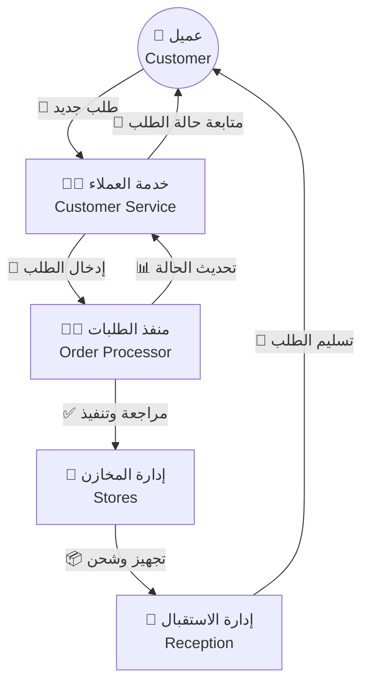
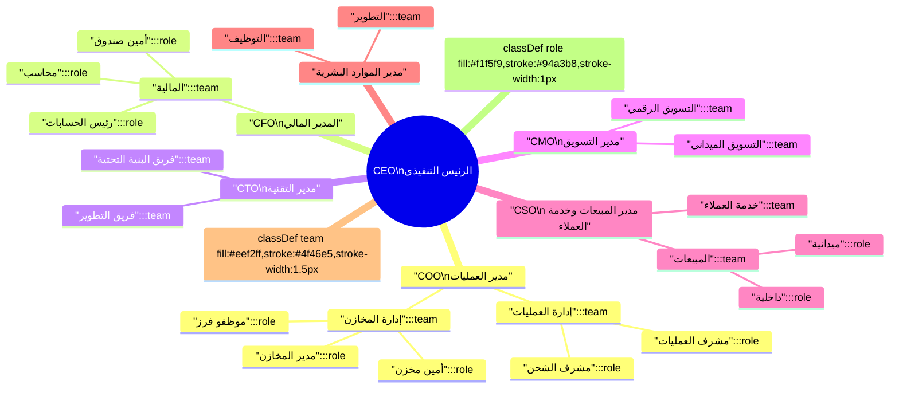

# 🏢 الهيكل التنظيمي والتسلسل الهرمي | Organizational Hierarchy & Structure

> | 🔖  | البيان                       | Details                                          |
> | --- | ---------------------------- | ------------------------------------------------ |
> | 🧾  | **المؤسسة / Organization**   | CA Admin DmG                                     |
> | 🧑‍💼  | **مالك الوثيقة / Owner**     | Abdullah Alshaif                                 |
> | 🎯  | **الغرض / Purpose**          | توضيح الأدوار، المسؤوليات، وتدفق العمل بين الفرق |
> | 📅  | **آخر تحديث / Last Updated** | 2025-09-08                                       |

**الملخص التنفيذي | Executive Summary:**  
يوضح هذا الملف البناء التنظيمي لـ CA Admin DmG، العلاقات بين الأقسام، ومسؤوليات كل دور لضمان وضوح المهام وتسريع القرارات.  
**Summary (EN):** This document outlines CA Admin DmG’s organizational structure, inter-departmental relationships, and key responsibilities to drive clarity and faster decision-making.

---

## 🧭 سير العمل بين الأقسام | Cross-Department Workflow

- 🔄 يوضّح المخطط رحلة الطلب من العميل إلى التسليم مع إبراز نقاط التنسيق.  
  **Shows the end-to-end order journey and key touchpoints.**
- 🧭 استخدمه كدليل سريع لفهم تأثير كل خطوة على الفرق الأخرى.  
  **Use it to see how each step impacts other teams.**

---

## ⚡ ملخص سير العمل السريع | Quick Workflow Summary

1. 👤 العميل يرسل طلبًا جديدًا. _(Customer submits a new order.)_
2. 🧑‍💼 خدمة العملاء تدخله في النظام وتتابع مع العميل. _(Customer Service records & follows up.)_
3. 🧑‍💻 منفذ الطلبات يراجع، ينفذ، ويصدر الفاتورة. _(Order Processor reviews & invoices.)_
4. 🏬 إدارة المخازن تجهز الطلب وتفرزه للشحن. _(Stores prepare & sort shipment.)_
5. 🎫 الاستقبال يسلم الطلب ويستلم المستحقات. _(Reception delivers & collects payment.)_
6. 📲 كل خطوة موثقة رقميًا ويمكن تتبعها من الإدارة. _(All steps digitally auditable.)_

---

## 👥 الأدوار الرئيسية والمسؤوليات | Key Roles & Responsibilities

| الدور (AR)           | Role (EN)          | المهام الرئيسية (AR/EN)                                                                             | التفاعل مع الأقسام      |
| -------------------- | ------------------ | --------------------------------------------------------------------------------------------------- | ----------------------- |
| 🧑‍💼 موظف خدمة العملاء | Customer Service   | استقبال الطلبات، إدخالها، متابعة العميل. Receive orders, log them, follow up.                    | منفذ الطلبات، الاستقبال |
| 🧑‍💻 منفذ الطلبات      | Order Processor    | مراجعة الطلبات، تنفيذها، إصدار الفواتير. Review orders, execute, invoice.                        | خدمة العملاء، المخازن   |
| 🏬 موظفو المخازن     | Store Staff        | تجهيز وفرز الطلبات، الجرد، تجهيز الشحنات. Prepare/sort orders, inventory, shipments.             | منفذ الطلبات، الاستقبال |
| 🎫 موظفو الاستقبال   | Reception Staff    | استقبال العملاء، تسليم الطلبات، تحصيل المستحقات. Receive clients, hand off orders, collect dues. | خدمة العملاء، المخازن   |
| 👔 مدير القسم        | Department Manager | الإشراف، اتخاذ القرارات، التنسيق بين الفرق. Oversee, decide, coordinate.                         | جميع الأقسام            |

---

## 🧾 الهيكل التنظيمي التنفيذي | Executive Organization Chart

- 👔 يوضّح توزيع الأقسام الرئيسية تحت الإدارة التنفيذية.  
  **Shows how executive leadership spans all departments.**
- 🧭 يساعد المدراء والمحللين على رؤية خطوط التقارير بسرعة.  
  **Quick reference for managers and analysts to grasp reporting lines.**

---

## 🧩 تقسيم الإدارات والفرق الفرعية | Departments & Sub-teams

### 1. الإدارة العليا (Executive Management)

- **الرئيس التنفيذي (CEO):** يقود الشركة ويضع الرؤية العامة.
- **مدير العمليات (COO):** يدير العمليات اليومية وينسق بين الأقسام التنفيذية.
- **المدير المالي (CFO):** مسؤول عن التخطيط المالي، الميزانية، والتحصيل.
- **مدير التقنية (CTO):** يقود التطوير، البنية التحتية، والأمان التقني.
- **مدير التسويق (CMO):** يضع استراتيجية التسويق، الحملات، الهوية.
- **مدير المبيعات وخدمة العملاء (CSO):** يقود فرق المبيعات وخدمة العملاء.
- **مدير الموارد البشرية:** التوظيف، التدريب، إدارة الأداء.

### 2. إدارة العمليات (Operations)

- **مدير العمليات:** يشرف على التشغيل بالكامل.
- **مشرف العمليات:** يضمن سير العمل اليومي.
- **مشرف الشحن:** يدير ترتيبات الشحن والتنسيق مع الخدمات اللوجستية.

### 3. الإدارة المالية (Finance)

- **رئيس الحسابات:** يشرف على المحاسبة، التقارير المالية.
- **محاسب:** يسجل المعاملات ويتابع الذمم.
- **أمين صندوق:** يدير النقدية والمدفوعات.

### 4. إدارة التقنية (Technology)

- **قائد الفريق التقني:** يقود المطورين.
- **مطورون:** يبنون المنظومة ويضيفون الميزات.
- **مهندسو بنية تحتية:** يديرون الخوادم، قواعد البيانات، الأمان.
- **مهندس ضمان الجودة:** يختبر النظام، يضع سيناريوهات الاختبار.

### 5. إدارة التسويق (Marketing)

- **مدير التسويق:** يحدد الاستراتيجية التسويقية ويشرف على الحملات.

#### أ) التسويق الرقمي

- رئيس الفريق، مختص SEO، مختص إعلانات، مصمم محتوى.

#### ب) التسويق الميداني

- رئيس الفريق، منسق فعاليات، باحث سوق.

### 6. إدارة المبيعات (Sales)

- **مدير المبيعات:** يضع الأهداف ويتابع الأداء.

#### أ) المبيعات الداخلية

- رئيس الفريق، موظفو مبيعات داخلية.

#### ب) المبيعات الميدانية

- رئيس الفريق، مندوبي المبيعات.

### 7. إدارة خدمة العملاء (Customer Service)

- **مدير خدمة العملاء:** يحدد السياسات.
- **رئيس الفريق:** يتابع الشكاوى، يوزع المهام.
- **فريق خدمة العملاء:** استقبال الطلبات، تسجيلها، المتابعة مع منفذ الطلبات.

### 8. إدارة المخازن (Stores)

- **مدير المخازن:** المستودعات والتوزيع.
- **رئيس القسم:** حركة البضائع.
- **أمين مخزن، موظفو فرز، موظفو جرد:** تجهيز الطلبات، ضبط المخزون.

### 9. إدارة الاستقبال (Reception)

- **مدير مكتب الاستقبال:** يشرف على تجربة العميل عند زيارة المقر.
- **رئيس الفريق + موظفو الاستقبال:** استقبال العملاء، تسليم الطلبيات، تحصيل المدفوعات.

---

## 📌 ملاحظات عملية | Practical Notes

- 🔄 كل قسم مرتبط بنظام رقمي لتسجيل الأنشطة وتسهيل المتابعة.
- 📈 التنسيق بين خدمة العملاء ومنفذ الطلبات يقلل الأخطاء ويرفع رضا العملاء.
- 🧾 توثيق الخطوات في النظام يساعد الإدارة على تقييم الأداء بشكل مستمر.
- 🛠️ يمكن دمج هذه الهيكلية مع أنظمة HR/ERP لرفع الكفاءة.

---

## 🚀 أفكار للتطوير المستقبلي | Future Enhancements

1. إضافة أقسام متقدمة (الجودة، اللوجستيات، التحول الرقمي) مع توسع الأعمال.
2. إدراج أدوار تخصصية (محلل بيانات، منسق مشاريع، مسؤول الامتثال).
3. ربط الهيكل بدليل الكفاءات وخطط التدريب.
4. بناء لوحة مراقبة تعرض حالة كل قسم وتقدم الطلبات.

---

## 💡 كيفية استخدام الملف | How To Use

- 🧭 ابدأ بالمخطط البصري لاستيعاب العلاقات بين الأقسام.
- 📋 راجع جدول الأدوار لتحديد المسؤوليات بسرعة.
- 🧩 استخدم قائمة الإدارات عند إعداد سياسات أو خطط تشغيل.
- 🔄 حدّث الملف مع أي تغييرات تنظيمية لضمان استمرار الملاءمة.
- 🤝 مناسب للمديرين، المطورين، محللي الأعمال، وفرق التشغيل.

---
